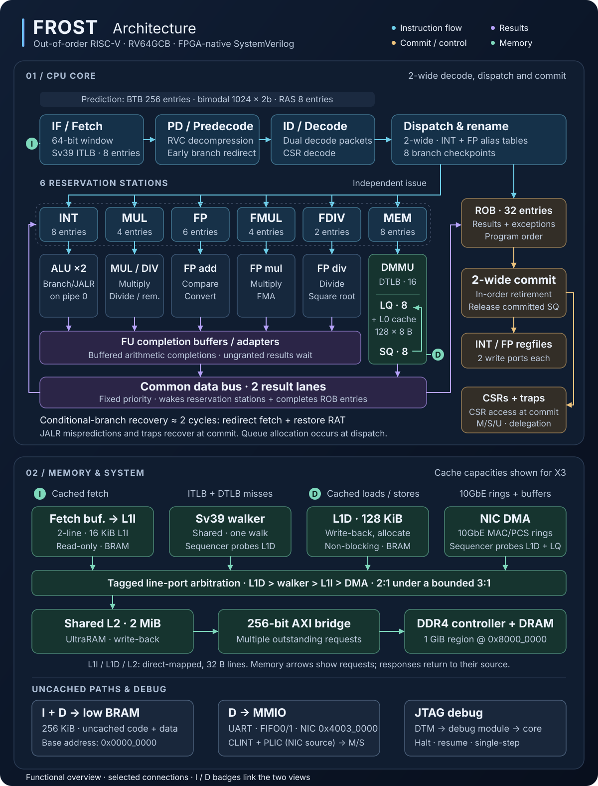

# FROST

**F**PGA **R**ISC-V **O**pen-sourced in **S**ystemVerilog by **T**woSigma

FROST is a two-wide, out-of-order RISC-V processor for FPGAs, written in
SystemVerilog. It implements RV64GCB with machine, supervisor, and user modes
and Sv39 virtual memory. On an AMD Alveo X3522PV it runs at 322 MHz, scores
1,259 CoreMark (3.91 CoreMark/MHz), and boots Debian 13 with Debian's
unmodified riscv64 kernel, mounting its root filesystem over NFS through its
own 10 Gigabit Ethernet NIC.

[](docs/diagrams/frost-architecture.svg)

The diagram shows the X3 configuration; click it for the full-size version.

## Highlights

- Debian 13 with systemd on an NFS root filesystem; the
  [Debian guide](docs/debian_nfsroot.md) walks through the setup.
- A 10 Gigabit Ethernet NIC (MAC, PCS, and descriptor-ring DMA that is
  coherent with the caches) with a Linux driver.
- FreeRTOS and all nine EEMBC CoreMark-PRO workloads.
- An open-source flow: simulation (Verilator and cocotb), synthesis checks
  (Yosys), and formal proofs (SymbiYosys) run in a pinned Docker image. AMD
  Vivado is needed only for the FPGA itself: building bitstreams and
  programming and loading the board.
- Continuous testing against the RISC-V architecture tests and random
  riscv-torture programs, with Spike as the reference, plus the riscv-tests
  suites and unit benches for the hardware blocks.
- Hand-written SystemVerilog rather than RTL generated from Chisel or
  SpinalHDL, with optional Xilinx primitives and board integration kept
  separate.
- A [VS Code extension](tools/vscode-frost/README.md) that programs the FPGA,
  loads software, and debugs it with source breakpoints and a serial console.
- The Apache 2.0 license.

## Quick Start

You don't need an FPGA to try FROST. From the repository root:

```bash
docker build -t frost .                   # build the toolchain image (once)
./scripts/frost.py doctor                 # check the setup (read-only)
./scripts/frost.py cocotb hello_world     # simulate the SoC running Hello World
```

The first image build compiles GCC, Verilator, Yosys, QEMU, Spike, and other
tools from source, so expect it to take a while. The last command compiles
the program, simulates the full SoC in Verilator, and prints
`Frost: Hello, world!` from the simulated UART. `scripts/frost.py`
runs each tool inside the image as your user, so build outputs stay yours, and
initializes Git submodules automatically. Use it for every simulation, formal,
and lint run.

Other programs to simulate:

```bash
./scripts/frost.py cocotb directed_traps      # directed M-mode trap and interrupt tests
./scripts/frost.py cocotb isa_test            # ISA self-test
./scripts/frost.py cocotb coremark            # CoreMark benchmark
./scripts/frost.py cocotb coremark_pro_core   # CoreMark-PRO core workload
./scripts/frost.py cocotb freertos_demo       # FreeRTOS demo
./scripts/frost.py cocotb ddr_heap_test       # multi-MB malloc through the caches into DDR
./scripts/frost.py cocotb frost_cache         # cache hierarchy unit bench
./scripts/frost.py cocotb --list-tests        # every simulation target

# Run a program from cached DDR instead of on-chip BRAM
FROST_COCOTB_MEM_CONFIG=ddr ./scripts/frost.py cocotb hello_world

# Write waveforms (dump.fst)
WAVES=1 ./scripts/frost.py cocotb directed_traps

# Open a shell inside the image
./scripts/frost.py shell
```

## Running on the FPGA

FPGA builds and board tools run natively on a host with Vivado:

```bash
# 1. Build the bitstream (30-90 minutes)
./fpga/build/build.py x3

# 2. Program the FPGA
./fpga/program_bitstream/program_bitstream.py x3

# 3. Load software; this doesn't touch the bitstream
./fpga/load_software/load_software.py x3 hello_world
./fpga/load_software/load_software.py x3 coremark
./fpga/load_software/load_software.py x3 isa_test

# CoreMark-PRO: -v1 validates results, -v0 measures performance
./fpga/load_software/load_software.py x3 coremark_pro_core -v1
./fpga/load_software/load_software.py x3 coremark_pro_radix2 -v1
```

The UART console runs at 115200 baud, 8N1; the VS Code extension has a
built-in serial terminal. The [FPGA guide](fpga/README.md) covers target
selection, debugging, and the hardware regression, and the
[Debian guide](docs/debian_nfsroot.md) covers booting Linux.

## Architecture

### Supported RISC-V Extensions

FROST implements RV64GCB (G = IMAFD). The table lists every supported
extension and privilege mode.

| Extension        | Description                                    |
|------------------|------------------------------------------------|
| **RV64I**        | Base 64-bit integer instruction set |
| **M**            | Integer multiply/divide                        |
| **A**            | Atomic memory operations (LR/SC, AMO; word and doubleword) |
| **F**            | Single-precision floating-point (32-bit)       |
| **D**            | Double-precision floating-point (64-bit)       |
| **C**            | Compressed instructions (16-bit encodings) |
| **B**            | Bit manipulation (B = Zba + Zbb + Zbs)         |
| **Zicsr**        | CSR access instructions                        |
| **Zicntr**       | Base counters (cycle, time, instret)           |
| **Zifencei**     | Instruction fence                              |
| **Zicond**       | Conditional zero                               |
| **Zbkb**         | Bit manipulation for crypto                    |
| **Zihintpause**  | Pause hint for spin-wait loops                 |
| **Machine Mode** | M-mode privilege (mret, wfi, ecall, ebreak)    |
| **Supervisor Mode** | S-mode privilege, trap delegation, Sv39 virtual memory, Sstc timers |
| **User Mode**    | U-mode privilege and system calls |

### Microarchitecture

- Tomasulo out-of-order execution with two-wide decode, rename, and commit, a
  32-entry reorder buffer, and precise exceptions.
- Six reservation stations, two integer ALUs, and hardware single- and
  double-precision floating point.
- Branch prediction with a 256-entry BTB, a 1024-entry direction predictor,
  and an 8-entry return stack. A mispredicted conditional branch recovers in
  about two cycles.
- Sv39 virtual memory with hardware page-table walks and separate instruction
  and data TLBs.
- Separate instruction and data paths into a cache hierarchy. On X3: 16 KiB
  L1I, 128 KiB L1D, 2 MiB L2, and a 128-entry L0 cache in the load queue. DMA
  is coherent with the data caches.
- 256 KiB of on-chip BRAM and 1 GiB of cached DDR4, with the same
  [memory map](sw/README.md#memory-map) in simulation and on hardware.
- UART, CLINT-compatible timer, PLIC interrupt controller, and 10GBASE-R
  Ethernet.
- JTAG debugging with halt, resume, and single-step through OpenOCD and GDB.

The [design documentation](#design-documentation) below explains how each
part works.

## Supported FPGA Boards

| Board              | FPGA                 | CPU Clock  | Cache hierarchy → main memory               |
|--------------------|----------------------|------------|---------------------------------------------|
| Alveo X3522PV      | UltraScale+ (xcux35) | 322.27 MHz | 128 KiB L1D + 16 KiB L1I → 2 MiB URAM L2 → 1 GiB DDR4 |

See the [board guide](boards/README.md) for pinouts, clocking, and adding a board.

<!-- FPGA_UTILIZATION_START -->

### FPGA Resource Utilization

**Alveo X3522PV** (Virtex UltraScale+; 322.27 MHz, counters off)

| Resource | Used | Available | Util% |
|----------|-----:|----------:|------:|
| CLB LUTs | 187,812 | 1,029,600 | 18.2% |
|   LUT as Logic | 169,295 | 1,029,600 | 16.4% |
|   LUT as Distributed RAM | 17,218 | — | — |
|   LUT as Shift Register | 1,299 | — | — |
| CLB Registers | 114,206 | 2,059,200 | 5.5% |
| Block RAM Tile | 360 | 2,112 | 17.1% |
| URAM | 68 | 352 | 19.3% |
| DSPs | 51 | 1,320 | 3.9% |
| CARRY8 | 2,735 | 128,700 | 2.1% |
| F7 Muxes | 1,962 | 514,800 | 0.4% |
| F8 Muxes | 926 | 257,400 | 0.4% |
| Bonded IOB | 132 | 364 | 36.3% |
| MMCM | 2 | 11 | 18.2% |
| PLL | 3 | 22 | 13.6% |

<!-- FPGA_UTILIZATION_END -->

## Development

### Tests and Checks

```bash
./scripts/frost.py check                     # CI's lint and fast Python test jobs
./scripts/frost.py pytest                    # the cocotb targets registered for pytest
./scripts/frost.py cocotb directed_traps     # a single target
./scripts/frost.py formal                    # formal proofs
./scripts/frost.py synthesis                 # open-source synthesis checks (Yosys)
```

The lint hooks in `check` can modify files, so review the diff afterwards.
Use `./scripts/frost.py lint` for lint alone, or add `--fail-fast` to `check`
to stop at the first failing phase.

CI runs on pushes and pull requests to `main`. It runs the RISC-V
architecture tests and riscv-torture programs against Spike reference
results, the riscv-tests suites, unit benches for the CPU and SoC blocks,
full programs from on-chip BRAM and from cached DDR, formal proofs, synthesis
checks, the Ethernet MAC/PCS benches, and QEMU boots of the Linux images. The
[test guide](tests/README.md#ci-integration) has the details and the commands
for each suite.

### Building Software

Simulation, FPGA loading, and bitstream builds compile applications
automatically. To compile by hand:

```bash
./scripts/frost.py run make -C sw/apps/hello_world         # one application
./scripts/frost.py run python3 sw/apps/build_all_apps.py   # all applications
```

For native builds outside the container, initialize the submodules first with
`git submodule update --init --recursive`.

## Repository Layout

| Directory | Contents |
|-----------|----------|
| [hw/rtl/](hw/rtl/README.md) | CPU, caches, peripherals, and reusable hardware blocks |
| [sw/](sw/README.md) | Bare-metal libraries, applications, and benchmarks |
| [linux/](linux/README.md) | Linux boot images, firmware, and NIC driver |
| [fpga/](fpga/README.md) | FPGA build, programming, and software-loading tools |
| [boards/](boards/README.md) | Board wrappers and pin constraints |
| [tests/](tests/README.md) | Test runners |
| [verif/](verif/README.md) | Cocotb tests, reference models, and monitors |
| [formal/](formal/README.md) | Formal verification |
| [tools/vscode-frost/](tools/vscode-frost/README.md) | VS Code extension |
| [docs/](docs/) | Debian setup, performance, and toolchain guides; diagrams |
| [scripts/](scripts/) | Docker wrapper and development tools |

### Design Documentation

| Document | Covers |
|----------|--------|
| [RTL overview](hw/rtl/README.md) | SoC structure, memory map, and the data bus rules |
| [CPU](hw/rtl/cpu_and_mem/cpu/README.md) | Front end, branch prediction, address translation, and debug |
| [Out-of-order back end](hw/rtl/cpu_and_mem/cpu/tomasulo/README.md) | Renaming, scheduling, memory ordering, and commit, with a README for each block |
| [Cache hierarchy](hw/rtl/lib/cache/README.md) | Caches, coherence, and the DMA port |
| [NIC](hw/rtl/peripherals/nic/README.md) and [MAC/PCS](hw/rtl/net10g/README.md) | 10 Gigabit Ethernet |
| [Single-core performance](docs/single_core_performance.md) | CoreMark configuration and measurement method |

## Toolchain

The Docker image pins the tools CI uses. Vivado is installed separately on the
host. [docs/tooling.md](docs/tooling.md) covers native toolchain setup and
updating the image.

| Category | Tool | Version |
|----------|------|---------|
| **Image** | Ubuntu | 26.04 |
| **Runtime** | Python | 3.14.7 (native scripts support 3.12+) |
| | Node.js / npm | 26.9.0 / 12.0.2 |
| **Compiler** | Native GCC / G++ | 16.2.0 |
| | Clang / clang-tidy / clang-format | 23.1.1 |
| | RISC-V GCC for bare metal, OpenSBI and Linux (Bootlin musl) | 15.3.0 (2026.08-1) |
| | pip / setuptools / wheel | 26.2.1 / 84.0.0 / 0.48.0 |
| **Build** | CMake / Meson / Ninja | 4.4.3 / 1.12.0 / 1.13.2 |
| | Buildroot / OpenSBI | 2026.08 / 1.9 |
| **Testbench** | Cocotb / pytest / pytest-cov | 2.1.0 / 9.1.1 / 7.1.0 |
| **Simulator** | Verilator / QEMU | 5.052 / 11.1.1 |
| | Spike | `02b1dc182164bb73b19b050676dd89f0834f8b2e` |
| **Synthesis** | Yosys / sv2v | 0.69 / 0.0.13 |
| **Formal** | SymbiYosys / Z3 / Boolector | 0.69 / 5.1.0 / 3.2.4 |
| **Debug** | OpenOCD | 0.12.0 (Ubuntu package) |
| **FPGA** | Vivado (native, separately installed and validated) | 2025.2 |
| **Linting** | pre-commit / Ruff / mypy | 4.6.2 / 0.16.8 / 2.3.1 |
| | Verible | 0.0-4294-gc1d8f5e8 |
| **CLI** | Click | 8.5.0 |
| **Extension** | TypeScript / vsce | 7.0.2 / 4.0.0 |

## Status and Roadmap

FROST supports one board, the Alveo X3522PV, and a single hart. Planned work
includes reaching 4 CoreMark/MHz at the same clock and a two-hart SMP
configuration; see [ROADMAP.md](ROADMAP.md).

## Contributors and License

[CONTRIBUTORS.md](CONTRIBUTORS.md) lists contributors. FROST is licensed under
the [Apache License 2.0](LICENSE); third-party code in submodules keeps its own
license.
