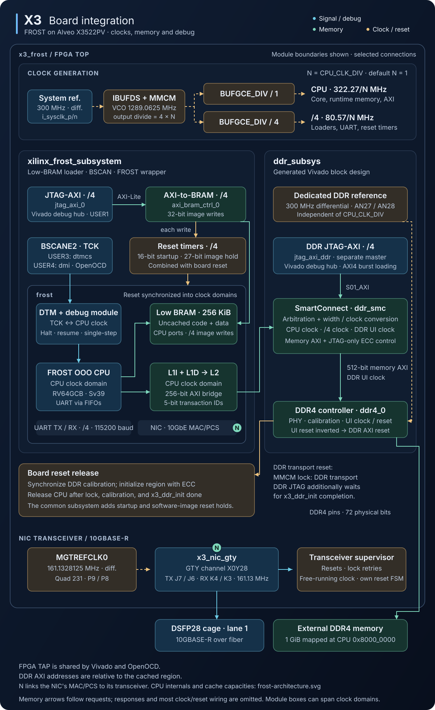

# FPGA Board Support

The supported board is the **Alveo X3522PV (X3)**, with a 300 MHz CPU,
256 KiB BRAM, 16 KiB L1I, 128 KiB L1D, 2 MiB URAM L2, and 1 GiB DDR4.
See the [FPGA guide](../fpga/README.md) for build, programming, and loading commands.

## Architecture Overview

| Module | Role |
|--------|------|
| `xilinx_frost_subsystem.sv` | CPU/BRAM, JTAG software loader, BSCAN debug, reset timers |
| `x3/x3_frost.sv` | Board clocks, DDR and NIC integration, reset sequencing |
| `x3/x3_ddr_init.sv` | Initialize the exposed DDR region with valid ECC |
| `x3/x3_nic_gty.sv` | Ethernet transceiver, MAC clocks, reset supervisor |
| `x3/constr/x3.xdc` | Pins and timing constraints |

`x3/x3_frost.f` lists board RTL. The Vivado flow generates loader, DDR, and
transceiver IP using `fpga/build/build_step.tcl`, `x3_ddr_bd.tcl`, and
`x3_gty_ip.tcl`.

The cache bridge sends 256-bit AXI with region-relative addresses.
SmartConnect combines it with the DDR JTAG master, crosses the CPU, CPU/4,
and DDR UI clocks, and converts to the controller's 512-bit interface.
CPU address `0x80000000` maps the first 1 GiB. Only the DDR JTAG master can
reach ECC management, at region offset `0x40000000`.

After calibration, `x3_ddr_init` zeroes the region with full-width writes
before reads are allowed (about 110 ms at the rated clock). Synchronized
calibration, MMCM lock, and initialization completion release the common
subsystem and DDR loader. DDR transport reset depends on MMCM lock;
startup and image-load holds are separate. Inspect ECC with
`fpga/ddr_ecc/ddr_ecc_status.py`.

## Clock Generation

| Domain | Clock |
|--------|-------|
| CPU | 300 MHz input × 4 / 1 / 4 = 300 MHz |
| Loader, UART, reset timers | CPU/4 = 75 MHz |
| DDR reference | Independent 300 MHz |
| Ethernet TX / recovered RX | GTY user clocks, about 161.13 MHz |
| GTY reset controller | Input/2 = 150 MHz, independent of MMCM and link |

`CPU_CLK_DIV=N` divides the CPU and CPU/4 domains by N; DDR and Ethernet
clocks are unchanged. Use `build.py --cpu-clock-div N`, and match the software
clock when loading. `PERF_COUNTERS` is controlled by `--perf-counters` and
`--no-perf-counters`; it defaults off at full rate and on in divided-clock builds.

## JTAG-based software loading

The loader resets the CPU with a low-BRAM write, bursts any `sw_ddr.txt`
image through `jtag_axi_ddr`, then writes `sw.txt` to BRAM. Keepalive BRAM
writes during DDR transfer re-arm reset. Every BRAM write restarts a 27-bit
CPU/4 counter; execution starts about 1.8 seconds after the last write at
300 MHz. A separate 16-bit startup counter delays programming IP and CPU
release after board reset. `frost` synchronizes resets into both clock domains.

## RISC-V debug over BSCAN (OpenOCD)

Debug shares the FPGA TAP: BSCANE2 USER3 carries `dtmcs`, USER4 carries `dmi`,
and the Vivado debug hub uses USER1. The subsystem selects `DEBUG_JTAG_TAP=0`.
The six-bit IR uses IDCODE `0x09`, DTMCS `0x22`, and DMI `0x23`; configurations
live in `fpga/debug/`. Only one process can own the cable: stop the owning
Vivado hardware server before OpenOCD, and vice versa.

## I/O Connections

| Signal       | Direction | Pin  | Description                            |
|--------------|-----------|------|----------------------------------------|
| `i_sysclk_p` | Input     | AK23 | 300 MHz differential clock (positive) |
| `i_sysclk_n` | Input     | AL23 | 300 MHz differential clock (negative) |
| `o_uart_tx`  | Output    | AP24 | UART transmit for debug console        |
| `i_uart_rx`  | Input     | AR24 | UART receive for debug console input   |
| `i_nic_refclk_p` / `i_nic_refclk_n` | Input | P9 / P8 | 161.1328125 MHz Ethernet reference clock (MGTREFCLK0, quad 231) |
| `o_nic_txp` / `o_nic_txn` | Output | J7 / J6 | NIC transceiver TX (GTY X0Y28, DSFP28 cage labelled 2, lane 1) |
| `i_nic_rxp` / `i_nic_rxn` | Input | K4 / K3 | NIC transceiver RX (GTY X0Y28) |

The UART console uses 115200 baud, 8N1.

## Adding Support for New Boards

To support another Xilinx FPGA board:

1. Create a new subdirectory named after the board
2. Start from the existing `x3_frost.sv` wrapper
3. Adapt the clock generation:
   - Set the MMCM parameters for the board's input clock frequency
   - Drive the CPU clock from CLKOUT0, and derive the /4 clock with a suitable
     global clock divider for the target family
4. Instantiate `xilinx_frost_subsystem`. For a DDR-capable board, also
   instantiate its `ddr_subsys` block design, wire the FROST cache-bridge AXI,
   and hold the CPU in reset until `mem_ok` (DDR calibrated), and, on a board
   whose memory is ECC-checked, until the region has been written. Pass
   `ENABLE_CACHED_TIER=1` and `USE_BEHAVIORAL_DDR=0`; the full-system hierarchy
   includes a 2 MiB UltraRAM L2, so the board must have sufficient UltraRAM.
   A BRAM-only board leaves the cached tier disabled and needs no DDR block design
5. Create a constraint file with the board's pin assignments. For a
   DDR-capable board, include the DDR pins unless they come from a MIG
   `.prj`/board interface
6. Update the file list (`.f` file) to include the subsystem
7. Add the board's FPGA part and its `has_ddr` and `has_gty` capabilities to
   `board_build_configs` in `fpga/build/build_step.tcl`. For a DDR-capable
   board, add `fpga/build/<board>_ddr_bd.tcl` for its `ddr_subsys` block design.
   The CPU port's `S00_AXI` range determines the memory advertised to Linux.
   For a board with a NIC transceiver, add `fpga/build/<board>_gty_ip.tcl` for
   its wizard core. The Tcl flow derives the wrapper, file-list, constraint,
   DDR-script, DDR-creation, transceiver-script and transceiver-creation
   procedure names from `<board>`; it skips the DDR pair for a BRAM-only board
   and the transceiver pair for a board without a transceiver
8. Register the board in the remaining FPGA-tool metadata:
   - `BOARD_CONFIG` in `fpga/build/build.py` for its clock, family, and tuned
     synthesis directive
   - `BOARD_INFO` in `fpga/build/extract_timing_and_util_summary.py`
   - `BOARD_CONFIG` in `fpga/load_software/load_software.py` for its clock,
     CoreMark iterations, and DDR capability
   - `BOARD_VENDOR_INFO` in `fpga/common/hw_target.py` and all three maps in
     `fpga/common/hw_defaults.py` for JTAG, UART, and timeout defaults
   - `supported_boards` in `fpga/program_bitstream/program_bitstream.tcl` for
     direct Tcl use. The Python programmer derives its choices from
     `BOARD_VENDOR_INFO`; the regression, soak, and sweep tools likewise derive
     their choices from the registries above
9. Calibrate the board's CoreMark-PRO `hardware_iterations` entries in
   `sw/apps/software_registry.py`. Set `hardware_timeout_minimums` if untimed
   setup exceeds the board's default timeout. Optionally record score gates
   in `BASELINE_SCORES` in `fpga/hw_regression.py`
10. Update this README with the new board's specifications

Before building, check that the MMCM VCO frequency produces the target CPU
clock, that the timing constraints match the input clock period, that the I/O
standards match the board's bank voltages, and that the board-appropriate DDR
controller IP is configured for its soldered or SODIMM memory. A non-Xilinx
FPGA (Altera, Lattice) would need a new subsystem, since
`xilinx_frost_subsystem` uses Xilinx IP and `BSCANE2` primitives.
