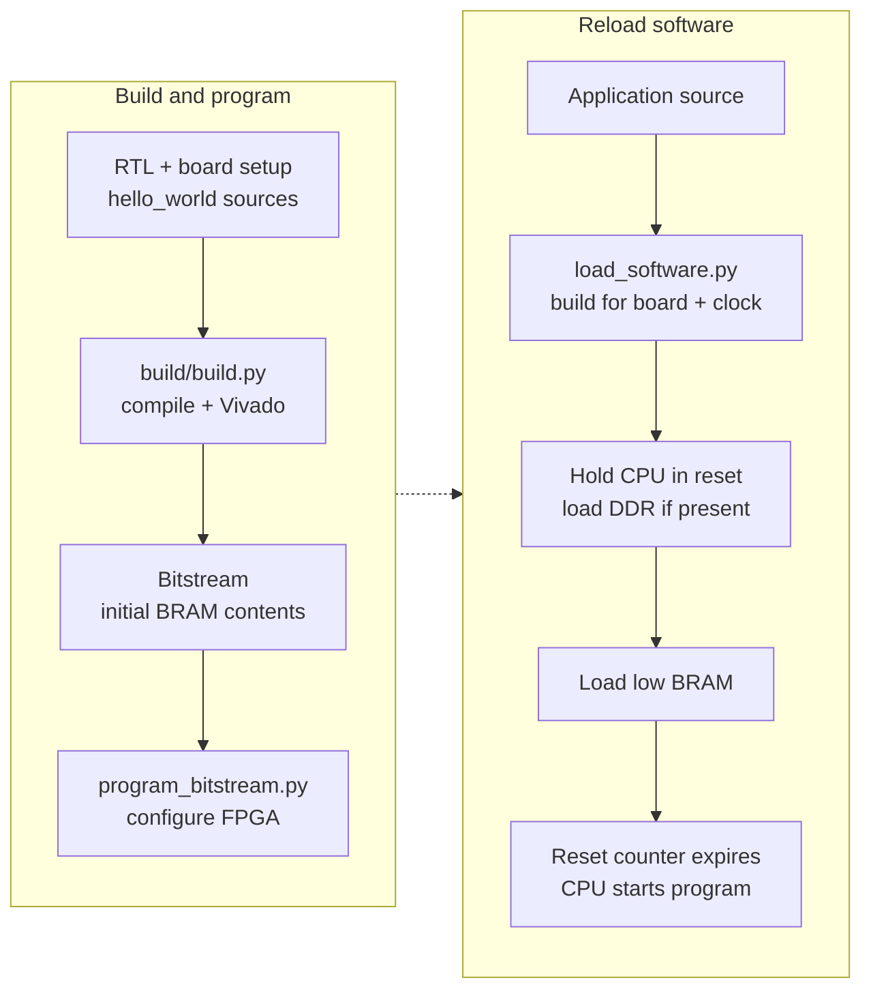

# FROST FPGA Build and Deployment

Build, program, load software, and debug on Xilinx FPGAs. Run these tools
natively on the host; Vivado is not included in the Docker image.

## Layout and flows

| Directory            | Purpose                                    |
|----------------------|--------------------------------------------|
| `build/`             | Synthesize and generate bitstream          |
| `program_bitstream/` | Program FPGA with bitstream via JTAG       |
| `load_software/`     | Load software images into low BRAM and optional DDR without reprogramming |
| `debug/`             | OpenOCD configurations for the RISC-V debug module (simulation and X3) |
| `ddr_ecc/`           | Read the DDR4 controller's ECC error state over JTAG |



`build/build.py` compiles `hello_world` for the initial BRAM image before
synthesis. Software reload uses `load_software/load_software.py`, which
rebuilds the selected app by default and loads `sw.txt` plus any
`sw_ddr.txt`; `--skip-build` reuses eligible existing artifacts.

The loader holds the CPU in reset while loading DDR and BRAM, then releases
it to run the program. See the [board guide](../boards/README.md#jtag-based-software-loading)
for the loading interface and reset timing.

For command-line debugging, close your Vivado hardware server before starting
OpenOCD; only one tool can own the cable:

```bash
openocd -f fpga/debug/openocd_x3.cfg
riscv-none-elf-gdb sw/apps/hello_world/sw.elf -ex 'target extended-remote :3333'
```

Use the JTAG loader for whole images. Debugger memory access uses the program
buffer and is slower. Software breakpoints work in BRAM and DDR; hardware
breakpoints and data watchpoints are not supported.

`debug/openocd_sim.cfg` connects OpenOCD to RTL simulation over `remote_bitbang`;
the `debug_openocd_test` cocotb target exercises this interface.

### VS Code debugging

The [FROST extension](../tools/vscode-frost/README.md) handles programming,
software loading, debugging, serial I/O, and cable handoff. Follow its
[installation guide](../tools/vscode-frost/README.md#build-and-install-locally),
then run **FROST: Configure Target**.

The repository also includes a manual
[launch configuration](../.vscode/launch.json) and
[OpenOCD task](../.vscode/tasks.json). These attach Microsoft's C/C++ debugger
to an already loaded image. Use official VS Code on the Linux FPGA host,
directly or through Remote-SSH, with C/C++, RISC-V GDB, and OpenOCD installed.

1. Load the application with debug symbols. Set `FROST_CPU_CLK_HZ` if the
   bitstream uses a clock other than the board default:

   ```bash
   ./fpga/load_software/load_software.py x3 hello_world --debug --target '<target serial>'
   ```

   Keep the loaded `sw.elf` for the debugger. Wait for the image-load reset
   to expire before starting OpenOCD: 2040 ms at 300 MHz or 3830 ms at
   150 MHz, including the guard interval. For another clock, use
   `ceil(4 * 2^27 * 1000 / CPU_clock_Hz) + 250` milliseconds.
2. Close Hardware Manager and stop the `hw_server` you started. Check that
   the cable and local GDB port 3333 are free.
3. Select **FROST: X3 loaded hello_world (Phase A)** in Run and Debug, press
   F5, and enter the FT4232H JTAG serial. Check the task terminal or
   `.vscode/openocd-phase-a.log` for successful OpenOCD startup. Fix task
   failures before retrying; do not select **Debug Anyway**.
4. The debugger attaches at the current PC. It does not reset, load, or stop
   at `main`. Reload the image when fresh initialized DDR data is needed.
5. To finish, pause and enter `-exec detach` in the Debug Console, then stop
   the session and terminate **FROST: start OpenOCD (Phase A)**. Confirm
   OpenOCD has exited before using Vivado again. Reload after a debugger
   crash, since software breakpoints may remain in memory.

GDB's memory map permits BRAM and DDR access and excludes device registers
with read side effects. For register and disassembly workarounds, see the
[debugger guide](../tools/vscode-frost/README.md#debugger-scope).

### Hardware regression

`hw_regression.py` runs unattended bare-metal apps, all nine CoreMark-PRO
workloads, and Debian 13 from an NFS root, then reads the memory
controller's ECC error state. It checks console output, benchmark scores,
Linux startup, counters, networking, and that none of that traffic was ever
reported as an ECC error.

The `ddr_ecc` stage runs last because its reading covers everything before
it: the counters have been accumulating since the board was programmed, so a
clean report means the whole run read nothing the array had never been
written with. It is `ddr_ecc/ddr_ecc_status.py`, which can also be run on its
own -- `--clear` resets the latched state first, which is how to start a
measurement from a known point without reprogramming.

Prepare the export with the [Debian setup guide](../docs/debian_nfsroot.md#hardware-regression),
then state the two things a checkout cannot know -- which host exports the
root, and which address the board takes on that network -- in `fpga/site.env`.
Git ignores that file; write it once per lab:

```
FROST_LINUX_NFSROOT=192.0.2.1:/srv/nfs/debian
FROST_LINUX_IP=192.0.2.2::192.0.2.1:255.255.255.0:frost:eth0:off
```

The whole run is then:

```bash
./fpga/hw_regression.py --board x3
```

The kernel and the initramfs are not site facts and are not asked for: the
release is pinned in this repository, the kernel is the image
`linux/debian_kernel.py` computes, and the initramfs is that release's image
inside the export above. `FROST_LINUX_KERNEL` and `FROST_LINUX_INITRD`
override them, which is how a replacement kernel is tested, and the same two
site values can be given in the environment instead of the file, which wins
over it.

Preflight failures report `ENV_FAIL` before touching the board. The run
excludes `debug_target` and `nic_echo`, which need external interaction.
`perf_off_test` is skipped when `FROST_CPU_CLK_HZ` selects a divided-clock
build with profiling counters.

`--timeout` includes build and load time. CoreMark-PRO workloads may raise
it to their board-specific minimum; X3 ZIP needs at least 600 seconds.
Use `linux_boot_soak.py` for repeated boots of the smaller test image.

## Prerequisites

- Vivado (see the [main README](../README.md#prerequisites) for the validated version)
- Python 3
- JTAG cable connected to the target board
- For remote programming: Vivado Hardware Server running on the remote host
- For `hw_regression.py`'s Linux stage: the board's Debian NFS root, prepared as
  [`../docs/debian_nfsroot.md`](../docs/debian_nfsroot.md) describes, with its
  export directory reachable on this host, and a riscv64 Linux cross compiler
  (Debian's `gcc-riscv64-linux-gnu`, `FROST_LINUX_CROSS_COMPILE`, or the one
  Buildroot's own build produces) for the two programs the stage installs into
  it

## Supported Boards

| Board    | FPGA                       | FROST Clock | Status         |
|----------|----------------------------|-------------|----------------|
| X3       | Alveo UltraScale+ (xcux35) | 300 MHz     | Primary target |

## Quick Start

```bash
# 1. Build the bitstream
./fpga/build/build.py x3

# 2. Program the FPGA
./fpga/program_bitstream/program_bitstream.py x3

# 3. (Optional) Load different software without reprogramming
./fpga/load_software/load_software.py x3 coremark
```

## Functional-validation builds

`--cpu-clock-div N` builds the same RTL for 300/N MHz. The board top's
`CPU_CLK_DIV` generic scales the MMCM output divide and the `CLK_FREQ_HZ` the
subsystem derives its UART and timer constants from, the DDR block design
declares the divided CPU and JTAG clocks, and `hello_world` is compiled for the
divided clock. At half rate the design closes timing with hundreds of
picoseconds to spare, so the build runs one `RuntimeOptimized` placement at the
baseline uncertainty without quick-route probes or the off-grid seed, routes
with `RuntimeOptimized` only, and finishes in a fraction of the time. An
explicit `--directives`, `--num-uncertainties` or `--route-directives` is
honored instead. The README utilization table is left alone: a divided-clock
build is not the reference implementation.

Use the CLI option to set the clock; `build.py` overrides any inherited
`FROST_CPU_CLK_DIV` value.

## NIC transceiver

The X3 build puts the NIC's MAC on GTY channel X0Y28 (quad 231) through
`../boards/x3/x3_nic_gty.sv`. The synth step creates the transceiver wizard
core `x3_nic_gty_wiz` from `build/x3_gty_ip.tcl` (one channel, QPLL0 from the
161.1328125 MHz reference clock, raw 64-bit words, reset and user clocking
helpers in the core) and generates and synthesizes it with the other IP
cores. The receive equalizer is LPM; `FROST_GTY_RX_EQ=DFE` in the synthesis
environment builds DFE instead. The MAC clocks are the transceiver's TX and
recovered RX user clocks, so they do not follow `--cpu-clock-div`; the NIC's
self-test loopback on this build is the transceiver's near-end PMA loopback.
Without block lock the wrapper retries every 100 ms with an RX PCS reset, and
every tenth retry is a full RX reset (GTRXRESET, which UG578 recommends after
the receive inputs are connected). The full RX reset drops the NIC's RX READY,
so with no link partner receive is disabled about once a second; the Linux
driver enables it again when the carrier returns.

## Profiling counters

The profiling counters (the `mperf*` CSRs, about 24k cells beside the
timing-critical core: 3.8k LUTs, 18.3k flops, 2.1k CARRY8 at post-opt) are a
build option: `--perf-counters` exports
`FROST_PERF_COUNTERS=1` and synthesis passes `PERF_COUNTERS=1` to the board
top. A full-rate build leaves them out by default, a divided-clock build
includes them, and `--no-perf-counters` overrides that. The CLI always sets
`FROST_PERF_COUNTERS`, so an inherited value cannot change the netlist; a run
that starts after synthesis keeps whatever the checkpoint holds, and the
banner says so. Without the counters the `mperf*` CSRs read zero and the
software profile reports say "Profiling counters: absent".

Use it to separate RTL bugs from timing margin (a failure that survives at half
clock is not a setup violation), to get a bitstream quickly for functional
checks, and to run stress programs on hardware that simulation cannot afford.
Board software must match the programmed clock: set `FROST_CPU_CLK_HZ` (Hz)
for `load_software.py` and `hw_regression.py`, which then build apps and the
Linux device tree for that clock and skip the CoreMark score checks (baselines
are recorded at the rated clock).

```bash
./fpga/build/build.py x3 --cpu-clock-div 2
./fpga/program_bitstream/program_bitstream.py x3
FROST_CPU_CLK_HZ=150000000 ./fpga/hw_regression.py --board x3 hello_world itlb_test
FROST_CPU_CLK_HZ=150000000 ./fpga/hw_regression.py --board x3 linux_boot
```

## Fetch-seam ILA captures

`--debug-ila` instruments the fetch seam with a Vivado ILA: synthesis compiles
the `FROST_DEBUG_FETCH_ILA` mirror nets in (IF stage, fetch provider, immu,
the IF-to-PD and PD-to-ID packets, commit and trap pulses; the low 16 PC bits
of each), inserts one debug core on the CPU clock over every marked net, and
the bitstream step writes the probes file beside the bitstream. Combine it with
`--cpu-clock-div 2` for a fast build with timing to spare. The capture is
scripted so the JTAG target is never held while the loader and the boot use
it:

```bash
./fpga/build/build.py x3 --cpu-clock-div 2 --debug-ila
./fpga/program_bitstream/program_bitstream.py x3
./fpga/debug/capture_fetch_ila.py x3 hook --offset 5e4   # trigger: fetch-fault packet at that page offset
FROST_ILA_ARM_HOOK=fpga/build/x3/work/ila_arm_hook.tcl \
  FROST_ILA_COLLECT_HOOK=fpga/build/x3/work/ila_collect_hook.tcl \
  FROST_CPU_CLK_HZ=150000000 ./fpga/hw_regression.py --board x3 linux_boot
./fpga/debug/fetch_ila_report.py fpga/build/x3/work/fetch_ila.csv --before 200 --only if_ fp_
```

Arming, waiting and collecting share one Hardware Manager session, because
the device refresh every new session performs resets the core, and the
software loader's own refresh would reset a capture armed before it. `hook`
therefore writes two scripts that `load_software.py` (hence
`hw_regression.py`) sources: `FROST_ILA_ARM_HOOK` right after its refresh,
before the CPU is released, and `FROST_ILA_COLLECT_HOOK` after the load
sentinel, where it waits for the trigger and writes the CSV. The trigger is
the IF fault packet (`== 1`) with its PC probe `== X<offset>` (the page number
masked), keeping 3072 of 4096 samples before the trigger. `capture` is the
standalone form for a program that is already running. `fetch_ila_report.py`
prints the CSV as a cycle table with the mirror names.

## Building

`build/build.py` compiles `hello_world` into the board's initial BRAM
contents, then runs the Vivado pipeline. Every step writes a checkpoint, so
`--start-at` and `--stop-after` can resume from or stop after any step.
Non-sweep steps use their defaults unless a `--*-directive` flag overrides
them. The current X3 target builds RV64GCB; board configuration remains
table-driven so another target can be added without restructuring the flow.

`--jobs N` (or `-j N`, default 12) limits concurrent Vivado sweep jobs per
invocation. It does not change each process's thread count. Account for
combined memory use when running multiple builds on one host.

X3 placement uses a sweep; `--place-directive` is ignored. Defaults are:

- Four directives: `ExtraNetDelay_high`, `ExtraPostPlacementOpt`,
  `AltSpreadLogic_high`, and `AltSpreadLogic_medium`.
- Six setup uncertainties from 0.500 to 0.250 ns, plus an off-grid
  `ExtraPostPlacementOpt`/0.425 seed.
- Two integer-RS `CELL_BLOAT_FACTOR=LOW` variants at
  `ExtraNetDelay_high`/0.350 and `ExtraPostPlacementOpt`/0.450: 27 jobs total.

Use `--directives` to choose directives and `--num-uncertainties` for 1–10
values in 50 ps steps from 0.500 ns. The off-grid seed is included once;
LOW variants are included only when their base recipe is selected.
Divided-clock builds omit the extra variants.

Set `FROST_PLACE_CELL_BLOAT` to `LOW`, `MEDIUM`, `HIGH`, or empty for none.
`FROST_PLACE_CELL_BLOAT_CELLS` accepts comma- or space-separated hierarchy
patterns, defaulting to `*u_tomasulo/u_int_rs`. Setting either variable
disables the automatic LOW variants.

Both route stages sweep `Explore`, `AggressiveExplore`, `NoTimingRelaxation`,
and `AlternateCLBRouting`. Override with `--route-directives`; a single
directive runs once and streams output to the terminal. Divided-clock builds
use one `RuntimeOptimized` route by default.

Placement must meet the −0.200 ns setup-slack gate at the actual CPU clock
with zero added setup uncertainty. If no candidate passes, the build stops
and preserves the best checkpoint and reports. The X3 CPU datapath uses no
false-path or multicycle timing exceptions.

Passing candidates are ranked by congestion and timing:

- `FROST_PLACE_CONGESTION_VETO_LEVEL` defaults to 5. If every candidate is
  vetoed, those with the lowest congestion survive. In reports, `none` means
  no windows reached the reporting threshold; `N/A` means the report was unreadable.
- `FROST_PLACE_QUICK_ROUTE_COUNT` defaults to 0. A positive value probes
  leading candidates and selects by routed WNS; otherwise post-place WNS wins.
- Post-place phys-opt runs with 0.500 ns added setup uncertainty; routing and
  post-route phys-opt use 0.000 ns. Promoted reports and checkpoints always
  use 0.000 ns. `FROST_PHYSOPT_SETUP_UNCERTAINTY` overrides all three phys-opt
  stages, so it also affects post-route sweeps.

Keep `post_place_gate.txt`, `post_place_gate_binding.json`, and
`*.lineage.json` alongside their checkpoints when copying a build directory.
Resumed stages verify this metadata against their inputs. A new synthesis or
optimization result invalidates the previous placement approval, so rerun
placement before resuming downstream stages. Missing or stale downstream
lineage requires `--start-at post_place_physopt` from a qualified placement.
`netlist_config.json` records whether the netlist includes profiling counters.

Promoting a new post-opt checkpoint removes `audit_post_opt_*` and
`post_opt_fence_*` reports from the work directory. Save any reports you need
before rerunning optimization.

The build updates the root README's utilization table from its last completed
stage. The standalone `build/extract_timing_and_util_summary.py` instead uses
the most advanced available reports.

To route a completed phys-opt sweep while further sweeps continue, fork it
into a separate board build directory:

```bash
./fpga/build/build.py x3 --start-at route --stop-after route \
  --snapshot-physopt-from fpga/build/x3/work \
  --build-dir fpga/build/x3/work_early_route --jobs 2
```

The destination must be new. The snapshot copies a completed sweep with its
placement, reports, and metadata, and verifies that the source stays unchanged
during the copy. A running sweep needs a launch manifest; otherwise wait for
the stage to finish before taking the snapshot.

`--build-dir` selects the directory containing `work/` and all per-stage
worker directories. The fork's reports and bitstream stay there, and it leaves
the reference README utilization table alone. Later source sweeps cannot
invalidate the copied parent or collide with the fork's route workers. Resume
the fork with `--build-dir` alone; omit `--snapshot-physopt-from` once it exists.
As in the normal flow, closing route timing promotes `final.dcp` and generates
a bitstream even with `--stop-after route`. The source build continues its
own requested pipeline independently.

```bash
# Full build with default directives
./fpga/build/build.py x3

# Override the board's default synthesis directive (AlternateRoutability)
./fpga/build/build.py x3 --synth-directive PerformanceOptimized

# Resume at the x3 placement sweep with at most twelve concurrent Vivado jobs
./fpga/build/build.py x3 --start-at place --jobs 12

# Run only placement with a 2×4 grid plus the off-grid seed (9 jobs)
./fpga/build/build.py x3 --start-at place --stop-after place \
  --directives ExtraNetDelay_low ExtraTimingOpt --num-uncertainties 4

# Synth only
./fpga/build/build.py x3 --stop-after synth

# Route with one directive instead of the router sweep
./fpga/build/build.py x3 --start-at route --route-directives RuntimeOptimized

# Functional-validation bitstream at 150 MHz (see below)
./fpga/build/build.py x3 --cpu-clock-div 2
```

Run `./fpga/build/build.py --help` for the full list of directives and options.

Production placement does not invoke `x3_pd_target_pin_swaps.tcl` or
`x3_flush_guidance.tcl`. `FROST_X3_PD_TARGET_PIN_SWAPS` and
`FROST_PLACE_FLUSH_INCREMENTAL` no longer enable production behavior.
The historical pin-refinement helper stays in the tree for diagnostics only. It
has no production call site and no maintained replay recipe; its timing checks
and rollback apply only when it is invoked directly.
The normal gate and reports describe the single placer result after restoring
canonical cost groups and zero added setup uncertainty. Retired diagnostic
audits are cleared when publishing a new production placement.

The normal placement sweep needs no refinement override and defaults to no
quick-route probes:

```bash
./fpga/build/build.py x3 --start-at place --stop-after place
```

## Programming the FPGA

```bash
./fpga/program_bitstream/program_bitstream.py <board> [remote_host] [--target PATTERN] [--list-targets]
```

Arguments:

- `board`: `x3`
- `remote_host`: hostname of a remote Vivado Hardware Server
- `--target PATTERN`: target index or case-insensitive name/serial substring
- `--list-targets`: list this board's targets and exit
- `--bitstream PATH`: program a selected nonempty `.bit` file; defaults to
  `fpga/build/<board>/work/<board>_frost.bit`. File validation precedes discovery.
- `--hw-server-url HOST:PORT`: connect to an already running server at this
  endpoint, instead of implicit local startup; cannot be combined with
  `remote_host`. The caller owns and stops that server process.
- `--target-exact NAME`: require the full case-sensitive Vivado target name,
  mutually exclusive with `--target`.
- `--non-interactive`: fail on ambiguous target selection instead of prompting.

Programming and loading require exactly one FPGA device on the selected target.
Their Tcl clients close their target/server connections after success or errors;
closing a client connection does not stop `hw_server` or release its cable.

Examples:

```bash
# Local FPGA (auto-selects if only one matching target, prompts if multiple)
./fpga/program_bitstream/program_bitstream.py x3

# List available targets for this board (filtered by vendor)
./fpga/program_bitstream/program_bitstream.py x3 --list-targets

# Select target by index (from filtered list)
./fpga/program_bitstream/program_bitstream.py x3 --target 0

# Select target by serial-number substring
./fpga/program_bitstream/program_bitstream.py x3 --target 507711333S8VAA

# Remote FPGA (requires Vivado Hardware Server on remote host)
./fpga/program_bitstream/program_bitstream.py x3 fpga-server.local
```

## Loading Software

By default, the loader compiles the app before discovering hardware, for the board's clock (scaling CoreMark
iterations to the board), bursts a nonempty `sw_ddr.txt` into cached DDR
while low-BRAM keepalive writes hold the CPU in image reset, then writes the
full `sw.txt` image at `0x00000000`. The image-load reset, which every
low-BRAM write re-arms, expires after the last write and the CPU starts the
new image.

```bash
./fpga/load_software/load_software.py <board> <app> [remote_host] [--target PATTERN] [--list-targets]
```

Arguments:

- `board`: `x3`
- `app`: an application listed by `--help`
- `remote_host`: hostname of a remote Vivado Hardware Server
- `--target PATTERN`: target index or case-insensitive name/serial substring
- `--list-targets`: list this board's targets; `app` is not required
- `--hw-server-url HOST:PORT`, `--target-exact NAME`, `--non-interactive`:
  the same explicit server and selection contracts as the programmer above.
- `--debug`: use the `FROST_DEBUG=1` profile (`-Og -g3`, normally with frame
  pointers and no loop unrolling; standalone assembly gets DWARF too).
  Available for every single-ELF app. `linux_boot` and `opensbi_smoke` remain
  load-only composite image flows. The profile adds debugging information
  without a software startup wait loop. `isa_test`
  opts out of frame pointers because its instruction tests clobber `s0`;
  `ddr_smc_test` uses a debug-only large code model to address its DDR code.
- `--build-only`: clean/build without invoking Vivado or touching JTAG. Prints
  `FROST_ELF=<path>` and `FROST_BUILD_COMPLETE` on success. With `--debug`, also
  emits `FROST_DEBUG_BUILD=<JSON>` describing the resolved app directory/ELF,
  effective layout, startup strategy, and build-configuration SHA-256.
- `--skip-build`: load current files for an eligible single-ELF app without
  rebuilding; mutually exclusive with `--build-only`. The loader checks the
  RV64 ELF, image words, debug sections when requested, and the existing Make
  configuration's memory mode, debug profile, CPU clock, and workload/run-mode
  options. CoreMark-PRO aliases use the shared registered build directory.
  It does not
  verify source freshness or freeze files. Keep the app directory unchanged
  between build and load, and point GDB at that same `sw.elf`.
- `--expected-build-config-sha256 HASH`: with `--skip-build`, require the Make
  configuration hash returned by the earlier debug build. The extension passes
  this value and checks image hashes before and after loading.

A caller that owns a server can compile before acquiring the cable, then load
the same files using its explicit endpoint and full target name:

```bash
FROST_CPU_CLK_HZ=150000000 ./fpga/load_software/load_software.py x3 hello_world --debug --ddr --build-only
FROST_CPU_CLK_HZ=150000000 ./fpga/load_software/load_software.py x3 hello_world --debug --ddr --skip-build \
  --hw-server-url 127.0.0.1:3219 --target-exact '<full Vivado target name>' --non-interactive
```

Use the CPU clock of the actual programmed bitstream. Stop only the server
process the caller started before handing the cable to OpenOCD. `debug_target`
expects debugger-driven memory/privilege/breakpoint interactions and is not an
unattended UART regression app.

Use a serial terminal configured for 115200 baud, 8 data bits, no parity, and
1 stop bit (8N1) to view the board UART console.

CoreMark-PRO workloads require `-v1` (validation) or `-v0` (performance run
with the iteration counts from `../sw/apps/software_registry.py`). Data placed
in the cached region, such as radix2's ~800 KiB FFT tables, is burst-loaded
before the low-BRAM image through the DDR JTAG master, which the loader
identifies automatically.

Examples:

```bash
# Load coremark on X3 locally
./fpga/load_software/load_software.py x3 coremark

# Load hello_world through a remote hardware server
./fpga/load_software/load_software.py x3 hello_world fpga-server.local

# Load FreeRTOS demo
./fpga/load_software/load_software.py x3 freertos_demo

# CoreMark-PRO validation and performance
./fpga/load_software/load_software.py x3 coremark_pro_core -v1
./fpga/load_software/load_software.py x3 coremark_pro_radix2 -v1
./fpga/load_software/load_software.py x3 coremark_pro_linear_alg -v0

# List targets for this board (doesn't require app argument)
./fpga/load_software/load_software.py x3 --list-targets

# Select specific target by serial number
./fpga/load_software/load_software.py x3 hello_world --target 507711333S8VAA
```

## Multiple Hardware Targets

Target discovery applies the vendor filter registered for each board,
including for `--list-targets`; X3 targets use `Xilinx`. A unique match is
selected automatically, while multiple matches prompt for selection.

Target names follow the format `hostname:port/xilinx_tcf/<vendor>/<serial>`:

- Alveo boards: `localhost:3121/xilinx_tcf/Xilinx/507711333S8VAA`

`--target` accepts a case-insensitive substring such as a serial number, or an
index (`0`, `1`, …) from the filtered list.

## Remote Programming

Start Vivado Hardware Server on the remote host, then pass its hostname:

```bash
hw_server -d  # port 3121
./fpga/program_bitstream/program_bitstream.py x3 remote-hostname
./fpga/load_software/load_software.py x3 coremark remote-hostname
```

## Customization

### Adding a New Board

1. Create `../boards/<board>/` with:
   - `<board>_frost.sv`: top-level wrapper. It generates the CPU clock and the
     /4 clock with an MMCM and instantiates `xilinx_frost_subsystem`
     (`../boards/xilinx_frost_subsystem.sv`). A DDR-capable target also
     instantiates the `ddr_subsys` block design built by
     `build/<board>_ddr_bd.tcl`, wires the cache-bridge AXI and `mem_ok`, and
     enables the cached tier. That full-system hierarchy includes the 2 MiB
     UltraRAM L2, so a DDR-capable target must provide sufficient UltraRAM. A
     BRAM-only target leaves the cached tier disabled.
   - `constr/<board>.xdc`: pin assignments and timing constraints
   - `<board>_frost.f`: file list for synthesis, including the subsystem and core

   The Xilinx IP cores (`jtag_axi_0`, `axi_bram_ctrl_0`), for a DDR-capable
   board its `ddr_subsys` block design, and for a board with a NIC transceiver
   its wizard core are created during synthesis by `build/build_step.tcl`, so
   no per-board `ip/` directory is needed.

2. For a DDR-capable board, add `build/<board>_ddr_bd.tcl` to assemble the
   `ddr_subsys` block design (memory controller + SmartConnect + a JTAG-AXI
   DDR-image-load master). The range it assigns the CPU port (`S00_AXI`) is the
   memory `load_software.py` has `linux_boot` advertise to Linux. A BRAM-only
   board does not need this file. For a board with a NIC transceiver, add
   `build/<board>_gty_ip.tcl` with a `create_<board>_gty_ip` procedure that
   creates its wizard core (the X3's is `build/x3_gty_ip.tcl`).

3. Register the board throughout the table-driven tool layer:
   - `BOARD_CONFIG` in `build/build.py` for its clock, FPGA family, and default
     synthesis directive, plus `BOARD_INFO` in
     `build/extract_timing_and_util_summary.py`
   - `board_build_configs` in `build/build_step.tcl` for its FPGA part and
     `has_ddr` and `has_gty` capabilities; its other per-board names derive
     from the board key
   - `BOARD_CONFIG` in `load_software/load_software.py` for its clock, CoreMark
     iterations, and DDR capability
   - `BOARD_VENDOR_INFO` in `common/hw_target.py` and all three maps in
     `common/hw_defaults.py` for JTAG, UART, and timeout defaults
   - `supported_boards` in `program_bitstream/program_bitstream.tcl` for direct
     Tcl use. The Python build/load/programming and hardware-regression CLIs
     derive their choices from the registries above

4. Calibrate every CoreMark-PRO workload's `hardware_iterations` entry in
   `../sw/apps/software_registry.py`. If a workload's untimed setup can exceed
   the board's common timeout, also set its `hardware_timeout_minimums` entry.
   Optionally record silicon score gates in `BASELINE_SCORES` in
   `hw_regression.py`.

5. See `../boards/README.md` for the complete board-integration checklist.

### Adding a New Application

1. Add a `../sw/apps/<app>/` directory whose `make` produces `sw.txt` (one
   32-bit hex word per line) and `sw.mem`. An app that places code or data in
   the cached DDR region also produces `sw_ddr.txt`/`sw_ddr.mem`, which the
   loader bursts into DDR over the second JTAG-AXI master.

2. Register the app name in both `VALID_APPS` in
   `load_software/load_software.py` and the `valid_apps` list in
   `load_software/load_software.tcl` (the loader rejects unknown app names).
   The fast tests in `tests/test_fpga_managed_flows.py` exercise Tcl's app
   validation for every Python-listed app to catch mismatches before a
   hardware load.

3. Load it (the loader compiles the app for the target board automatically):
   ```bash
   ./fpga/load_software/load_software.py <board> <app>
   ```

## Troubleshooting

**"No hardware targets found"**
- Check that the JTAG cable is connected and the board is powered on
- For remote: verify `hw_server` is running on the remote host
- Use `--list-targets` to see what targets are detected

**"Multiple hardware targets detected" / wrong board selected**
- Use `--list-targets` to see available targets
- Use `--target <pattern>` to select the correct board by index, vendor, or serial number

**Timing failures**
- Try different directives for the failing step (see `./fpga/build/build.py --help`)
- Check `build/<board>/work/final_timing.rpt` for failing paths
- Lowering the CPU clock means changing the MMCM parameters in
  `../boards/<board>/<board>_frost.sv` and the `clock_freq` entries in
  `build/build.py` and `load_software/load_software.py`

**Software not running after load**
- Verify the hex file format (one 32-bit word per line, no address prefix)
- Check that the low-BRAM image fits and any required `sw_ddr.txt` image was loaded

## License

Copyright 2026 Two Sigma Open Source, LLC

Licensed under the Apache License, Version 2.0 (the "License");
you may not use this file except in compliance with the License.
You may obtain a copy of the License at

    http://www.apache.org/licenses/LICENSE-2.0

Unless required by applicable law or agreed to in writing, software
distributed under the License is distributed on an "AS IS" BASIS,
WITHOUT WARRANTIES OR CONDITIONS OF ANY KIND, either express or implied.
See the License for the specific language governing permissions and
limitations under the License.
