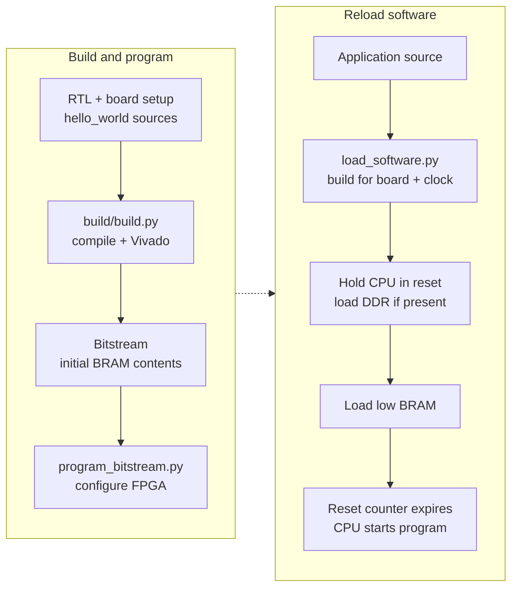

# FROST FPGA Build and Deployment

Xilinx FPGA build, programming, software-loading, and debug tools.

## Layout and flows

| Directory            | Purpose                                    |
|----------------------|--------------------------------------------|
| `build/`             | Synthesize and generate bitstream          |
| `program_bitstream/` | Program FPGA with bitstream via JTAG       |
| `load_software/`     | Load software images into low BRAM and optional DDR without reprogramming |
| `debug/`             | OpenOCD configurations for the RISC-V debug module (simulation and X3) |



`build/build.py` compiles `hello_world` for the initial BRAM image before
synthesis. Software reload uses `load_software/load_software.py`, which
rebuilds the selected app by default and loads `sw.txt` plus any
`sw_ddr.txt`; `--skip-build` reuses eligible existing artifacts.

BRAM writes use JTAG-AXI through the AXI-to-BRAM controller. DDR images use
the board's separate burst-capable JTAG-AXI master. When a DDR image is
present, the loader first writes one BRAM word to assert CPU reset, loads
DDR while periodically re-arming that reset, then writes the full BRAM
image. The CPU starts after the image-load reset counter expires. See the
[board integration diagram](../docs/diagrams/x3-board-integration.svg) for
the two loading paths and reset dependencies.

The RISC-V debug module (Phase 3 M3) shares the FPGA's own TAP through two
BSCAN USER chains (see `../boards/README.md`); `debug/` holds the OpenOCD
configurations. The cable has one owner, so close hw_server before starting
OpenOCD:

```bash
openocd -f fpga/debug/openocd_x3.cfg
riscv-none-elf-gdb sw/apps/hello_world/sw.elf -ex 'target extended-remote :3333'
```

`openocd_sim.cfg` is the same target over `remote_bitbang` against the
cocotb bench (`debug_openocd_test`). Software breakpoints work in BRAM and
DDR code alike. There are no hardware triggers, and memory is reached
through the program buffer rather than a system bus, so `load` of a whole
image is slow. Use the JTAG loader for images and the debugger for debugging.

### VS Code debugger spike (Phase A)

The repository's [launch configuration](../.vscode/launch.json) and
[OpenOCD task](../.vscode/tasks.json) use Microsoft's unmodified `cppdbg`
adapter. This is a bare-metal X3 attach experiment; it does not automate
programming or the handoff between Vivado and OpenOCD.

Open the repository root in official VS Code on the Linux FPGA host, or
through Remote-SSH to that host. Install the recommended Microsoft C/C++
extension on that host. Its VS Code environment needs `riscv-none-elf-gdb`,
`openocd`, `python3`, and `bash` on `PATH`; Vivado program/load commands run
natively. Check which `hw_server`, OpenOCD, and programming/regression jobs
are active before taking the cable. Coordinate with their owners; never
stop another session's server.

1. Use the existing [programming](#programming-the-fpga) and
   [software-loading](#loading-software) commands in a free cable window.
   For source debugging, load `hello_world` with `--debug`. The loader
   rebuilds and validates the ELF with the source-debug profile.
   Supply the actual board clock through `FROST_CPU_CLK_HZ` when it differs
   from the board default.

   ```bash
   ./fpga/load_software/load_software.py x3 hello_world --debug --target '<target serial>'
   riscv-none-elf-readelf --sections sw/apps/hello_world/sw.elf
   ```

   Confirm `.debug_info` and `.debug_line` exist. Keep this exact loaded
   `sw.elf` for the debugger; the app-directory ELF need not match a bitstream's
   embedded application. Ordinary builds do not enable DWARF by default.
   After the loader exits, wait at least
   `ceil(4 * 2^27 * 1000 / CPU_clock_Hz) + 250` milliseconds before starting
   OpenOCD/F5: 3.830 seconds at 150 MHz or 2.040 seconds at 300 MHz. The
   27-bit image-reset counter runs at CPU clock/4 and holds the debug module
   in reset too. An immediate DMI request while that reset was active left
   the transport persistently busy during the hardware spike. The
   [FROST extension](../tools/vscode-frost/README.md) performs this wait
   automatically for its load commands; its clock setting must match the
   programmed bitstream.
2. Close the Hardware Manager connection and stop the `hw_server` you started.
   Closing the client alone may leave its server holding the cable. Check
   that the cable and local GDB port 3333 are free.
3. Select **FROST: X3 loaded hello_world (Phase A)** in Run and Debug, then
   press F5. Enter the FT4232H JTAG bridge's serial at the prompt (the value
   normally used for `FROST_JTAG_SERIAL`). The background task rejects an
   empty serial or an occupied port, binds GDB to loopback, disables Tcl and
   telnet listeners, and waits for OpenOCD's GDB readiness message. It uses
   the host-compatible `gdb_port`, `tcl_port`, and `telnet_port` commands.
   Output is copied to the ignored `.vscode/openocd-phase-a.log`, overwritten
   on each OpenOCD launch. A task failure must be fixed before retrying;
   do not select **Debug Anyway**. Set `debug.onTaskErrors` to `abort` in
   your local VS Code settings to abort recognized prelaunch errors. Failure
   detection for background tasks is not fully reliable: verify this task's
   current terminal/log shows a successful OpenOCD startup before debugging.
4. Check halt, registers, disassembly, a source breakpoint, stepping, and
   continue/pause. The configuration starts GDB and attaches to the already
   loaded image; it does not issue `load`, reset, or run-to-entry commands.
   The CPU can execute during the cable handoff, so this does not promise a
   fresh stop at `main`. Reset behavior must be evaluated separately; DDR
   initialized data is not restored by reset alone.
5. Before stopping the session, pause the CPU and enter `-exec detach` in
   the Debug Console so GDB can remove software breakpoints and detach.
   The task installs an OpenOCD detach event that resumes the CPU; the
   hardware spike confirmed this preserves execution without reset.
   Then stop the debug session if it is still open and use **Tasks: Terminate
   Task** for **FROST: start OpenOCD
   (Phase A)**, or Ctrl+C in that task's terminal. Verify that this OpenOCD
   process exited before using Vivado again. VS Code's Stop button alone
   does not terminate the background task, and a launch-session Stop can
   otherwise request target termination. The detach event also resumes the
   CPU when a debugger connection closes after a crash; breakpoint
   restoration in that case is unproven, so reload the image before
   relying on its contents.

FROST has no hardware code breakpoints or data watchpoints. The launch
configuration forces software code breakpoints and sets both remote
hardware limits to zero. Plain `cppdbg` can still display a data-breakpoint
action; leave it unused. No DAP filter is included in this spike.

The hardware spike with C/C++ 1.29.3 verified source breakpoints, step
into/over/out, locals, and the call stack. RV64 integration is incomplete:
MIEngine warns that it assumes `x86_64` although GDB reports `riscv:rv64`.
The default target description makes the native Registers view fail on
unsupported `vcsr`; use
`-exec info registers pc sp ra a0` in the Debug Console for selected
registers. Watches of `$pc`, `$sp`, `$ra`, and `$a0` also work. With the RAM
map below, the native DDR Disassembly view and instruction stepping over
4-byte and 2-byte instructions worked. Initial BRAM disassembly prefetch
wrapped below address zero; a fresh BRAM session with the map has not been
retested. `-exec x/16i $pc` works in the Debug Console. The native view can
retain stale software-breakpoint bytes after console breakpoint deletion;
console disassembly and direct OpenOCD memory checks verified the original
instructions were restored on the target.
The configuration leaves `targetArchitecture` unset because specifying an
unrelated architecture would not supply RV64 support.

The extension's 0.1 hardware checks covered optional
`frost.registerDescription: core`: Registers → CPU expanded, and an MI bulk read returned all
68 selected CPU/FPU registers, including `fflags`, `frm`, and `fcsr`,
without the `vcsr` error. Its guarded program/load/OpenOCD/`cppdbg` startup,
attach at the current PC with a private ELF copy, and managed detach/resume
also passed hardware checks. BRAM load-and-debug automatically stopped at
`main` (`0x6a8`); source breakpoints and step over/into/out passed, and
native register reads refreshed after stepping with updated SP and PC.
Managed DDR load-and-debug also passed: the 3830 ms guard preceded a halt
at `0x800006d4`, a source breakpoint stopped at `0x800006be`, and native
mixed-width instruction stepping, core-register reads, a 64-bit RAM
write/read/restore, and UART-backed detach/resume all worked. DDR still
attaches at the current PC and does not promise a fresh stop at `main`.
These extension checks are separate from the manual Phase A configuration
above. If a load is cancelled, the
extension waits for confirmed loader exit and the full reset interval
before accepting another operation.

The extension's 0.2 additions provide **FROST: Load Software** over the
current loader application registry, an integrated **FROST Serial**
terminal, and optional focus-layout/profile commands. Plain Load Software
uses the normal build profile and asks for application, default layout or
DDR relocation, actual CPU clock, and CoreMark-PRO mode when applicable.
Default layout can include DDR; it does not force every application into
BRAM. The command leaves the program running without starting a debugger.
Its separate `frost.loadTimeoutMs` defaults to two hours for first Linux builds.

FROST Serial opens automatically by default, prefers a stable by-id UART
matching the selected X3, and otherwise uses the repository's `/dev/ttyUSB3`
default at 115200 8N1. It supports RX and typed TX without local echo, keeps
its own descriptor across managed JTAG work, and reasserts raw baud settings
afterward without flushing RX. Existing external serial readers are refused
and left untouched. Debugger detach leaves the terminal open; close it with
**FROST: Close Serial Console** or Ctrl+]. CPU halt naturally pauses UART output.
Close and reopen the console after changing its port or baud settings.
See the [extension quickstart](../tools/vscode-frost/README.md) for install,
settings, and the optional independent FROST Debug profile. The 0.2 update
has 88 passing TypeScript tests and 24 passing Docker Python tests. Actual
workbench checks passed for focus Apply/Zen/Restore and importing a separate
profile without replacing Default. On X3 at 150 MHz, live serial RX and typed
TX, console coexistence with managed load/debug and detach, and a normal-profile
plain CoreMark load passed; CoreMark printed validation and `<<PASS>>` without
a debugger. Programming reopened the closed console automatically and restored
live output. A separate reader was refused with its termios unchanged; reconnect
and final cleanup passed while the independent timing build kept running.
This does not establish all-app or interactive Linux-shell coverage.

Extension 0.3 uses one repository-backed application/layout/clock picker for
Configure Target and both load-and-debug commands, saving completed debug
choices for later Attach. The repository currently marks 47 of 49 loader apps
as eligible. `linux_boot` and `opensbi_smoke` remain visible with load-only
reasons because their composite images require multi-ELF debugging. Cancelling
or rejecting a selection preserves an existing debug session before handoff.
CoreMark-PRO aliases resolve to their shared build directory and retain the
selected workload/run mode. Their debug-build timings are not benchmark scores.
`freertos_demo` offers source/CPU debugging without RTOS task awareness.

Startup now follows the validated ELF. A BRAM entry at zero without initialized
writable DDR data resets to `main`, or stops at PC zero if `main` is absent.
The five standalone assembly loader apps use this latter stop in their default
BRAM layout. DDR execution, initialized writable DDR data, or another entry
address selects current-PC attach; even a BRAM/default-layout choice can need
this behavior. Reset does not restore initialized DDR data changed during the
cable handoff. The earlier 0.1/0.2 hardware evidence does not validate the new
0.3 app coverage or startup strategies; those hardware checks remain pending.

The launch configuration permits GDB memory access only in low BRAM
(`0x0`–`0x40000`) and DDR (`0x80000000`–`0xc0000000`), with exclusive upper
bounds. This blocks automatic reads outside RAM, including backward DDR
disassembly prefetch into device registers. OpenOCD reports data-access
failures to GDB. Debug Console RAM reads remain available; read only small,
explicit ranges. Device-register reads can consume UART/FIFO data or
acknowledge interrupts, so these are excluded from the spike's GDB map.

For configuration semantics, see Microsoft's [C/C++ launch reference](https://code.visualstudio.com/docs/cpp/launch-json-reference)
and [background task documentation](https://code.visualstudio.com/docs/debugtest/tasks#_background-watching-tasks).

### Hardware regression

`hw_regression.py` loads and UART-checks every bare-metal app that runs
unattended (`debug_target` waits for a debugger, so it is left out), runs all
nine CoreMark-PRO workloads with per-board score gates, then boots Linux to the
Buildroot login prompt. The Linux stage boots the OpenSBI + Sv39 image,
requires the userspace stress token, logs in and runs `perf stat` on the cycle
and instruction counters:

```bash
./fpga/hw_regression.py --board x3
```

The regression's `--timeout` is a common end-to-end base (build and load
included). The CoreMark-PRO sweep raises it when a workload has a larger
board-specific minimum in `../sw/apps/software_registry.py`. In particular,
X3 ZIP gets 600 seconds because its conforming official 1 MiB input generator
does several minutes of untimed repeated-`strcat` setup before the scored
interval; this budget does not alter the workload or its reported score.

## Prerequisites

- Vivado (see the [main README](../README.md#prerequisites) for the validated version)
- Python 3
- JTAG cable connected to the target board
- For remote programming: Vivado Hardware Server running on the remote host

## Supported Boards

| Board    | FPGA                       | FROST Clock | Status         |
|----------|----------------------------|-------------|----------------|
| X3       | Alveo UltraScale+ (xcux35) | 300 MHz     | Primary target |

## Quick Start

```bash
# 1. Build the bitstream
./fpga/build/build.py x3

# 2. Program the FPGA
./fpga/program_bitstream/program_bitstream.py x3

# 3. (Optional) Load different software without reprogramming
./fpga/load_software/load_software.py x3 coremark
```

## Functional-validation builds

`--cpu-clock-div N` builds the same RTL for 300/N MHz. The board top's
`CPU_CLK_DIV` generic scales the MMCM output divide and the `CLK_FREQ_HZ` the
subsystem derives its UART and timer constants from, the DDR block design
declares the divided CPU and JTAG clocks, and `hello_world` is compiled for the
divided clock. At half rate the design closes timing with hundreds of
picoseconds to spare, so the build runs one `RuntimeOptimized` placement at the
baseline uncertainty without quick-route probes or the off-grid seed, routes
with `RuntimeOptimized` only, and finishes in a fraction of the time. An
explicit `--directives`, `--num-uncertainties` or `--route-directives` is
honored instead. The README utilization table is left alone: a divided-clock
build is not the reference implementation.

Use it to separate RTL bugs from timing margin (a failure that survives at half
clock is not a setup violation), to get a bitstream quickly for functional
checks, and to run stress programs on hardware that simulation cannot afford.
Board software must match the programmed clock: set `FROST_CPU_CLK_HZ` (Hz)
for `load_software.py` and `hw_regression.py`, which then build apps and the
Linux device tree for that clock and skip the CoreMark score checks (baselines
are recorded at the rated clock).

```bash
./fpga/build/build.py x3 --cpu-clock-div 2
./fpga/program_bitstream/program_bitstream.py x3
FROST_CPU_CLK_HZ=150000000 ./fpga/hw_regression.py --board x3 hello_world itlb_test
FROST_CPU_CLK_HZ=150000000 ./fpga/hw_regression.py --board x3 linux_boot
```

## Fetch-seam ILA captures

`--debug-ila` instruments the fetch seam with a Vivado ILA: synthesis compiles
the `FROST_DEBUG_FETCH_ILA` mirror nets in (IF stage, fetch provider, immu,
the IF-to-PD and PD-to-ID packets, commit and trap pulses; the low 16 PC bits
of each), inserts one debug core on the CPU clock over every marked net, and
the bitstream step writes the probes file beside the bitstream. Combine it with
`--cpu-clock-div 2` for a fast build with timing to spare. The capture is
scripted so the JTAG target is never held while the loader and the boot use
it:

```bash
./fpga/build/build.py x3 --cpu-clock-div 2 --debug-ila
./fpga/program_bitstream/program_bitstream.py x3
./fpga/debug/capture_fetch_ila.py x3 hook --offset 5e4   # trigger: fetch-fault packet at that page offset
FROST_ILA_ARM_HOOK=fpga/build/x3/work/ila_arm_hook.tcl \
  FROST_ILA_COLLECT_HOOK=fpga/build/x3/work/ila_collect_hook.tcl \
  FROST_CPU_CLK_HZ=150000000 ./fpga/hw_regression.py --board x3 linux_boot
./fpga/debug/fetch_ila_report.py fpga/build/x3/work/fetch_ila.csv --before 200 --only if_ fp_
```

Arming, waiting and collecting share one Hardware Manager session, because
the device refresh every new session performs resets the core, and the
software loader's own refresh would reset a capture armed before it. `hook`
therefore writes two scripts that `load_software.py` (hence
`hw_regression.py`) sources: `FROST_ILA_ARM_HOOK` right after its refresh,
before the CPU is released, and `FROST_ILA_COLLECT_HOOK` after the load
sentinel, where it waits for the trigger and writes the CSV. The trigger is
the IF fault packet (`== 1`) with its PC probe `== X<offset>` (the page number
masked), keeping 3072 of 4096 samples before the trigger. `capture` is the
standalone form for a program that is already running. `fetch_ila_report.py`
prints the CSV as a cycle table with the mirror names.

## Building

The [NIC post-opt setup record](build/x3_post_opt_nic_timing.md) documents
the 300 MHz CPU / 40 MHz loopback MAC result, verification, checkpoint
provenance and remaining implementation scope.

`build/build.py` compiles `hello_world` into the board's initial BRAM
contents, then runs the Vivado pipeline. Every step writes a checkpoint, so
`--start-at` and `--stop-after` can resume from or stop after any step.
Non-sweep steps use their defaults unless a `--*-directive` flag overrides
them. The current X3 target builds RV64GCB; board configuration remains
table-driven so another target can be added without restructuring the flow.

Promoting a new post-opt checkpoint deletes ad hoc `audit_post_opt_*` reports
and retired `post_opt_fence_*` diagnostics from the work directory, so neither
can be mistaken for evidence about the new DCP. Regenerate manual audits from
the promoted checkpoint.

The build flow adds no false-path or multicycle exceptions to the X3 CPU
datapath. Existing board and IP crossing constraints remain active, including
the NIC's per-bus max-delay and bus-skew limits. A functional false path
through the front end would be sound only if the released control
were stable across the cycle before every sensitive cycle, and the front-end
recovery state does not guarantee that. The one cut that was tried was worth
12 ps of post-opt WNS and was retired. The `prediction_release` formal target
proves that the atomic target handoff suppresses old-path buffer validity,
exercises both raw-capture cofactors, keeps the integrated release sources
clear, and masks every pending-state consumer outside a live episode.
`../tests/test_fpga_build.py` locks the flow against exceptions.

Commit-mispredict recovery has one structural gate. The front-end validity
tracker exports preflush slot candidates, and `dispatch.i_flush` applies the
single architectural recovery qualification before any allocation side
effect. The recovery-qualified companions remain debug and invariant views.
Assertions in `cpu_ooo` and `dispatch` check that the direct gate suppresses
both slots and that the preceding recovery edge has cleared even the preflush
candidates before the gate reopens.

Both X3 route stages sweep every router directive in parallel unless
`--route-directives` names a subset; a single directive is a single route run.
A sweep of one job (placer or router) streams its Vivado output to the
terminal instead of leaving it in the work directory's log.

X3 placement ignores `--place-directive`. By default it runs four directives
(`ExtraNetDelay_high`, `ExtraPostPlacementOpt`, `AltSpreadLogic_high`, and
`AltSpreadLogic_medium`) at six setup uncertainties from 0.500 to 0.250 ns: a
24-job grid plus the off-grid `ExtraPostPlacementOpt`/0.425 seed preserves the
original 25 controls. Two additional variants apply `CELL_BLOAT_FACTOR=LOW`
to `*u_tomasulo/u_int_rs` at `ExtraNetDelay_high`/0.350 and
`ExtraPostPlacementOpt`/0.450, for 27 default jobs. These alternatives compete
under the same scoring and selection rules; they are not forced winners.
`--directives` accepts a nonempty unique subset of legal directives;
`--num-uncertainties` accepts 1–10 values in 50 ps steps from 0.500 ns (the tenth
is 0.050 ns). The grid size is the product of both counts; the qualified
off-grid seed is appended unless the grid already contains it. A LOW variant
is added only when its corresponding control remains in the requested grid.

Explicitly setting either `FROST_PLACE_CELL_BLOAT` or
`FROST_PLACE_CELL_BLOAT_CELLS` disables the automatic LOW variants and preserves
the manual override behavior for the original control sweep. The factor may
be `LOW`, `MEDIUM`, or `HIGH`; the target defaults to `*u_tomasulo/u_int_rs`
and accepts comma- or space-separated hierarchy patterns. An explicitly empty
`FROST_PLACE_CELL_BLOAT` requests a control-only sweep with no bloat. Every
automatic LOW variant must record exactly one successful integer-RS hierarchy
match before it can be ranked. Variant work-directory labels include
`_bloatLOW_intRS`, and generated utilization provenance retains the applied
factor and hierarchy pattern.

After a successful build, the generated README utilization table uses the
active board's last completed report stage, including runs stopped after opt
or place. Existing route/final reports from an older build cannot supersede
that stage; the promoted placement recipe, including LOW cell bloat, remains
in its provenance. If the selected utilization report is missing, refresh
warns and omits that board from the collected data rather than borrowing
another stage. If no boards have data, the existing README table is left
untouched. Missing matching timing leaves its clock/timing status unknown.
Running `build/extract_timing_and_util_summary.py` standalone retains its existing
most-advanced-available selection; boards outside the active build do too.

Three qualified directive/uncertainty pairs use a temporary placer cost group:
`ExtraNetDelay_high`/0.500 and `ExtraPostPlacementOpt`/0.450 or 0.425. The
LOW variant at a qualifying pair requires the same group and audit. The
group holds the paths from the fourteen predecode-metadata launches to
selected and state PC bits 0–63, sequential halfword-PC bits 0–62, and
pending-valid. Those launches are the pinned low-address scalar LUTRAM output
FFs of `IsCompressedLo/Hi`, `EvenLocalPairValid`, `PairableNativeLo`,
`PairableCompressedHi`, `PairableNativeHi`, and `Slot2StartValidLo` on both
IMEM parities, and all fourteen must match exactly. Topology-derived queries
require one canonical endpoint per architectural bit/control, only FD endpoints
on `clock_from_mmcm`, disjoint families, and no unexpected namespace members.

The audit repeats these invariants after placement and a clean DCP reopen.
Each validation also requires every individual launch to retain a timing path
to its intended endpoint family; aggregate connectivity from the remaining
launches cannot hide a disconnected source.
Physical synthesis may change noncanonical replica names and counts, so they
are reacquired after placement; the reopen must then preserve the complete
post-place launch and endpoint-name sets. The custom group must own no paths,
and the cone must return to `clock_from_mmcm`, before scoring at the restored
0.500 ns uncertainty. The winning guided seed promotes its audit and cone
report; an unguided winner clears them. The historical `compressed` group,
audit, and report names remain stable although the cone now covers every
predecode metadata predicate on both parities.

Placement rejects congestion estimates at
`FROST_PLACE_CONGESTION_VETO_LEVEL` (default 5). If every seed is rejected, the
least-congested survive. The leading
`FROST_PLACE_QUICK_ROUTE_COUNT` candidates (default 3) by
zero-uncertainty-equivalent WNS are quick-routed at real constraints; routed
WNS selects the winner, with router congestion warnings last. A count of zero
uses post-place WNS. The promoted checkpoint retains 0.500 ns uncertainty until
routing.

```bash
# Full build with default directives
./fpga/build/build.py x3

# Override the board's default synthesis directive (AlternateRoutability)
./fpga/build/build.py x3 --synth-directive PerformanceOptimized

# Resume at the x3 placement sweep
./fpga/build/build.py x3 --start-at place

# Run only placement with a 2×4 grid plus the off-grid seed (9 jobs)
./fpga/build/build.py x3 --start-at place --stop-after place \
  --directives ExtraNetDelay_low ExtraTimingOpt --num-uncertainties 4

# Synth only
./fpga/build/build.py x3 --stop-after synth

# Route with one directive instead of the router sweep
./fpga/build/build.py x3 --start-at route --route-directives RuntimeOptimized

# Functional-validation bitstream at 150 MHz (see below)
./fpga/build/build.py x3 --cpu-clock-div 2
```

Run `./fpga/build/build.py --help` for the full list of directives and options.

Normal X3 placement defaults to `FROST_X3_PD_TARGET_PIN_SWAPS=auto`. After
placement, canonical group restoration, the 0.500 ns rescore, and any
clean-reopen group audit, it checks whether two PD target LUTs match the
recorded `ExtraNetDelay_high`/0.350 LOW placement. Matching candidates receive
the measured physical input-pin refinement; unmatched seeds log `SKIPPED`
and continue normally. No additional `place_design`, physical optimization,
or routing command runs.

Both LUTs must match their recorded primitive, INIT, location, original pin
map, fixed flags, and unused paired BEL before either is changed. The helper
preserves logical INIT/net connectivity and cell LOC/BEL/fixed flags. It
measures global worst setup slack (WNS) and worst hold slack (WHS) before and
after refinement at the same final scoring constraints. If either global
minimum worsens, automatic mode restores the original pair and skips only
after verifying exact snapshots and original WNS/WHS. This checks the two
global timing minima; it does not claim that every individual path improves.
Failed restoration or audit-file I/O aborts the run.

Set `FROST_X3_PD_TARGET_PIN_SWAPS=0` to disable refinement, or `1` for strict
replay that fails on a mapping mismatch or rejected refinement. Other boards
default to disabled. A successful application records
`post_place_pin_swap_audit.txt`, including before/after global timing;
skipped and disabled runs clear stale pin audits. Promotion preserves the
successful audit, and generated README provenance appends
`+ PD target pin refinement` only after the helper's success message.
See the [post-place timing record](build/x3_post_place_timing.md) for the
measured checkpoint chain, pin maps, timing, and validation.

The normal placement sweep needs no refinement override. Disable its
quick-route probes to keep this run entirely within post-place:

```bash
FROST_PLACE_QUICK_ROUTE_COUNT=0 ./fpga/build/build.py x3 \
  --start-at place --stop-after place
```

A single matching placement can also use the default automatic mode natively:

```bash
frost_root=$(pwd)
fresh_opt=/absolute/path/to/current/post_opt.dcp
place_run="$frost_root/fpga/build/x3/work/refined_place"
mkdir -p "$place_run"
(
  cd "$place_run"
  FROST_PLACE_SETUP_UNCERTAINTY=0.350 \
  FROST_PLACE_CELL_BLOAT=LOW \
  FROST_PLACE_CELL_BLOAT_CELLS='*u_tomasulo/u_int_rs' \
    vivado -mode batch -source "$frost_root/fpga/build/build_step.tcl" \
      -nojournal -tclargs x3 place ExtraNetDelay_high "$fresh_opt" 0
)
```

Direct helper calls remain strict by default. To replay the retained matching
raw checkpoint, which already has 0.500 ns scoring uncertainty, use separate
output paths in native Vivado Tcl:

```tcl
open_checkpoint /absolute/path/to/raw/post_place.dcp
source /absolute/path/to/frost/fpga/build/x3_pd_target_pin_swaps.tcl
frost_x3_pd_target_pin_swaps::apply /absolute/path/to/replay/post_place_pin_swap_audit.txt
write_checkpoint -force /absolute/path/to/replay/post_place.dcp
report_timing_summary -file /absolute/path/to/replay/post_place_timing.rpt
```

Passing `auto` as the helper's second argument enables its skip behavior.
The helper changes no timing constraints. Preserve the raw input, helper and
flow hashes, invocation, pin audit, and independent clean-reopen timing audit
with the refined checkpoint; distinguish its result from raw `place_design`.
The automatic integration has bounded Tcl and cached-checkpoint validation;
a fresh complete placement sweep has not been rerun for this follow-up.

## Programming the FPGA

```bash
./fpga/program_bitstream/program_bitstream.py <board> [remote_host] [--target PATTERN] [--list-targets]
```

Arguments:

- `board`: `x3`
- `remote_host`: hostname of a remote Vivado Hardware Server
- `--target PATTERN`: target index or case-insensitive name/serial substring
- `--list-targets`: list this board's targets and exit
- `--bitstream PATH`: program a selected nonempty `.bit` file; defaults to
  `fpga/build/<board>/work/<board>_frost.bit`. File validation precedes discovery.
- `--hw-server-url HOST:PORT`: connect to an already running server at this
  endpoint, instead of implicit local startup; cannot be combined with
  `remote_host`. The caller owns and stops that server process.
- `--target-exact NAME`: require the full case-sensitive Vivado target name,
  mutually exclusive with `--target`.
- `--non-interactive`: fail on ambiguous target selection instead of prompting.

Programming and loading require exactly one FPGA device on the selected target.
Their Tcl clients close their target/server connections after success or errors;
closing a client connection does not stop `hw_server` or release its cable.

Examples:

```bash
# Local FPGA (auto-selects if only one matching target, prompts if multiple)
./fpga/program_bitstream/program_bitstream.py x3

# List available targets for this board (filtered by vendor)
./fpga/program_bitstream/program_bitstream.py x3 --list-targets

# Select target by index (from filtered list)
./fpga/program_bitstream/program_bitstream.py x3 --target 0

# Select target by serial-number substring
./fpga/program_bitstream/program_bitstream.py x3 --target 507711333S8VAA

# Remote FPGA (requires Vivado Hardware Server on remote host)
./fpga/program_bitstream/program_bitstream.py x3 fpga-server.local
```

## Loading Software

By default, the loader compiles the app before discovering hardware, for the board's clock (scaling CoreMark
iterations to the board), bursts a nonempty `sw_ddr.txt` into cached DDR
while low-BRAM keepalive writes hold the CPU in image reset, then writes the
full `sw.txt` image at `0x00000000`. The image-load reset, which every
low-BRAM write re-arms, expires after the last write and the CPU starts the
new image.

```bash
./fpga/load_software/load_software.py <board> <app> [remote_host] [--target PATTERN] [--list-targets]
```

Arguments:

- `board`: `x3`
- `app`: an application listed by `--help`
- `remote_host`: hostname of a remote Vivado Hardware Server
- `--target PATTERN`: target index or case-insensitive name/serial substring
- `--list-targets`: list this board's targets; `app` is not required
- `--hw-server-url HOST:PORT`, `--target-exact NAME`, `--non-interactive`:
  the same explicit server and selection contracts as the programmer above.
- `--debug`: use the `FROST_DEBUG=1` profile (`-Og -g3`, normally with frame
  pointers and no loop unrolling; standalone assembly gets DWARF too).
  Available for the repository's 47 single-ELF debug apps. `linux_boot` and
  `opensbi_smoke` remain load-only composite image flows. The profile adds
  debugging information without a software startup wait loop. `isa_test`
  opts out of frame pointers because its instruction tests clobber `s0`;
  `ddr_smc_test` uses a debug-only large code model to address its DDR code.
- `--build-only`: clean/build without invoking Vivado or touching JTAG. Prints
  `FROST_ELF=<path>` and `FROST_BUILD_COMPLETE` on success. With `--debug`, also
  emits `FROST_DEBUG_BUILD=<JSON>` describing the resolved app directory/ELF,
  effective layout, startup strategy, and build-configuration SHA-256.
- `--skip-build`: load current files for an eligible single-ELF app without
  rebuilding; mutually exclusive with `--build-only`. The loader checks the
  RV64 ELF, image words, debug sections when requested, and the existing Make
  configuration's memory mode, debug profile, CPU clock, and workload/run-mode
  options. CoreMark-PRO aliases use the shared registered build directory.
  It does not
  verify source freshness or freeze files. Keep the app directory unchanged
  between build and load, and point GDB at that same `sw.elf`.
- `--expected-build-config-sha256 HASH`: with `--skip-build`, require the Make
  configuration hash returned by the earlier debug build. The extension passes
  this value and checks image hashes before and after loading.

A caller that owns a server can compile before acquiring the cable, then load
the same files using its explicit endpoint and full target name:

```bash
FROST_CPU_CLK_HZ=150000000 ./fpga/load_software/load_software.py x3 hello_world --debug --ddr --build-only
FROST_CPU_CLK_HZ=150000000 ./fpga/load_software/load_software.py x3 hello_world --debug --ddr --skip-build \
  --hw-server-url 127.0.0.1:3219 --target-exact '<full Vivado target name>' --non-interactive
```

Use the CPU clock of the actual programmed bitstream. Stop only the server
process the caller started before handing the cable to OpenOCD. `debug_target`
expects debugger-driven memory/privilege/breakpoint interactions and is not an
unattended UART regression app.

Use a serial terminal configured for 115200 baud, 8 data bits, no parity, and
1 stop bit (8N1) to view the board UART console.

CoreMark-PRO workloads require `-v1` (validation) or `-v0` (performance run
with the iteration counts from `../sw/apps/software_registry.py`). Data placed
in the cached region, such as radix2's ~800 KiB FFT tables, is burst-loaded
before the low-BRAM image through the DDR JTAG master, which the loader
identifies automatically.

Examples:

```bash
# Load coremark on X3 locally
./fpga/load_software/load_software.py x3 coremark

# Load hello_world through a remote hardware server
./fpga/load_software/load_software.py x3 hello_world fpga-server.local

# Load FreeRTOS demo
./fpga/load_software/load_software.py x3 freertos_demo

# CoreMark-PRO validation and performance
./fpga/load_software/load_software.py x3 coremark_pro_core -v1
./fpga/load_software/load_software.py x3 coremark_pro_radix2 -v1
./fpga/load_software/load_software.py x3 coremark_pro_linear_alg -v0

# List targets for this board (doesn't require app argument)
./fpga/load_software/load_software.py x3 --list-targets

# Select specific target by serial number
./fpga/load_software/load_software.py x3 hello_world --target 507711333S8VAA
```

## Multiple Hardware Targets

Target discovery applies the vendor filter registered for each board,
including for `--list-targets`; X3 targets use `Xilinx`. A unique match is
selected automatically, while multiple matches prompt for selection.

Target names follow the format `hostname:port/xilinx_tcf/<vendor>/<serial>`:

- Alveo boards: `localhost:3121/xilinx_tcf/Xilinx/507711333S8VAA`

`--target` accepts a case-insensitive substring such as a serial number, or an
index (`0`, `1`, …) from the filtered list.

## Remote Programming

Start Vivado Hardware Server on the remote host, then pass its hostname:

```bash
hw_server -d  # port 3121
./fpga/program_bitstream/program_bitstream.py x3 remote-hostname
./fpga/load_software/load_software.py x3 coremark remote-hostname
```

## Customization

### Adding a New Board

1. Create `../boards/<board>/` with:
   - `<board>_frost.sv`: top-level wrapper. It generates the CPU clock and the
     /4 clock with an MMCM and instantiates `xilinx_frost_subsystem`
     (`../boards/xilinx_frost_subsystem.sv`). A DDR-capable target also
     instantiates the `ddr_subsys` block design built by
     `build/<board>_ddr_bd.tcl`, wires the cache-bridge AXI and `mem_ok`, and
     enables the cached tier. That full-system hierarchy includes the 2 MiB
     UltraRAM L2, so a DDR-capable target must provide sufficient UltraRAM. A
     BRAM-only target leaves the cached tier disabled.
   - `constr/<board>.xdc`: pin assignments and timing constraints
   - `<board>_frost.f`: file list for synthesis, including the subsystem and core

   The Xilinx IP cores (`jtag_axi_0`, `axi_bram_ctrl_0`) and, for a DDR-capable
   board, its `ddr_subsys` block design are created during synthesis by
   `build/build_step.tcl`, so no per-board `ip/` directory is needed.

2. For a DDR-capable board, add `build/<board>_ddr_bd.tcl` to assemble the
   `ddr_subsys` block design (memory controller + SmartConnect + a JTAG-AXI
   DDR-image-load master). A BRAM-only board does not need this file.

3. Register the board throughout the table-driven tool layer:
   - `BOARD_CONFIG` in `build/build.py` for its clock, FPGA family, and default
     synthesis directive, plus `BOARD_INFO` in
     `build/extract_timing_and_util_summary.py`
   - `board_build_configs` in `build/build_step.tcl` for its FPGA part and
     `has_ddr` capability; its other per-board names derive from the board key
   - `BOARD_CONFIG` in `load_software/load_software.py` for its clock, CoreMark
     iterations, and DDR capability
   - `BOARD_VENDOR_INFO` in `common/hw_target.py` and all three maps in
     `common/hw_defaults.py` for JTAG, UART, and timeout defaults
   - `supported_boards` in `program_bitstream/program_bitstream.tcl` for direct
     Tcl use. The Python build/load/programming and hardware-regression CLIs
     derive their choices from the registries above

4. Calibrate every CoreMark-PRO workload's `hardware_iterations` entry in
   `../sw/apps/software_registry.py`. If a workload's untimed setup can exceed
   the board's common timeout, also set its `hardware_timeout_minimums` entry.
   Optionally record silicon score gates in `BASELINE_SCORES` in
   `hw_regression.py`.

5. See `../boards/README.md` for the complete board-integration checklist.

### Adding a New Application

1. Add a `../sw/apps/<app>/` directory whose `make` produces `sw.txt` (one
   32-bit hex word per line) and `sw.mem`. An app that places code or data in
   the cached DDR region also produces `sw_ddr.txt`/`sw_ddr.mem`, which the
   loader bursts into DDR over the second JTAG-AXI master.

2. Register the app name in both `VALID_APPS` in
   `load_software/load_software.py` and the `valid_apps` list in
   `load_software/load_software.tcl` (the loader rejects unknown app names)

3. Load it (the loader compiles the app for the target board automatically):
   ```bash
   ./fpga/load_software/load_software.py <board> <app>
   ```

## Troubleshooting

**"No hardware targets found"**
- Check that the JTAG cable is connected and the board is powered on
- For remote: verify `hw_server` is running on the remote host
- Use `--list-targets` to see what targets are detected

**"Multiple hardware targets detected" / wrong board selected**
- Use `--list-targets` to see available targets
- Use `--target <pattern>` to select the correct board by index, vendor, or serial number

**Timing failures**
- Try different directives for the failing step (see `./fpga/build/build.py --help`)
- Check `build/<board>/work/final_timing.rpt` for failing paths
- Lowering the CPU clock means changing the MMCM parameters in
  `../boards/<board>/<board>_frost.sv` and the `clock_freq` entries in
  `build/build.py` and `load_software/load_software.py`

**Software not running after load**
- Verify the hex file format (one 32-bit word per line, no address prefix)
- Check that the low-BRAM image fits and any required `sw_ddr.txt` image was loaded

## License

Copyright 2026 Two Sigma Open Source, LLC

Licensed under the Apache License, Version 2.0 (the "License");
you may not use this file except in compliance with the License.
You may obtain a copy of the License at

    http://www.apache.org/licenses/LICENSE-2.0

Unless required by applicable law or agreed to in writing, software
distributed under the License is distributed on an "AS IS" BASIS,
WITHOUT WARRANTIES OR CONDITIONS OF ANY KIND, either express or implied.
See the License for the specific language governing permissions and
limitations under the License.
