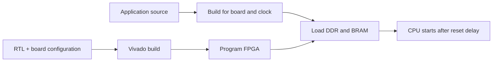

# FPGA Build and Deployment

Run these tools natively on the Linux host with Vivado (validated with 2025.2),
Python 3.12+, a JTAG cable, and the [RISC-V toolchain](../docs/tooling.md#shared-risc-v-toolchain)
on PATH. The supported target is the Alveo X3522PV at 300 MHz.

## Quick Start

```bash
./fpga/build/build.py x3
./fpga/program_bitstream/program_bitstream.py x3
./fpga/load_software/load_software.py x3 coremark
```

The bitstream includes Hello World. Loading a new app rebuilds it by default
and replaces BRAM/DDR contents without rebuilding the bitstream. Read the
UART console at **115200 baud, 8N1**.

Synthesis treats Vivado's same-named implicit-net diagnostic (`Synth 8-605`)
as an error. Declare shared signals before any generated primitive instances
that use them; a later declaration can leave separate local nets undriven.



## Programming the FPGA

```bash
./fpga/program_bitstream/program_bitstream.py x3 --list-targets
./fpga/program_bitstream/program_bitstream.py x3 --target '<serial>'
./fpga/program_bitstream/program_bitstream.py x3 --bitstream path/to/image.bit
```

Both programmer and loader accept:

| Option | Behavior |
|--------|----------|
| `--list-targets` | List targets matching the board vendor; no app required |
| `--target PATTERN` | Select by list index or case-insensitive name/serial substring |
| `--target-exact NAME` | Require the full case-sensitive target name |
| `--non-interactive` | Fail instead of prompting for ambiguous targets |
| Positional remote hostname | Connect to remote `hw_server` on port 3121 |
| `--hw-server-url HOST:PORT` | Use an existing caller-owned server; excludes the positional hostname |

A unique target is selected automatically; it must contain exactly one FPGA.
For remote use, start `hw_server -d` on that host first. Closing a Vivado
client connection does not stop the server or release its cable.

## Loading Software

```bash
./fpga/load_software/load_software.py x3 hello_world
./fpga/load_software/load_software.py x3 hello_world --ddr
./fpga/load_software/load_software.py x3 coremark_pro_core -v1
./fpga/load_software/load_software.py x3 coremark_pro_radix2 -v0
```

Use `--help` for supported apps. CoreMark-PRO requires `-v1` (validation) or
`-v0` (performance with board-calibrated iterations). The loader sets the app
clock, loads DDR while holding the CPU in reset, then loads low BRAM. See the
[board guide](../boards/README.md#jtag-based-software-loading) for reset timing.

| Option | Behavior |
|--------|----------|
| `--debug` | Source-debug build (`-Og -g3` for C); supports single-ELF apps |
| `--build-only` | Compile without cable access; report `FROST_ELF` and `FROST_BUILD_COMPLETE` |
| `--skip-build` | Validate and load existing single-ELF artifacts |
| `--expected-build-config-sha256 HASH` | With `--skip-build`, require the earlier debug build's configuration hash |

`--debug --build-only` also emits `FROST_DEBUG_BUILD` JSON for tool integration.
`--skip-build` checks ELF/images, requested debug sections, and build settings;
it does not establish source freshness. Keep build files unchanged until the
load finishes, and use that ELF in GDB. CoreMark-PRO aliases share a build
directory. `linux_boot` and `opensbi_smoke` are composite, load-only images.

## Functional-validation builds

`--cpu-clock-div N` divides the selected CPU base rate and adjusts UART, timers, loader,
and initial software. DDR and Ethernet clocks remain unchanged. These builds
use one `RuntimeOptimized` placement/route unless overridden and do not update
the reference utilization table.

Set `FROST_CPU_CLK_HZ` to the actual bitstream clock for subsequent loads and
regressions; this also adjusts the Linux device tree and disables rated-clock
benchmark score gates.

```bash
./fpga/build/build.py x3 --cpu-clock-div 2
./fpga/program_bitstream/program_bitstream.py x3
FROST_CPU_CLK_HZ=150000000 ./fpga/load_software/load_software.py x3 hello_world
FROST_CPU_CLK_HZ=150000000 ./fpga/hw_regression.py --board x3 hello_world itlb_test
```

The experimental roadmap clock is selectable with
`--cpu-base-clock-hz 322265625` (default: `300000000`). It chooses the matching
MMCM recipe, updates the block-design and initial software clocks, and requires
timing evidence for that rate. Use a separate `--build-dir` and set
`FROST_CPU_CLK_HZ=322265625` for subsequent loads and hardware regression
(divide that value too when using `--cpu-clock-div`). Selecting the rate does
not establish routed timing or a benchmark result. Target-clock builds leave
the rated utilization table unchanged.

`--single-core-performance` selects the experimental single-core configuration
at synthesis: a four-bundle decoded queue, sixteen-entry INT RS, load
preparation while the shared port is busy, and early memory wakeup. It is
independent of `--cpu-base-clock-hz`; for the roadmap experiment use both
`--single-core-performance --cpu-base-clock-hz 322265625`. This configuration
has not met routed timing and cannot update the rated README table, even at
300 MHz. A resumed checkpoint keeps its existing configuration; changing it
requires synthesis.

## Profiling counters

Counters default off at full rate and on in divided-clock builds.
`--perf-counters` / `--no-perf-counters` select the `mperf*` hardware; absent
counters read zero. The build CLI sets clock/counter values regardless of
inherited `FROST_CPU_CLK_DIV` / `FROST_PERF_COUNTERS`. Resuming after synthesis
retains the checkpoint's counter setting. See the
[counter reference](../hw/rtl/cpu_and_mem/cpu/cpu_ooo/perf/README.md).

## VS Code debugging

The [FROST extension](../tools/vscode-frost/README.md) manages programming,
loading, debugging, the serial console, and cable handoff. Run **FROST:
Configure Target** after installation.

For command-line debugging, load a matching debug ELF, wait for image reset,
stop the owning Vivado `hw_server`, then run:

```bash
openocd -f fpga/debug/openocd_x3.cfg
riscv64-linux-gdb sw/apps/hello_world/sw.elf -ex 'target extended-remote :3333'
```

The reset wait including guard is `ceil(4 * 2^27 * 1000 / CPU_clock_Hz) + 250`
ms: 2040 ms at 300 MHz, 3830 ms at 150 MHz. Whole images use the JTAG loader;
program-buffer memory access is slower. Software breakpoints work in BRAM
and DDR; hardware breakpoints and data watchpoints are unavailable.

The manual [.vscode launch configuration](../.vscode/launch.json) attaches to
an already loaded image using **FROST: X3 loaded hello_world (Phase A)** and
the matching OpenOCD task. It attaches at the current PC without reset or a
`main` stop. Check `.vscode/openocd-phase-a.log` before retrying failures.
Finish by pausing, entering `-exec detach`, stopping the session, and terminating
the OpenOCD task before returning to Vivado. Reload after a debugger crash or
when initialized DDR data must be restored. GDB excludes device registers
with read side effects; see [debugger limits](../tools/vscode-frost/README.md#debugger-scope).

## Hardware regression

`hw_regression.py` runs bare-metal apps, all nine CoreMark-PRO workloads,
Debian from NFS, and an end-of-run ECC check. Prepare the
[Debian export](../docs/debian_nfsroot.md#hardware-regression) and set the
Git-ignored `fpga/site.env`:

```text
FROST_LINUX_NFSROOT=192.0.2.1:/srv/nfs/debian
FROST_LINUX_IP=192.0.2.2::192.0.2.1:255.255.255.0:frost:eth0:off
```

```bash
./fpga/hw_regression.py --board x3
```

The runner needs local access to the export, write access to its
`usr/local/bin`, and a Linux cross compiler (`FROST_LINUX_CROSS_COMPILE`
overrides discovery). It uses the pinned kernel and matching initramfs; `FROST_LINUX_KERNEL` and
`FROST_LINUX_INITRD` override them. Environment values override `site.env`.
Preflight reports `ENV_FAIL` before board access. Interactive `debug_target`
and `nic_echo` are excluded; `perf_off_test` is skipped on profiled divided-clock
builds. `--timeout` includes build/load time, with workload-specific minimums
(X3 ZIP needs 600 seconds).

`ddr_ecc/ddr_ecc_status.py` reads accumulated controller errors; `--clear`
starts a new measurement interval. `linux_boot_soak.py` repeats boots of the
smaller test image.

## Building

`build/build.py` compiles `hello_world` into the board's initial BRAM
contents, then runs the Vivado pipeline. Every step writes a checkpoint, so
`--start-at` and `--stop-after` can resume from or stop after any step.
Non-sweep steps use their defaults unless a `--*-directive` flag overrides
them.

`--jobs N` (or `-j N`, default 12) limits concurrent Vivado sweep jobs per
invocation. It does not change each process's thread count. Account for
combined memory use when running multiple builds on one host.

X3 placement uses a sweep; `--place-directive` is ignored. Defaults are:

- Four directives: `ExtraNetDelay_high`, `ExtraPostPlacementOpt`,
  `AltSpreadLogic_high`, and `AltSpreadLogic_medium`.
- Six setup uncertainties from 0.500 to 0.250 ns, plus an off-grid
  `ExtraPostPlacementOpt`/0.425 seed.
- Two integer-RS `CELL_BLOAT_FACTOR=LOW` variants at
  `ExtraNetDelay_high`/0.350 and `ExtraPostPlacementOpt`/0.450: 27 jobs total.

Use `--directives` to choose directives and `--num-uncertainties` for 1–10
values in 50 ps steps from 0.500 ns. The off-grid seed is included once;
LOW variants are included only when their base recipe is selected.
Divided-clock builds omit the extra variants.

Set `FROST_PLACE_CELL_BLOAT` to `LOW`, `MEDIUM`, `HIGH`, or empty for none.
`FROST_PLACE_CELL_BLOAT_CELLS` accepts comma- or space-separated hierarchy
patterns, defaulting to `*u_tomasulo/u_int_rs`. Setting either variable
disables the automatic LOW variants.

Both route stages sweep `Explore`, `AggressiveExplore`, `NoTimingRelaxation`,
and `AlternateCLBRouting`. Override with `--route-directives`; a single
directive runs once and streams output to the terminal. Divided-clock builds
use one `RuntimeOptimized` route by default.

Placement below −0.200 ns setup slack at the actual CPU clock with zero added
setup uncertainty produces a warning. If no candidate meets that threshold,
the build continues with the best checkpoint and reports into post-place
phys-opt. The X3 CPU datapath uses no false-path or multicycle timing exceptions.

Passing candidates are ranked by congestion and timing:

- `FROST_PLACE_CONGESTION_VETO_LEVEL` defaults to 5. If every candidate is
  vetoed, those with the lowest congestion survive. In reports, `none` means
  no windows reached the reporting threshold; `N/A` means the report was unreadable.
- `FROST_PLACE_QUICK_ROUTE_COUNT` defaults to 0. A positive value probes
  leading candidates and selects by routed WNS; otherwise post-place WNS wins.
- Post-place phys-opt runs with 0.500 ns added setup uncertainty; routing and
  post-route phys-opt use 0.000 ns. Promoted reports and checkpoints always
  use 0.000 ns. `FROST_PHYSOPT_SETUP_UNCERTAINTY` overrides all three phys-opt
  stages, so it also affects post-route sweeps.

Keep `post_place_gate.txt`, `post_place_gate_binding.json`, and
`*.lineage.json` alongside their checkpoints when copying a build directory.
Resumed stages verify this metadata against their inputs. A new synthesis or
optimization result invalidates the previous placement approval, so rerun
placement before resuming downstream stages. Missing or stale downstream
lineage requires `--start-at post_place_physopt` from a qualified placement.
`netlist_config.json` records profiling counters, the single-core profile,
the base clock and its divider at synthesis. Resumed builds use this record
when deciding whether to update the rated table; omitting experimental flags
cannot relabel a checkpoint. Older checkpoints without recorded clock/profile
settings need a new synthesis before they can update that table.

Promoting a new post-opt checkpoint removes `audit_post_opt_*` and
`post_opt_fence_*` reports from the work directory. Save any reports you need
before rerunning optimization.

The build updates the root README's utilization table from its last completed
stage. The standalone `build/extract_timing_and_util_summary.py` instead uses
the most advanced available reports.

To route a completed phys-opt sweep while further sweeps continue, fork it
into a separate board build directory:

```bash
./fpga/build/build.py x3 --start-at route --stop-after route \
  --snapshot-physopt-from fpga/build/x3/work \
  --build-dir fpga/build/x3/work_early_route --jobs 2
```

The destination must be new. The snapshot copies a completed sweep with its
placement, reports, and metadata, and verifies that the source stays unchanged
during the copy. A running sweep needs a launch manifest; otherwise wait for
the stage to finish before taking the snapshot.

`--build-dir` selects the directory containing `work/` and all per-stage
worker directories. The fork's reports and bitstream stay there, and it leaves
the reference README utilization table alone. Resume
the fork with `--build-dir` alone; omit `--snapshot-physopt-from` once it exists.
As in the normal flow, closing route timing promotes `final.dcp` and generates
a bitstream even with `--stop-after route`. The source build continues its
own requested pipeline independently.

Run `./fpga/build/build.py --help` for directive and stage options.

## Fetch-seam ILA captures

`--debug-ila` adds a Vivado ILA for fetch, translation, commit, and trap
signals, including the low 16 PC bits, and writes a probes file beside the
bitstream. Combine it with `--cpu-clock-div 2` for a faster build.

```bash
./fpga/build/build.py x3 --cpu-clock-div 2 --debug-ila
./fpga/program_bitstream/program_bitstream.py x3
./fpga/debug/capture_fetch_ila.py x3 hook --offset 5e4   # trigger: fetch-fault packet at that page offset
FROST_ILA_ARM_HOOK=fpga/build/x3/work/ila_arm_hook.tcl \
  FROST_ILA_COLLECT_HOOK=fpga/build/x3/work/ila_collect_hook.tcl \
  FROST_CPU_CLK_HZ=150000000 ./fpga/hw_regression.py --board x3 linux_boot
./fpga/debug/fetch_ila_report.py fpga/build/x3/work/fetch_ila.csv --before 200 --only if_ fp_
```

Use `hook` for a load-triggered capture: the loader arms after its device
refresh and collects in the same Hardware Manager session. A new session's
refresh resets the core and would lose a previously armed capture. `capture`
is the standalone form; `fetch_ila_report.py` decodes the CSV. The default
trigger matches a fetch fault at the page offset, with 3072 pre-trigger
samples out of 4096.

## NIC transceiver

The X3 uses GTY X0Y28, QPLL0, and a 161.1328125 MHz reference. The build creates
`x3_nic_gty_wiz` from `build/x3_gty_ip.tcl`. LPM equalization is the default;
`FROST_GTY_RX_EQ=DFE` selects DFE during synthesis. Loopback uses near-end PMA.
Without block lock, RX PCS reset retries every 100 ms and a full RX reset
occurs every tenth retry. Full reset drops RX READY; the driver re-enables
receive when carrier returns.

## Customization and troubleshooting

For new boards, use the [board checklist](../boards/README.md#adding-support-for-new-boards).
For applications, use [sw/CONTRIBUTING.md](../sw/CONTRIBUTING.md#adding-a-new-application).

- **No target:** check power, cable, server, and `--list-targets`.
- **Wrong/ambiguous target:** select `--target` or `--target-exact`.
- **Timing failure:** inspect `build/<board>/work/final_timing.rpt` and try the
  relevant directive options. Changing the rated clock also requires board
  MMCM and build/loader clock metadata updates.
- **App does not run:** check the actual CPU clock, low-BRAM capacity, and that
  any required DDR image was loaded.

## License

Copyright 2026 Two Sigma Open Source, LLC

Licensed under the Apache License, Version 2.0 (the "License");
you may not use this file except in compliance with the License.
You may obtain a copy of the License at

    http://www.apache.org/licenses/LICENSE-2.0

Unless required by applicable law or agreed to in writing, software
distributed under the License is distributed on an "AS IS" BASIS,
WITHOUT WARRANTIES OR CONDITIONS OF ANY KIND, either express or implied.
See the License for the specific language governing permissions and
limitations under the License.
