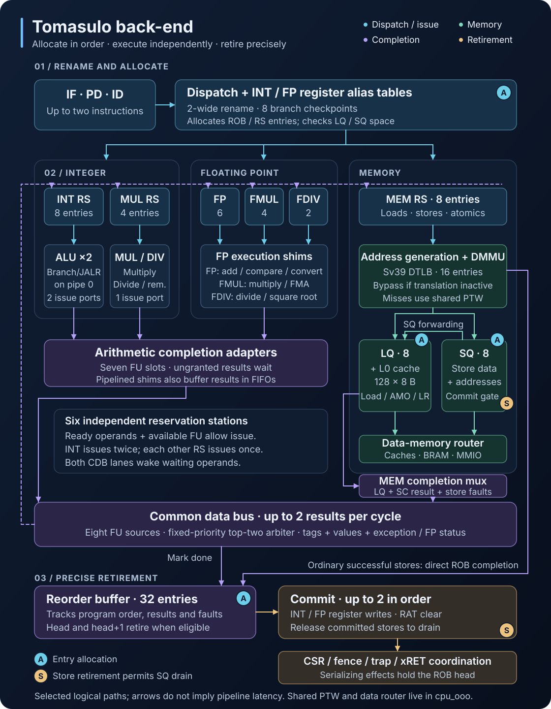

# FROST Tomasulo Out-of-Order Back-End

This directory is the out-of-order half of the FROST CPU. The in-order front
end fetches and decodes up to two instructions per cycle. The back end renames
them, parks them in reservation stations (RS) until their operands are ready,
executes them out of order, and retires them in program order from a 32-entry
reorder buffer (ROB), so exceptions stay precise. The core implements RV64GCB
plus Zicntr, Zicond, Zbkb, and Zihintpause (see the
[ISA table](../../../../../README.md#supported-risc-v-extensions)).

Dispatch, rename, the common data bus (CDB), and commit are all two wide. Six
reservation stations feed eight functional-unit (FU) slots. The integer
station issues two operations per cycle to two ALUs, with branches and JALR
only on the first; every other station issues one. Up to seven operations can
therefore start in one cycle. A result on either CDB lane can wake a waiting
RS entry and let it issue in the same cycle.



Dispatch allocates ROB, RS, and LQ/SQ entries before issue. Arithmetic results
reach the CDB through per-unit adapters. Memory operations translate their
addresses and go through the load and store queues. A successful ordinary
store marks its ROB entry done directly and never uses the CDB; loads, atomics,
SC results, and store faults complete through the MEM slot. The diagram shows
selected logical paths rather than pipeline timing; matching `A` and `S`
badges identify allocation and store-retirement connections.

## Directory contents

| Submodule | Role |
|-----------|------|
| [`tomasulo_wrapper/`](tomasulo_wrapper/README.md) | Instantiates the blocks below, except `dispatch` and the page-table walker, which `cpu_ooo` instantiates, and holds the glue between them |
| [`../mmu/`](../mmu/) | Sv39 translation. The data MMU (`dmmu`, with a 16-entry fully associative `dtlb`) sits in the wrapper between address generation and the LQ/SQ, bypassed while translation is off. The read-only page-table walker (`ptw`) lives in `cpu_ooo` and serves both the data and instruction MMUs. |
| [`dispatch/`](dispatch/README.md) | Two-wide rename and resource allocation |
| [`reorder_buffer/`](reorder_buffer/README.md) | In-order commit, precise exceptions, serializing instructions |
| [`register_alias_table/`](register_alias_table/README.md) | INT and FP rename tables, branch checkpoints |
| [`reservation_station/`](reservation_station/README.md) | Generic RS, instantiated six times |
| [`load_queue/`](load_queue/README.md) | Loads, L0 cache, MMIO, LR/AMO |
| [`store_queue/`](store_queue/README.md) | Stores, store-to-load forwarding, drain to memory |
| [`cdb_arbiter/`](cdb_arbiter/README.md) | Two-lane CDB priority arbiter |
| [`fu_cdb_adapter/`](fu_cdb_adapter/README.md) | One-entry holding register per FU slot |
| [`fu_shims/`](fu_shims/README.md) | Adapters from RS issue ports to the functional units |

Some blocks split out helper modules, such as `rob_serializer` and
`sq_forwarding_unit`; each parent README documents its helpers.

The CPU top level, `../cpu_ooo/cpu_ooo.sv`, instantiates the front end,
`dispatch`, and `tomasulo_wrapper`. Logic that spans the front and back ends,
such as branch recovery and memory-port routing, lives in `cpu_ooo`'s own
submodules (`branch_recovery/`, `memory_if/`, and others). See the
[CPU README](../README.md).

## Cross-cutting design notes

### Conservative memory disambiguation

Loads can execute out of order with respect to each other, but a load waits
until the address of every older store is known. If the newest older store
that overlaps the load covers all of its bytes and has its data, the SQ
forwards the data. If that store covers only some of the bytes, has no data
yet, or is an MMIO store or store-conditional (which never forward), the load
waits and checks again. With no overlapping older store, the load reads the
L0 cache or memory. See the
[store queue](store_queue/README.md#store-to-load-forwarding) for the rules.

Stores write memory only after they commit. An MMIO load issues only at the
ROB head, and its device read also waits for committed stores to drain, so no
device access is speculative. There is no memory-dependence prediction or
replay; the conservative gate costs some IPC on memory-heavy code.

### Two-tier branch recovery

Every branch, JAL, and JALR takes one of eight checkpoints at dispatch: a
snapshot of both RATs plus the return-address stack's top-of-stack pointer and
valid count. While all eight are in use, a branch or jump waits at dispatch;
other instructions still dispatch.

Conditional-branch mispredictions recover early. When `branch_jump_unit`
resolves one, `early_misprediction_recovery` (in `cpu_ooo/branch_recovery/`)
captures it. The next cycle it redirects the front end and restores the RAT,
and the cycle after that it removes younger back-end work with an age-based
partial flush. A misprediction costs about two cycles.

JALR mispredictions recover at commit instead. The JALR retires first, so
every uncommitted instruction left in the back end is younger, and the back
end flushes all of them. Exceptions go to the trap logic at commit and cause a
full flush; trap entry also applies the privilege and delegation rules.

### Serializing instructions

`rob_serializer` holds most of these instructions at the ROB head until their
side effects are safe. The LQ and SQ order atomics instead (last row).

| Class | Ordering |
|-------|----------|
| WFI | Waits at the head for a pending interrupt. |
| CSR | Runs its read/update handshake at the head. The value read reaches the register file through a delayed writeback at commit, and the front end holds younger instructions until then, because the CDB carries the CSR's write operand, not the value it reads. Translation CSRs also wait for committed stores to drain. |
| FENCE / FENCE.I / SFENCE.VMA | Wait for committed stores to drain. FENCE.I and SFENCE.VMA then wait for L1D writeback and L1I invalidation, and flush fetch; SFENCE.VMA also invalidates the TLBs and the page-table walker. |
| xRET | Handshakes with the trap unit and returns to `mepc`, `sepc`, or `dpc`. |
| AMO / LR / SC | AMO and LR leave the LQ only at the ROB head, and an AMO also waits until no committed stores remain in the SQ. An SC issues from MEM_RS like a store but resolves only at the ROB head, after the committed stores drain (see the [wrapper](tomasulo_wrapper/README.md)). Atomics have no serializer state. |

The ROB marks a CSR instruction as a translation CSR at allocation: any
`satp` access, or an `mstatus` or `sstatus` access that writes. Like FENCE.I
and SFENCE.VMA, its retirement is followed by a full flush. The CSR file
invalidates the TLBs and walker on its own: on every `satp` access, and on an
`mstatus` or `sstatus` write that changes SUM, MXR, or MPRV (or MPP while MPRV
is set).

Interrupts are held off until an AMO or MMIO read commits: for an AMO from one
cycle after it reaches the ROB head, which is before its write can launch, and
for an MMIO read from before the device accepts it. Once either has touched
memory or a device, an interrupt cannot squash it and make it run twice.
Exceptions stay enabled, because a faulting operation has no memory side
effect. See the [load queue](load_queue/README.md) for the details.

### CDB priority and tag reuse

Up to eight completions compete for the two CDB lanes each cycle, and
[`cdb_arbiter`](cdb_arbiter/README.md) grants them in fixed priority:

```
MUL  >  MEM  >  ALU  >  ALU2  >  DIV  >  FP_DIV  >  FP_MUL  >  FP_ADD
```

A completion that loses waits in its [`fu_cdb_adapter`](fu_cdb_adapter/README.md)
and competes again the next cycle; the pipelined MUL, DIV, and FP multiply
shims also queue results in FIFOs. On a full flush the arbiter's `i_kill`
suppresses both lanes, which keeps the widely fanned flush signal out of the
adapters' output logic.

ROB tags are reused as soon as the tail rewinds. The ROB tolerates a stray
completion only while its entry is free. Once the tag is reallocated, the ROB
cannot reliably tell a late completion for a squashed instruction from the
result of the new instruction holding that tag. Every producer therefore
drops squashed work at its own boundary:

- The shims mark squashed operations in their trackers, queues, and result
  registers, and drop them when they emerge. The FP multiply and divide shims
  do this a cycle late; see [fu_shims](fu_shims/README.md#flushes).
- The adapters compare held and passing results against the flush point by
  age.
- The LQ drops memory responses and staged CDB results for squashed loads.
- The arbiter suppresses both lanes on a full flush.

Allocation follows the same rule. The LQ and SQ allocation enables carry the
ROB's flush gate (`!i_flush_all && !i_flush_en`), so the ROB, LQ, and SQ all
drop a request presented during a flush. Dispatch can present one on a trap,
xRET, or FENCE-class flush, because the front-end kill arrives a cycle late.
If a queue accepted it, the queue would hold an entry for a tag the ROB never
allocated, and a later reuse of that tag would put two entries with the same
tag in the queue.

Each completion must also broadcast exactly once: a duplicate that arrives
after the first copy retired the instruction lands on a freed or reallocated
entry. The MEM slot needs care here, because store faults, SC results, and
load results share it, in that priority order. The LQ pops its result exactly
when the MEM mux presents it. Outside a full flush, a presented MEM result
always wins a lane, because only MUL outranks MEM on a two-lane bus. The MEM
adapter is therefore never left holding a result, and a result from the
store-fault or SC register, which presents it for only one cycle, is broadcast
unless a flush squashes it.

### Instruction → reservation station routing

| RS         | Depth | Instructions |
|------------|-------|--------------|
| `INT_RS`   | 16 (`INT_RS_DEPTH`) | ALU ops including LUI and AUIPC, shifts, Zba/Zbb/Zbs/Zbkb, Zicond, conditional branches, JALR, CSR\*, ECALL, EBREAK, and the illegal-instruction and fetch-fault markers |
| `MUL_RS`   | 4     | MUL/MULW/MULH\*/DIV\*/REM\* |
| `MEM_RS`   | 8     | All loads and stores (INT and FP), AMO\*, LR.W, LR.D, SC.W, SC.D, FENCE, FENCE.I, SFENCE.VMA |
| `FP_RS`    | 6     | FADD/FSUB, FMIN/FMAX, FEQ/FLT/FLE, FCVT\*, FMV.{X.W,W.X,X.D,D.X}, FCLASS, FSGNJ\* |
| `FMUL_RS`  | 4     | FMUL, FMA (3-source) |
| `FDIV_RS`  | 2     | FDIV, FSQRT (a separate RS so these long operations cannot block FP_RS) |
| (none)     | n/a   | JAL, WFI, MRET, SRET, DRET, PAUSE: ROB only, no operands to wait for |

`INT_RS_DEPTH` must be a power of two from 2 to 32. The INT RS's second issue
port considers only the lowest eight entries (`riscv_pkg::IntRsIssue2Window`).

Mixed INT/FP instructions such as FCVT.W.S, FMV.X.W, and FLW with an INT base
read each source from the RAT that matches that source slot.

### FP rounding modes

If an FP instruction's `rm` field is DYN, dispatch substitutes the current
`frm` value into the RS entry. The front end holds younger instructions while
any CSR instruction is in flight, so the substituted value is always the one
in program order, and a later `frm` write cannot affect an FP operation
already dispatched.

### 2-wide dispatch

The 64-bit fetch aligner delivers one or two instructions per cycle,
compressed or full size, including pairs that straddle two fetch words. It
drops slot 2 when slot 1 is control flow or serializing, when slot 2 is
serializing or an FP compute op, or when slot 2 does not fit in the fetch
window.

Dispatch fires the pair as a unit after checking that every target structure
has room for both, so slot 2 never allocates alone. Slot 2 has its own RAT
lookups, rename, ROB entry, and RS packet. A slot-2 source that reads slot 1's
destination is redirected to the ROB tag slot 1 allocates in the same cycle,
so a dependency inside the pair behaves like any other renamed dependency.

A renamed source whose producer has already completed has missed that
producer's CDB broadcast. Dispatch therefore registers a done-repair query for
each renamed source (channels 1 to 3 for slot 1, 4 to 6 for slot 2). One cycle
later the wrapper checks the ROB and, if the producer is done, wakes the RS
entry with its value.

The checkpoint pool saves at most one checkpoint per cycle. That is enough
because control flow in slot 1 ends the pair; when slot 2 is the branch, its
snapshot includes slot 1's rename. See [dispatch](dispatch/README.md) for the
bundle rules.

### 2-wide commit

The ROB retires up to two instructions per cycle. The head and head+1 retire
together when both are done, neither raised an exception, and neither is
serializing (CSR, FENCE, FENCE.I, SFENCE.VMA, WFI, xRET, AMO, LR, SC). A
correctly predicted branch may retire in either slot; a mispredicted or
early-recovered branch retires alone from the head. The RAT and SQ have second
commit ports for slot 2, and a correctly predicted branch in slot 2 trains the
predictors through its own capture path. The INT and FP register files each
have two write ports, built from two-write-port distributed RAM with a live
value table that steers reads to the slot-2 write when both slots write the
same register.

### Same-cycle bypasses

When either CDB lane completes the ROB head or head+1, commit uses the
broadcast in the same cycle instead of waiting for `rob_done` to update, which
removes a cycle from the common completion path. Exceptions, branches, CSRs,
fences, WFI, and xRETs do not take this bypass; they retire through the
serializer, branch-update, or trap paths.

The LQ has bypasses of its own. MEM_RS signals its next issue one cycle
early, so the LQ registers the address-update match in advance and the entry
is address-valid in the cycle MEM_RS issues. With translation on, the DMMU's
first stage provides the look-ahead instead, and the entry is address-valid in
the cycle the DMMU delivers the physical address. When the LQ's CDB staging
register is free and no stored result is waiting for it, a load's data from
memory, the L0 cache, or an SQ forward goes straight into the staging register
instead of through the entry's data field. See the
[load queue](load_queue/README.md).
