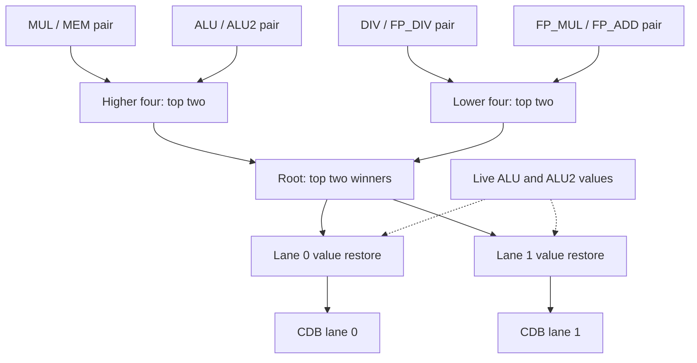

# CDB Arbiter

The common data bus (CDB) broadcasts finished results to the ROB and every
reservation station. It has two lanes. Each cycle, `cdb_arbiter` chooses up to
two of the eight functional-unit (FU) completions to put on them. It is purely
combinational and adds no latency; its clock and reset exist only for the
formal harness.

## Priority

```
MUL  >  MEM  >  ALU  >  ALU2  >  DIV  >  FP_DIV  >  FP_MUL  >  FP_ADD
```

Lane 0 carries the highest-priority valid completion and lane 1 the next, so
`o_grant` is 0-, 1-, or 2-hot. Inputs `i_fu_complete_0` to `_7` and the grant
bits are numbered by `riscv_pkg::fu_type_e` (ALU, MUL, DIV, MEM, FP_ADD,
FP_MUL, FP_DIV, ALU2), which is not the priority order.

ALU and ALU2 are the two single-cycle integer pipes fed by the dual-issue INT
reservation station. Either can win either lane, so a stream of pure ALU work
can broadcast two results per cycle.

A completion that is not granted stays in its
[`fu_cdb_adapter`](../fu_cdb_adapter/README.md) and competes again the next
cycle. The pipelined MUL, DIV, and FP multiply shims also queue results in
FIFOs; the FP divider runs one operation at a time and holds its single
result.

The order matters for the MEM slot. Store faults, SC results, and loads share
it, and the fault and SC registers present each result for only one cycle.
Because only MUL outranks MEM, a MEM result that reaches the arbiter always
wins one of the two lanes outside a full flush, so the MEM adapter is never
left holding a result when the next one arrives. See
[tag reuse](../README.md#cdb-priority-and-tag-reuse) in the back-end overview.

## Structure

One balanced tree computes both winners at once. It merges the eight inputs in
priority-ordered pairs, then fours, then a root. Each merge lists its
higher-priority input's packets before its lower one's and keeps the first two
valid packets, so three levels give exactly the fixed-priority result.



Solid arrows carry packets. Dashed arrows carry live ALU values around the
tree.

## Live ALU values

The path from the INT RS through an ALU to the CDB is timing-critical, so the
value of a live ALU result (one passing straight through its adapter) skips
the tree. Its valid bit, tag, and other fields go through the tree like any
packet, and each lane output restores the value with a small mux
(`cdb_live_value_restore`) selected by the grants. Held and test-injected ALU
values go through the tree normally.

For each ALU slot the wrapper supplies three extra inputs and must keep this
rule:

- When `i_alu*_value_is_live` is set, the packet is valid and
  `i_alu*_live_value` equals its value.
- Otherwise `i_alu*_tree_fallback_value` equals its value.

The `tomasulo_wrapper` formal target proves the rule; the standalone arbiter
proof assumes it (`FORMAL_ASSUME_VALUE_SOURCE_CONTRACT`, which the wrapper
sets to 0).

The arbiter also exports each lane's pre-restore value
(`o_lane*_tree_fallback_value`) and live selects (`o_lane*_select_alu*_live`).
The wrapper registers these with the CDB and repeats the restore after the
register. It reads the live value from the ALU adapter's `held_result`, which
captures every result that passes through the adapter, so it needs no second
wide register for the value.

## Full-flush kill

`i_kill` clears `valid` on both lanes and clears `o_grant`. It does not change
which packets are selected; `o_grant_raw` shows the grants before the kill,
and the wrapper leaves it unconnected. The wrapper drives `i_kill` on every
full flush, including commit-time misprediction recovery
(`speculative_flush_all`). The same signal clears every adapter, so a
completion the kill suppresses is discarded, not retried. Applying the kill
once here keeps the widely fanned flush signal out of the eight adapters'
output logic.

## Verification

The `cdb_arbiter` cocotb and formal targets check priority, grants, payload
selection, and the kill against reference models; the formal target compares
the tree with an independent flat priority encoder. Wrapper tests cover live,
held, and injected ALU packets.

See the [test runner](../../../../../../tests/README.md) for commands and the
[formal guide](../../../../../../formal/README.md) for proof scope and assumptions.
