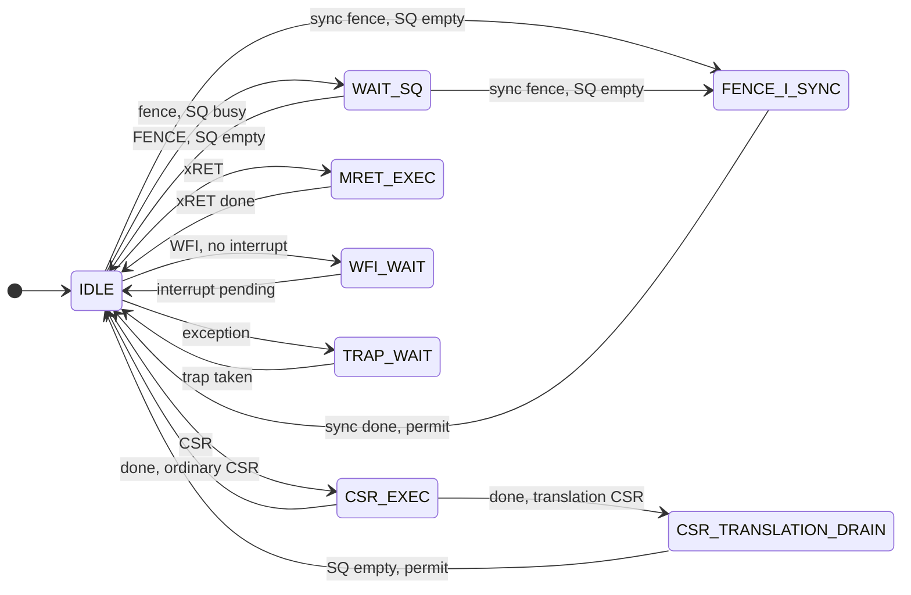

# Reorder Buffer

The reorder buffer (ROB) tracks every in-flight instruction from dispatch
until it retires. Instructions complete out of order but retire from the
head in program order, which makes exceptions precise and lets a mispredicted
branch discard everything younger. The ROB has 32 entries
(`riscv_pkg::ReorderBufferDepth`), shared by integer and FP instructions, and
allocates and retires up to two per cycle. An entry's index is its ROB tag,
the name the rest of the back end uses for the instruction: the RAT maps
registers to tags, reservation stations wait on tags, and the CDB broadcasts
results by tag.

An entry's life: allocate at dispatch → complete → retire at the head.

[`reorder_buffer.sv`](reorder_buffer.sv) holds the entries, and
[`rob_serializer.sv`](rob_serializer.sv) pins the head while an instruction
there waits on something outside the ROB. The
[back-end overview](../README.md) shows how the ROB fits with the other
blocks.

## Structure

Head and tail pointers carry an extra wrap bit to tell full from empty.
`dest_rf` selects the register file an entry writes.

Multi-bit fields live in distributed RAM: PC, destination register,
checkpoint ID, head metadata, value, exception cause, FP flags, branch
target, and the CSR address, op, and write data. A RAM with several
write ports keeps one bank per port and a Live Value Table (LVT) recording
which bank holds each entry's newest value. Allocation-only fields have two
write ports, one per dispatch slot; the value, FP-flag, and exception-cause
RAMs add one per CDB lane. The branch target is split by producer instead:
JAL targets go into an allocation-written RAM, and branch and JALR targets
into a single-port RAM written on branch update, so the branch-update path
has no LVT. The head selects between the two. Single-bit state (`valid`,
`done`, `exception`, the replay flag, and the branch flags) stays in
flip-flops, so reset and flushes can clear any set of entries at once.

The value field has eight copies with identical writes and different read
addresses: head, head+1, and six dispatch done-repair reads (three sources
per slot).

The value copies update their LVT one cycle after an allocation
(`NUM_STAGED_LVT_PORTS`), which keeps the late dispatch enable off the LVT;
reads stay exact. The price is one rule: no CDB write may target an entry in
the cycle after its allocation. In that cycle a live write would win the LVT
over the staged allocation and corrupt the new entry. No real completion is
that fast: dispatch, issue, execution, and the registered CDB take more than
one cycle. A simulation check flags violations; the unit bench, which drives
the CDB directly, disables it with `DrainWindowCheck=0`.

A CDB write reaches a free entry only if it is stale: a completion for a tag
that was flushed or has already retired (a JALR's wakeup broadcast can trail
its retirement). If it lands in the cycle that entry is reallocated, the
allocation wins in every field. The state bits and the exception cause take
CDB writes only for valid entries, the value copies resolve the collision in
the staged LVT, and the FP-flag RAMs number their allocation ports above
their CDB ports. A store or branch, which never completes on the CDB,
therefore retires with zero FP flags.

## Allocation

Slot 1 takes the tail entry and slot 2 the next, so ring order is program
order, which retirement and checkpoint age comparisons rely on. Slot 2
allocates only with slot 1, and only when two entries are free
(`full_for_2`). Allocation is gated off in flush cycles.

Dispatch stalls on registered full flags (`o_full`, `o_full_for_2`, and the
`full` field of each allocation response). They count this cycle's
allocations but not its retirements, so they err toward stalling; on a flush
they use the exact number of surviving entries. They are computed from the
raw request valids, which is safe because dispatch obeys rules the RTL
asserts: slot 1 is never presented while the ROB is full or flushing, and
slot 2 only with slot 1 and never while `full_for_2` is set.

### Legality checks at allocation

The ROB decides at allocation whether an instruction is illegal and records
it as an exception with cause `ExcIllegalInstr`. The check covers privilege
level, counter enables, `mstatus` TVM, TW, and TSR, S-mode `stimecmp` access
without `menvcfg.STCE`, Debug-only instructions and CSRs, unimplemented CSRs,
writes to read-only CSRs, FP use while `mstatus.FS` is Off, and an FP
instruction with the dynamic rounding mode (rm = 111) while `frm` holds a
reserved value (5 to 7), which traps like the reserved static modes do.
Dispatch marks such an instruction with the request's `fp_dyn_rm` bit: an F/D
instruction whose funct3 is 111. That funct3 is always an rm field set to
dynamic, since every F/D instruction without an rm field has a funct3 of 011
or less.

Deciding at allocation is exact because that state cannot change under a
live entry: every CSR instruction keeps younger instructions out of dispatch
until its CSR write is done (only CSR writes change `frm`), traps, xRETs, and
Debug Mode transitions flush younger work, and hardware never sets
`mstatus.FS` to Off (it only sets Dirty).

A normal CDB completion leaves an allocation-time fault in place, while an
exceptional one sets the exception and replaces the cause. ID marks F/D
instructions illegal while `mstatus.FS` is Off, so no FP load or store
reaches the memory pipeline and takes a memory fault. The only exceptional
completion that can reach an entry with an allocation-time fault and name a
different cause is an instruction fetch fault, which the privileged spec
ranks above illegal-instruction: the fetch-fault pseudo-op carries the
faulting fetch's bytes, and they can decode as, say, an access to a CSR that
does not exist. Exceptional completions set the exception bit and cause only
while the entry is valid, so a stale write for a recycled tag cannot
overwrite the cause of the entry allocated there in the same cycle.

## Completion

Most entries allocate not done and become done when their result arrives on
either CDB lane; the two lanes always carry different tags. The others:

| Instruction | Becomes done |
|-------------|--------------|
| JAL | At allocation: ID computes its link address and target |
| JALR, conditional branch | On its branch update |
| FENCE, FENCE.I, SFENCE.VMA, WFI, xRET | At allocation; the serializer handles them at the head |
| Store other than SC | When it issues without a fault, on a direct store-completion port instead of the CDB |

Allocation writes the link address into the value field of every branch and
jump, so JAL and JALR hold their register result from the start.

### Same-cycle CDB bypass

A CDB write sets `done` at the next clock edge, so on its own the head would
retire a cycle after its result arrives. The bypass matches both CDB lanes
against the head and head+1 tags and feeds a hit straight into retirement.
At the head it applies only to ordinary completions: exceptions, branches and
jumps, CSRs, fences, WFI, and xRETs keep their usual paths. CSRs and xRETs
must stay excluded there, because `o_csr_start` and `o_mret_start` read the
stored done bit (an assertion checks this). At head+1 the bypass excludes
only exceptional completions, since the two-wide hazard gate below already
keeps the serializing classes off slot 2.

## Retirement

The head retires when it is valid and done, has no exception, the serializer
does not stall it, and retirement is permitted: no commit hold from cpu_ooo,
no early-recovery pulse, and no flush. An exceptional head never retires; it
traps. Nothing retires in a flush cycle, and the store queue relies on that:
its flush logic has no guard for a store committing in the same cycle, so
that store's write would be lost.

### Two-wide commit

Head and head+1 retire together when both are ready and both pass the hazard
gate, unless cpu_ooo holds slot 2 off with `i_widen_commit_ok`. It does that
during a debugger single step, so exactly one instruction retires before the
halt. Slot 2 has no serializer, trap, or redirect path, so the gate keeps on
slot 1 anything that needs one: CSRs, FENCE, FENCE.I, SFENCE.VMA, WFI, xRETs,
AMO, LR, SC, exceptions, a mispredicted branch at the head, and a
mispredicted or early-recovered branch at head+1.

Slot 2 carries the register write, store commit, and RAT clear, plus branch
and checkpoint fields for a correctly predicted branch; its strobe
`o_commit_correct_branch_2_raw` frees the checkpoint and trains the
predictors. Its `misprediction` bit is always 0, and for a branch its
`redirect_pc` is just the next PC. Every RAM holding a field slot 2
retires has a `_next` copy that reads head+1; slot 2 never retires an
exception or a CSR, so the exception-cause and CSR RAMs have none.

When both slots write the same register, slot 2 holds the newer value. The
register files (two write ports merged by an LVT) give its write priority.
The RAT cannot still map the register to slot 1, because slot 2 renamed it
later, so only slot 2's commit can clear the mapping, and only if nothing
younger has renamed the register since. The store queue has a second commit
port for slot 2, which retires only plain stores.

### Commit buses

Each slot has a combinational commit bus (`o_commit_comb`, `o_commit_comb_2`)
and a registered copy (`o_commit`, `o_commit_2`). The full core leaves the
registered copies unconnected: the wrapper registers the combinational buses
in `commit_bus_pipeline`, and the register files, RAT, store queue, SC logic,
and CSR file use that view. The misprediction flush controller in cpu_ooo
acts in the retirement cycle, on the combinational buses and the strobes
`o_commit_misprediction_raw`, `o_commit_correct_branch_raw`, and
`o_commit_correct_branch_2_raw`.

The registered bus also drives `instret`, through cpu_ooo's `commit_actions`.
A full flush masks that bus a cycle after it is raised, so three retirements
never reach it, and cpu_ooo counts them separately: an xRET, which never
commits; a FENCE.I or SFENCE.VMA, whose own flush masks its registered
commit; and a WFI that a halt or interrupt takes over at the head, where the
take saves the PC after the WFI.

### Early-recovered branches

[`early_misprediction_recovery`](../../cpu_ooo/branch_recovery/early_misprediction_recovery.sv)
recovers from a mispredicted conditional branch that holds a checkpoint as
soon as the branch resolves, without waiting for the head. It marks the
entry `early_recovered` (`i_early_recovery_en`, `i_early_recovery_tag`) so
that retiring it does not start a second recovery. JALR mispredictions
recover at retirement.

## Serializing instructions

[`rob_serializer.sv`](rob_serializer.sv) pins the head while it waits for a
drained store queue, a cache sync, a CSR handshake, the trap unit, or an
interrupt.

State names omit the RTL's `SERIAL_` prefix. `SQ empty` means committed
stores have drained (`i_sq_committed_empty`). `sync fence` is FENCE.I or
SFENCE.VMA (the ROB treats SFENCE.VMA as a subtype of FENCE.I). `permit`
means retirement is allowed: no commit hold, early-recovery pulse, or flush.
`xRET` covers MRET, SRET, and DRET. A comma joins conditions that must all
hold.

The FSM leaves IDLE only for a ready head with retirement permitted, and an
exception outranks the instruction's class. Reset or a full flush returns it
to IDLE. A plain FENCE with committed stores drained, and a WFI with an
interrupt pending, retire straight from IDLE.

The serializer has two stall outputs. Retirement uses
`o_commit_stall_for_retire`, which in FENCE_I_SYNC and CSR_TRANSLATION_DRAIN
omits the permit terms that every retirement condition already has.
Performance counters and assertions must use `o_commit_stall`, which keeps
them, so blocked cycles in those states still count.

### CSRs

Entering CSR_EXEC raises `o_csr_start`; cpu_ooo returns `i_csr_done` a cycle
later, and an ordinary CSR retires then. The CSR file reads and writes the
register in the next cycle, from the registered commit bus, while cpu_ooo
holds retirement; the read value reaches the destination register a cycle
after that.

A CSR that may change address translation needs everything after it
refetched. The ROB classifies these conservatively at allocation: any `satp`
access, and any `mstatus` or `sstatus` access with write intent. On
`i_csr_done` such a CSR moves to CSR_TRANSLATION_DRAIN unconditionally, so
the one-cycle done pulse is never lost, and it retires once committed stores
have drained and retirement is permitted. The drain is required because the
recovery ends in a full flush, which empties the store queue.

### Fences and FENCE-class recovery

FENCE, FENCE.I, and SFENCE.VMA wait at the head for committed stores to
drain. FENCE.I and SFENCE.VMA then hold FENCE_I_SYNC, asserting
`o_fence_i_sync_req` until the caches return `i_fence_i_sync_done`. By then
the L1D has written back its dirty lines and the L1I has invalidated, so code
fetched after the fence sees the stores before it. For SFENCE.VMA,
`o_sfence_window` is high for exactly the same cycles, and the wrapper turns
it into the TLB and page-table-walker invalidate.

FENCE.I, SFENCE.VMA, and translation CSRs end in a full flush and refetch.
`o_fence_class_flush_event` marks the event, and `o_fence_i_flush`, the same
signal a cycle later, requests the flush:

| Retiring instruction | Cycle T | T+1 | T+2 |
|----------------------|---------|-----|-----|
| FENCE.I, SFENCE.VMA | Retires; `o_fence_class_flush_event` | `o_fence_i_flush` | |
| Translation CSR | Retires | Registered commit bus writes the CSR file; `o_fence_class_flush_event`, `o_translation_csr_commit_shadow` | `o_fence_i_flush` |

The extra cycle lets the CSR write land before the flush, and cpu_ooo stalls
the trap unit from the shadow cycle through the flush. The CSR file requests
the TLB and page-table-walker invalidate itself: for every `satp` access, and
for an `mstatus` or `sstatus` write that changes SUM, MXR, or MPRV, or
changes MPP while MPRV is set. The ROB's broader classification decides only
the drain and the flush.

### xRET, WFI, and exceptions

An xRET enters MRET_EXEC and requests the return with `o_mret_start`
(`o_mret_start_is_sret` and `o_mret_start_is_dret` say which). The trap unit
takes it only in a cycle where committed stores have drained, so the ROB
raises `o_mret_start` only while they have. It can rise in MRET_EXEC as well
as in IDLE: an xRET that reaches the head while stores are still draining
enters MRET_EXEC first and raises the start once they finish. A start that
could rise only on entry would never rise then, leaving the FSM stuck. The
trap unit redirects to `mepc`, `sepc`, or `dpc`, and its full flush, which
arrives with `i_mret_done`, clears the ROB, xRET included.

WFI holds the head until an interrupt is pending. `o_head_is_wfi` lets
cpu_ooo use the instruction after the WFI as the interrupt return address,
even when the interrupt flushes the WFI first.

An exception at the head raises `o_trap_pending` with `o_trap_pc`,
`o_trap_cause`, and `o_trap_value`, and waits in TRAP_WAIT until the trap's
full flush removes it. `o_trap_value` is the entry's value field, where the
producer parks the faulting virtual address for instruction access and page
faults (the INT ALU shim) and for misaligned, access, and page faults on
data (the load and store paths). cpu_ooo writes it to `mtval` or `stval` for
those causes.

### Memory-order replay

When a DMA write invalidates a line, the wrapper's
[coherence port](../tomasulo_wrapper/coherence/lq_coherence_port.sv) flags
every in-flight load that has already read it (`i_replay_set_mask`). A
flagged entry becomes exceptional with cause `ExcMemReplay`, and at the head
the trap unit restarts the load at its own PC, with no CSR or privilege
change. Otherwise a younger load that read the line before the DMA write
could retire after an older load that read it afterward. The flag is set
only on a valid entry with no stored exception, and clears on allocation,
retirement, flush, or an exceptional completion.

### Atomics

AMO, LR, and SC have no serializer state. The LQ issues an LR only at the
head, and an AMO only at the head with committed stores drained;
`sc_pending_unit` in the wrapper fires an SC under the same two conditions.
Once done, they retire normally.

## Performance counters

The ROB drives the head-wait, commit-blocked, and two-wide commit events in
the [counter reference](../../cpu_ooo/perf/README.md): `head_wait_total` and
per-class `head_wait_*` events, `commit_blocked_*` for cycles the serializer
holds a ready head, and the two-wide funnel (`head_and_next_done`,
`head_plus_one_done`, `commit_2_opportunity`, `commit_2_fire_actual`, and the
`commit_2_blocked_*` causes). A head that completes and retires in the same
cycle does not count as waiting.

## Verification

The `reorder_buffer` cocotb target covers allocation, completion, branch
resolution, two-wide commit, serialization (including translation CSRs),
allocation-time faults, flushes, and tag reuse. The `reorder_buffer` formal
target checks pointer and occupancy invariants, allocation into free entries,
retirement, serializer invariants, and FENCE-class event timing.
`rob_control_next`, `rob_retire_stall`, and `rob_start_cofactor` prove the
restructured next-state, retirement, and CSR/xRET start logic equal to
reference equations.

See the [test runner](../../../../../../tests/README.md) for commands and the
[formal guide](../../../../../../formal/README.md) for proof scope and assumptions.
