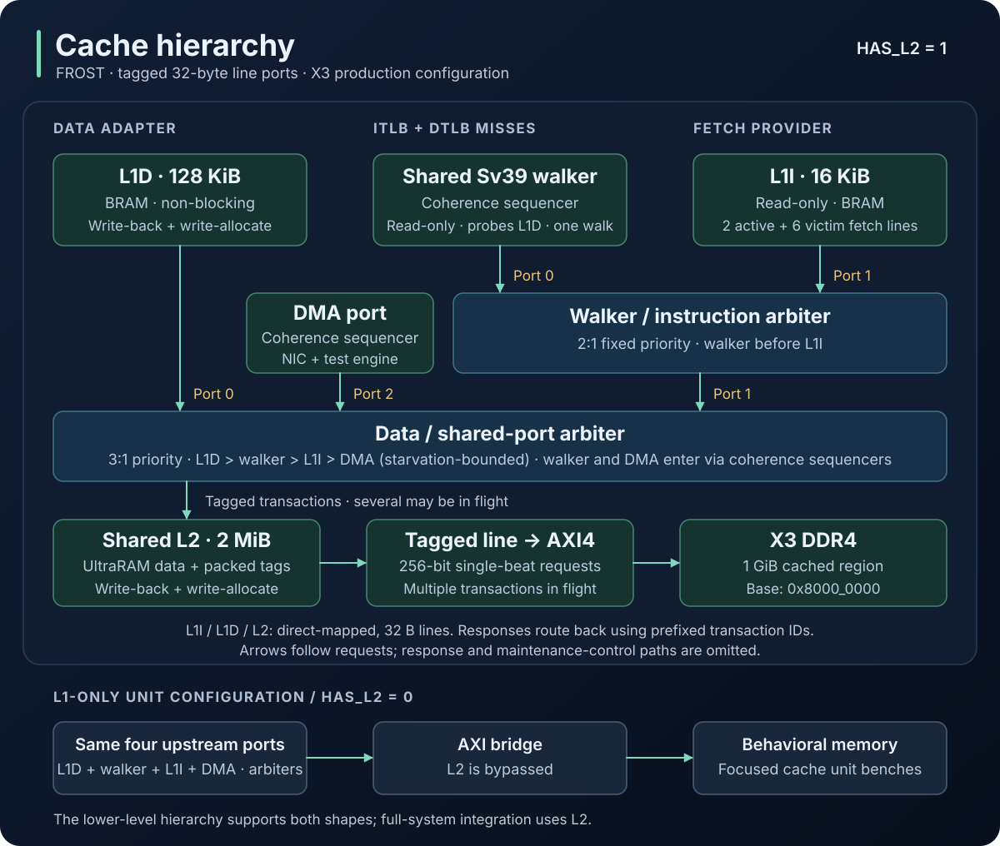

# Cache library

The cached tier: a direct-mapped write-back line cache used three times (L1D,
L1I, L2), the tagged line protocol its ports speak, the arbiter that merges
line ports, the sequencer that makes a DMA agent's traffic coherent with the
L1D and the load queue, the bridge to the DDR AXI port, and the
simulation-only main memory.

| File | Role |
|------|------|
| `cache_perf_pkg.sv` | Packed per-instance observer types: access/hit/miss/writeback and hit-under-miss pulses, the outstanding-miss count, and the two stall classes |
| `frost_cache.sv` | Direct-mapped, write-back, write-allocate, non-blocking line cache (one module for every level); the L1D instance also takes per-line coherence probes |
| `frost_cache_hierarchy.sv` | Per-board hierarchy: L1D + walker + L1I + DMA ports over a 2:1 sub-arbiter and a starvation-bounded 3:1 top arbiter, the DMA coherence sequencer, optional URAM-data/URAM-tag L2, fence.i sequencing |
| `dma_coherence_sequencer.sv` | Probes the L1D and hands the load queue its invalidations before a DMA request reaches the shared level; holds fills of a line between the probe and the write's ordering |
| `line_port_arbiter.sv` | N:1 tagged arbiter; fixed priority by port index with an optional starvation bound, ids prefixed per port |
| `line_port_axi_bridge.sv` | Tagged line port to single-beat AXI4 master; line ids become AXI ids |
| `axi_behavioral_memory.sv` | Simulation-only AXI main memory: concurrent, latency/jitter knobs, optional out-of-order completion |
| `*_test_harness.sv` | cocotb unit-bench tops (hierarchy + bridge + memory; arbiter + bridge + memory) |

## Line protocol

Every port between the CPU-side adapters and the AXI bridge carries one
32-byte line per transaction with a transaction id:

```
request:  valid  ready  write  addr[ADDR_WIDTH]  wdata[256]  wstrb[32]  id[ID_BITS]  maintenance
response: valid  id[ID_BITS]  rdata[256]
```

A request fires on the cycle where `req_valid && req_ready`. The slave captures
the payload at the fire; until then the master holds `req_valid` and a stable
payload. `addr` is a full byte address, used line-aligned. A slave's ready may
depend on the presented request: the bridge, for instance, is ready for a read
while a write's channels are still busy.

`resp_valid` is a one-cycle pulse at least one cycle after the fire, carrying
the request's `id`. `rdata` is the line for reads and don't-care for writes; a
write's response is its completion acknowledgement. There is no response
backpressure: a master only issues what it can sink, so it always has a home
for a response.

A master may have any number of requests in flight, each with an id unique
among its own in-flight requests, and a slave may deliver responses in any
order. Requests to the same line take effect in acceptance order: a write
accepted before a read of that line is visible to the read, and a read
accepted before a write never sees it. The slave is the ordering point for its
level and never relies on the level below for read/write order.

Each arbiter prefixes its port index to the ids it forwards, so the bottom of
the hierarchy sees `{port bits…, local id}` and ids stay unique across every
upstream master without a global plan. Arbiters compose: a tree of them yields
a prefix-free id code whose per-master widths need not be uniform, which is
how the hierarchy fits the walker port. The DMA port (Phase 4) is the fourth
port; a second hart (Phase 5) is one more.

The `maintenance` bit is present on the cache and arbiter ports, not on the
hierarchy's upstream ports or the bridge. It is a passive observer
classification that marks fence.i writeback-all traffic so lower levels
exclude it from their ordinary-traffic counters; it never changes functional
handling.

Partial writes carry byte strobes. A write with all strobes set allocates
without a fetch, the common case for evictions from the level above.

`frost_cache` is non-blocking. A request is accepted into a skid and issues a
tag lookup; the request resolves when that lookup returns after the configured
`TAG_READ_LATENCY`, and its side effects land in a write stage. The one-cycle
L1 tag path streams read hits one per cycle; the delayed L2 tag path serializes
its single T owner. Read data returns with the data array's output. Write hits
and write misses are acknowledged once the cache has ordered them; a miss's
bytes are merged into its fill. Misses occupy `NUM_MSHR` miss-status slots that
fetch downstream concurrently while dirty victims drain from `NUM_WB` writeback
slots. A write to a line whose write-allocate slot is pending merges into it, a
read takes the slot's single waiter seat, and anything else aimed at an index
in transition waits and issues a fresh tag lookup before deciding again. A fill
of a line still sitting in a writeback slot waits for that writeback's
acknowledgement, so the cache never relies on the level below ordering a read
against a write. Its downstream ids are `{type, slot}` (0 = fill of a miss
slot, 1 = writeback slot).

The L1D instance (`NUM_PROBE > 0`) also takes per-line coherence probes on
its upstream seam: a read-shaped request flagged `probe`, either PROBE_CLEAN
(write a dirty copy back, keep it valid and clean) or PROBE_INVAL (write a
dirty copy back, then invalidate). A probe never returns data; its response
pulse is the acknowledgement, sent only once any writeback it caused has been
acknowledged by the level below. Probes are ordinary requests to the
pipeline: one aimed at an index in transition waits like any other request,
one aimed at a line sitting in a writeback slot waits for that writeback, and
a probe never attaches as a merge or a waiter. Each probe mans one of
`NUM_PROBE` probe slots from its decision until the requester releases it
(after the level below has ordered the requester's own access), and while a
PROBE_INVAL slot is manned the cache issues no fill of that line downstream,
so a miss that follows the invalidation waits in its miss slot and fetches
the ordered line after the release instead of re-fetching the pre-write one.
Pending probe acknowledgements take the response port ahead of ordinary
acknowledgements and hold off new read hits, so a hit stream cannot starve
them.

Tag and data storage are selected independently. The L1D and L1I use
one-cycle BRAM tags and BRAM data. The X3 L2 keeps its data in URAM and packs
four logical tag entries into each 72-bit URAM row; its production tag-read
latency is three cycles. This removes the large L2 tag store from BRAM while
leaving the L1 hit path unchanged.

Maintenance (fence.i) starts only once every slot and pipeline stage is
empty. Writeback-all issues each tag lookup and waits for its response before
classifying the line, writes dirty lines back through the writeback slots,
and drains them before `o_maint_busy` falls. Invalidate-all clears the tag
store directly, so it does not depend on tag-read latency. Maintenance and
probes never overlap: maintenance waits for the probe slots to empty like any
other in-flight work, and a probe waits for maintenance like any other
request.

## Hierarchy shapes

The full-system integration fixes `HAS_L2=1`, matching X3. `HAS_L2=0` remains
available at the lower-level `frost_cache_hierarchy` boundary for focused unit
coverage and future reuse; it is not a supported board shape.

[](../../../../docs/diagrams/cache-hierarchy.svg)

The main view shows X3 capacities and the arbiter instances separately. The
lower view shows the L2 bypass exercised by unit benches. Arrows follow
requests; responses return using the transaction ID prefixes described below.
The DMA port and its sequencer (below) enter the top arbiter as its third
port.

The arbiter tree is a 2:1 `line_port_arbiter` (walker > L1I) under a 3:1 one
(L1D > that pair > DMA). Both are pure combinational pass-throughs, so the
tree behaves like a 4:1 priority arbiter ordered L1D > walker > L1I > DMA:
data misses stall committed work, a walk unblocks a load that is stalling
commit, fetch runs ahead through a buffer, and DMA drains the device's
buffers. The top arbiter carries a starvation bound (`DMA_STARVATION_LIMIT`,
16 grants): a port that has watched that many grants go to other ports while
presenting a request wins over the unstarved ports, so a port waits at most
17 competing grants (the bound plus the other starved port) and the DMA
port keeps a progress guarantee under a sustained stream of CPU-side misses
whatever the L2's acceptance rate. There is no grant lock: a request flows
whenever the downstream is ready, so an L1I fill, a walk, an L1D transaction
and a DMA transaction can be in flight together below the arbiters. Two
seams relax the stable-request rule above: the arbiters re-select among the
presenting ports every cycle, so the level below may see the payload change
while a request is held unaccepted (each port keeps its own presentation
stable; the slave samples the payload at the fire), and the DMA test engine
withdraws a request it has not yet fired when it is aborted (the sequencer
acts only on the fire). The X3
block design gives the CPU's AXI master 5-bit ids, the top arbiter's
downstream width (`fpga/build/x3_ddr_bd.tcl`). The bridge drops any
response whose id is not in flight, which is how a transaction interrupted by
an image-load CPU reset drains harmlessly: the caches' reset tag sweeps last
thousands of cycles, so no new request can reach the bridge before a stale
response has returned.

## The page-table walker port

The hardware page-table walker (Phase 3) attaches as the hierarchy's third
upstream port (`wup`), between the L1D and the L1I in the arbiter tree, on
the same line protocol. The tree's fixed priority and no-grant-lock flow mean
a walk never waits for an L1I fill to complete once it is ready to issue. The
walker's requests carry `maintenance = 0` and are counted as ordinary traffic
by the level they reach.

The tree composes a prefix-free id code inside an `UP_ID_BITS + 2`
downstream width: the L1D keeps `{2'b00, UP_ID_BITS-bit local id}`, the
walker gets `{2'b01, 1'b0, local id}` and the L1I `{2'b01, 1'b1, local id}`
with `UP_ID_BITS - 1`-bit local ids, and the DMA port `{2'b10, UP_ID_BITS-bit
id}`. The L2 (or the bridge on the L1-only shape) sees that width, which is
the 5-bit AXI id space the block design provides. With the default
`UP_ID_BITS=3`, the walker and L1I each keep a 2-bit local ID field. L1I
reserves one bit to distinguish fills from writebacks, leaving 2 miss slots.
The walker keeps one walk in flight and uses ID zero. The L1I loses nothing,
since its master, the two-line fetch provider, never has more than 2
requests in flight.

A walk is a short chain of dependent 8-byte PTE reads, one per level, each a
full-line read on this port; the walker extracts its PTE from the 256-bit
response the way `cached_tier_adapter` extracts a beat. One walker serves both
TLBs behind a requester mux in `cpu_ooo`: the data side wins, and a registered
owner bit steers each response to the TLB that asked. One walk is in flight at
a time, so the port never carries more than one read at once; the 2-bit local
id budget is headroom. Walks are read-only: the walker does not update PTE
A/D bits in hardware. Accesses that need those bits set instead take page
faults (Svade), so the walker has no PTE-write path.

PTEs live in cacheable memory and a walk reads through the L2 when present or
directly through the bridge in the L1-only shape, not through the L1D, so a
store to a page table that is still dirty in the L1D is not visible to a walk
until the L1D writes it back. The architectural `sfence.vma` is the point where
software expects its page-table stores to be visible. The Phase 3
implementation issues an L1D writeback-all
(the existing fence.i maintenance path) before invalidating the TLBs, which
drains every dirty line through the writeback slots before the next walk can
start.

## The DMA port and coherence

The DMA agent (Phase 4) attaches as the hierarchy's fourth upstream port
(`dma`), on the same line protocol, through `dma_coherence_sequencer`. The
L1D is write-back and the load queue keeps its own dword copies of loaded
data, so a DMA agent that simply joined the tree below the L1D would neither
see the CPU's dirty data nor invalidate the CPU's stale copies. The sequencer
therefore walks every DMA request through the L1D and the load queue before
the shared level orders it. For a write: the load queue admits the line (no
AMO or SC on it is between its read and its write, and none starts until the
release); PROBE_INVAL writes a dirty copy back and invalidates every copy,
and from its decision until the release the L1D issues no fill of the line,
because it holds no copy and a miss that fetched before the write is
ordered would carry the pre-write line back in; the load queue then drops
its dword copies, flags executed-but-unretired loads of the line for replay,
marks in-flight loads as not-to-fill and in-flight LRs as
reservation-suppressed, and clears a matching reservation; finally the write
is presented downstream, and its acceptance orders it, releases the L1D's
probe slot (the withheld fills now fetch the ordered line) and pulses the
release for the load queue's mirror. For a read: PROBE_CLEAN writes a dirty
copy back and leaves it valid and clean, then the read is presented and the
probe slot is released at its acceptance. The DMA port's response is the
shared level's completion, forwarded.

The contract the sequencer gives the agent is coherence order, not wall
clock: an acknowledged write is visible to every CPU load that observes
memory after it; a load that observed memory before it may still return its
old value afterwards, and the load queue's replay keeps program-order
consequences correct. Requests to different lines are not ordered with
respect to each other (an agent orders dependent writes by waiting for
responses); same-line requests serialize in acceptance order. The module
header states the phases and the progress argument: a probe waits only on
transients that resolve through the shared level and DDR, because a fill of
the probed line already in flight at the probe's decision is never withheld,
and a withheld fill waits only on the load queue and the shared level. The
handshakes are pipelined at both ends (a register stage in front of the L1D
for probes, a latched presentation and a pipelined answer for admission and
invalidation), so nothing combinational crosses the hierarchy.

## Benches

`verif/cocotb_tests/cache/test_frost_cache.py` drives tagged transactions on
the data, instruction and walker ports against a byte-granular reference
model (registry: `frost_cache*`, both shapes, fast-maintenance and
out-of-order-memory variants). `test_frost_cache_concurrency.py` keeps several
transactions in flight per port and checks the non-blocking paths: pipelined
hits, hit- and miss-under-miss, merges, waiters, index conflicts, a fill behind
a pending writeback, and fence.i under misses (`frost_cache_concurrency*`).
`test_frost_cache_dma.py` drives the DMA port with the bench playing the load
queue on the sequencer's handshake: writes to absent, clean and dirty lines
(partial strobes keep the CPU's dirty neighbours), reads of dirty CPU data, a
probe behind a fill in flight, the held fill during a long load-queue
invalidation, same-line serialization, a write racing fence.i's
writeback-all, a request under a data-side miss flood, concurrent disjoint
traffic, and a data-side reader that must see a DMA writer's sequence in
coherence order (`frost_cache_dma*`, both shapes and out-of-order memory).
`test_line_port_arbiter.py` plays two masters with several tagged transactions
in flight each (`line_port_arbiter*`). `test_fence_speed.py` counts fence.i
maintenance cycles at the production L1 geometry under the slow and fast
maintenance paths (`fence_speed_slow`, `fence_speed_fast`; not in the pytest
sweep). `test_dma_envelope.py` measures the DMA port's service envelope:
cycles per line, latency tail and the residence of a request in each
sequencer phase, per scenario (absent, clean, dirty and L2-only lines,
partial strobes, reads, a data-side miss flood, a stream beyond the L2)
and producer depth, one build per candidate lock count
(`dma_envelope_lock3`..`lock8`, `dma_envelope_lock3_mem30`; not in the
pytest sweep). `formal/line_port_axi_bridge.sby` proves the bridge's AXI handshake
legality, id conservation and stale-response drop.
