# Standalone 10GBASE-R MAC/PCS

This directory implements a portable, single-port, full-duplex Ethernet MAC
and normal-operation 10GBASE-R PCS. It prepares the Ethernet portion of
[roadmap Phase 4](../../../ROADMAP.md#phase-4-system-io-and-distribution)
independently of the Phase 3 CPU work. No existing CPU or board source list,
constraints, software, test registry, or CI workflow includes these modules.

The top is `eth10g_mac_pcs`. The standalone `net10g.f` manifest uses paths
relative to the repository root. All datapaths are native 64-bit, with
separate transmit and receive clock domains and a raw parallel interface
intended for a future GTY wrapper. There are no vendor primitive instances.

```mermaid
flowchart LR
    A[64-bit AXIS TX] --> B[Buffered TX MAC / CRC]
    B --> R[TX fault reconciliation]
    R --> C[64b/66b encoder]
    C --> D[Scrambler]
    D --> E[66-to-64 gearbox]
    E --> P[Raw PMA interface]
    P --> F[64-to-66 gearbox / block lock]
    F --> G[Descrambler]
    G --> H[64b/66b decoder / sequence validation]
    H --> I[Buffered RX MAC / CRC]
    I --> J[64-bit AXIS RX]
```



## Module boundaries

| Module | Responsibility |
| --- | --- |
| `eth10g_mac_tx` | Two complete-frame buffers, padding, preamble/SFD, CRC/FCS, termination, conservative IFG |
| `eth10g_mac_rx` | Preamble validation, FCS/length checking, speculative circular packet storage, AXIS publication |
| `eth10g_crc_pkg`, `eth10g_crc32_64` | Ethernet reflected CRC-32, byte and parallel-word operations |
| `eth10g_encode`, `eth10g_decode`, `eth10g_pcs_pkg` | All 15 control-block formats, data blocks, nine C codes and both ordered-set codes |
| `eth10g_scrambler`, `eth10g_descrambler` | Independent registered implementations of `1 + x^39 + x^58` |
| `eth10g_tx_gearbox`, `eth10g_rx_gearbox` | Continuous bit packing, candidate block unpacking, atomic one-bit receive slips |
| `eth10g_block_lock` | Acquire after 64 consecutive valid headers; lose lock on 16 invalid headers within a 64-block observation window |
| `eth10g_ber_monitor` | Physical-clock-based 125 us observation window, 16-invalid-header threshold, reset on loss of block lock |
| `eth10g_rx_sequence` | PCS receive sequencing and one-block lookahead before accepting termination |
| `eth10g_fault_monitor` | Qualify four identical fault sequences, clear after 128 fault-free XGMII columns |
| `eth10g_tx_reconcile` | Respond to local/remote faults and suppress interrupted frame tails through recovery |
| `eth10g_pcs_tx`, `eth10g_pcs_rx` | Compose the coding, synchronization, monitoring and sequencing stages |
| `eth10g_mac_pcs` | Compose the independent MAC/PCS directions and synchronize fault status into TX |

The codec performs block-format conversion independently of frame sequencing.
TX frame sequencing is supplied by the MAC and reconciliation logic. RX
sequencing checks both the current state and the block following `/T/`, so a
correct FCS alone cannot publish a frame with an invalid termination sequence.

## Raw interface and clocks

`i_tx_clk` and `i_rx_clk` are independent, nominally **161.1328125 MHz**.
Each raw word carries 64 consecutive bits of the 10.3125 Gb/s encoded line.
The receive clock comes from the eventual transceiver receive clocking path.
There is no clock crossing of packet data inside this top.

| Interface | Clock | Contract |
| --- | --- | --- |
| `s_axis_*` | `i_tx_clk` | Ordinary valid/ready packet input; ready includes link readiness and gearbox cadence |
| `m_axis_*` | `i_rx_clk` | Ordinary valid/ready packet output; can drain on every clock, including PCS block pauses |
| `o_tx_raw_data`, `o_tx_raw_valid` | `i_tx_clk` | Startup qualification followed by one raw word every clock; no backpressure |
| `i_rx_raw_data`, `i_rx_raw_valid` | `i_rx_clk` | One raw word every clock during normal operation; valid permits startup/test gaps |
| `i_rx_signal_ok` | `i_rx_clk` | Synchronized PMA/CDR readiness; deassert on signal or transceiver readiness loss |

`i_tx_rst` and `i_rx_rst` are active-high synchronous resets in their own
domains. The board wrapper must synchronize external resets/status, manage
GTY initialization, and handle raw TX startup. `i_rx_raw_valid` gaps alone
do not declare link loss; the wrapper must report loss through
`i_rx_signal_ok`.

The MAC/PCS XGMII side transfers eight bytes per enabled clock. At the raw
clock rate it advances on average 32 of every 33 clocks. Pipeline latency
and enable gaps are intentional; no clock is gated. A conventional
156.25 MHz XGMII interface would require a separate clock/rate adapter.
The scrambler state advances only with accepted blocks, including idles
and faults, and is never reset at frame boundaries.

**Bit order is explicit:** lane zero is bits `[7:0]`; bit zero is transmitted
first. A block is `{payload[63:0], header[1:0]}`. IEEE prints sync bits in
transmission order, so in these packed vectors:

| Block | Bits on the wire, first to last | Numeric `header[1:0]` |
| --- | --- | --- |
| Data | `0`, `1` | `2'b10` |
| Control | `1`, `0` | `2'b01` |

Headers bypass scrambling. A future wrapper must honor this bit contract;
the interface is not an implicit mapping to GTY `TXHEADER`/`RXHEADER` ports.
With a raw bypass configuration, the soft gearboxes own block packing and
alignment. Using a GTY hard gearbox instead would require a separate adapter.

## Packet contract

Packets begin with the destination MAC address. TX excludes preamble and FCS;
RX strips them. VLAN tags and other Ethernet payload bytes are transported
without interpretation. `MAX_FRAME_BYTES` defaults to **9216** and counts
destination address through payload/padding, excluding FCS. Supported shared
MAC configurations require a limit of at least 60 bytes.

- `tkeep` is contiguous from lane zero and nonempty; every nonfinal TX beat
  has `tkeep=8'hff`. `tlast` terminates the packet.
- TX `tuser=1`, malformed keeps, and oversized packets discard the entire
  packet through its accepted `tlast`, then pulse `o_tx_drop`.
- TX buffers the complete packet before transmission. Short packets pad to
  60 bytes; CRC starts at all ones and the complemented result is sent
  least-significant byte first. TX starts on lane zero and terminates on
  any lane.
- TX emits 12–19 actual idle characters between termination and the next
  start when another packet is queued. It does not implement deficit-idle
  counting. The encoded stream runs continuously, but this conservative
  spacing reduces maximum small-packet throughput relative to an optimized
  DIC transmitter.
- RX accepts starts on lanes zero and four, all eight termination positions,
  exact preamble/SFD, and frames of at least 64 bytes including FCS. It
  preserves received padding and does not enforce a minimum receive IFG.
- RX publishes only complete frames with valid CRC and length. `tuser` is
  therefore always zero. Data/keep/last remain stable while stalled.
- RX storage exhaustion discards a whole frame; speculative writes are
  rolled back. Subsequent valid frames recover without external reset.

Default TX storage is two 9216-byte buffers with synchronous read prefetch.
Default RX storage is a 32 KiB circular data buffer and 512 descriptors;
frame starts are word-aligned, and the four FCS bytes consume storage until
the corresponding frame drains. RX uses asynchronous memory reads, which
generally imply distributed RAM. Selecting device RAM primitives and closing
timing are later board work. Mixed jumbo/minimum packets with continuously
ready output, wraparound, and concurrent reader/drop rollback are tested.

## Link status and errors

`o_rx_locked`, `o_rx_high_ber`, `o_rx_local_fault`, and `o_rx_remote_fault`
belong to the receive clock domain. `o_tx_link_ready` belongs to TX and
includes synchronized fault status plus recovery to a complete idle boundary.
TX ingress is backpressured until it is ready, including during startup.

A local receive fault causes remote-fault ordered sets on TX; a received
remote fault causes idles. A fault interrupts any packet already on the
wire. Frames accepted before a later link failure can be lost; there is no
per-packet delivery acknowledgment. The MAC continues its internal frame
progress so recovery cannot expose an old packet tail or deadlock a partially
received AXIS packet. Packet-level CDC, DMA completion semantics and retry
policy belong to later integration.

Error outputs are event indications, not accumulated counters:

| Output | Clock | Meaning |
| --- | --- | --- |
| `o_tx_drop` | TX | Invalid/aborted/oversized AXIS packet discarded |
| `o_tx_bad_block` | TX | Unrepresentable XGMII word encountered by encoder |
| `o_rx_bad_block` | RX | Invalid decoded block or PCS receive sequence |
| `o_rx_bad_frame` | RX | MAC malformed/runt/oversized/CRC/buffer-full discard |
| `o_rx_bad_fcs` | RX | CRC failure, also reported as bad frame |
| `o_rx_overflow` | RX | Packet dropped for insufficient buffer/descriptor space |

Events may remain asserted on consecutive cycles for consecutive errors.
The BER timer advances independently of block-valid pauses; its default
`BER_WINDOW_CYCLES=20142` corresponds to approximately 125 us at the raw clock.

## Verification and remaining integration

From the repository root:

```bash
./scripts/frost.py doctor
./scripts/frost.py run python3 tests/net10g/run.py all
./scripts/frost.py run python3 tests/net10g/synthesize.py
```

The runner cleans each isolated target before compiling with frost's
Verilator/cocotb and checks the resulting XML for actual passing tests. See
[the verification README](../../../tests/net10g/README.md) for targets,
coverage, artifact paths, and the extra pinned synthesis frontend.

The implementation has simulation, lint/type, and portable coarse synthesis
evidence. It has not been placed/routed or tested against a physical link.
There is no GTY instance, optical-module management, board constraint change,
CPU/DMA interface, register bank, interrupt wiring, or Linux driver here.
MAC address filtering, PAUSE/PFC handling, PTP, EEE state machines, MDIO and
PCS compliance test-pattern modes are not implemented. Recognizing a control
code does not implement its optional protocol. The target is normal
full-duplex 10GBASE-R operation, without BASE-T PHY functions or backplane
autonegotiation/link training.

## Design references

- [IEEE Clause 49 block formats and state diagrams](https://www.ieee802.org/3/ap/public/sep05/szczepanek_02_0905.pdf).
  This proposal reproduces the base Clause 49 text; its proposed KR CRC8
  extension is not implemented.
- [IEEE control-code table, including LPI](https://www.ieee802.org/3/ca/public/meeting_archive/2018/01/remein_3ca_1_0118.pdf).
- [Published encoding and scrambling vectors with explicit bit order](https://www.ieee802.org/3/10G_study/email/msg03521.html).
- [IEEE reconciliation fault-signaling clarification](https://www.ieee802.org/3/ae/comments/d2.1/D2_1_comments.pdf).
- [AMD UltraScale GTY architecture guide](https://docs.amd.com/v/u/en-US/ug578-ultrascale-gty-transceivers).
- [X3522PV Ethernet reference clock](https://docs.amd.com/r/en-US/Alveo-X3522PV-Adaptable-Accelerator-Card-User-Guide-UG1607/Ethernet-Reference-Clocks).
