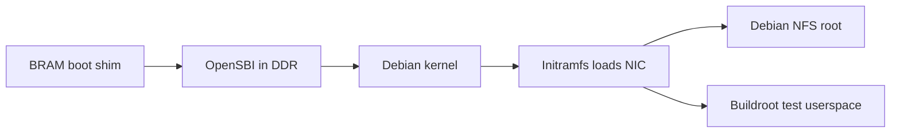

<!--
   Copyright 2026 Two Sigma Open Source, LLC

   Licensed under the Apache License, Version 2.0 (the "License");
   you may not use this file except in compliance with the License.
   You may obtain a copy of the License at

       http://www.apache.org/licenses/LICENSE-2.0

   Unless required by applicable law or agreed to in writing, software
   distributed under the License is distributed on an "AS IS" BASIS,
   WITHOUT WARRANTIES OR CONDITIONS OF ANY KIND, either express or implied.
   See the License for the specific language governing permissions and
   limitations under the License.
-->

# FROST Linux

FROST runs Debian 13 with Debian's stock riscv64 kernel on the X3.
Use the [Debian setup guide](../docs/debian_nfsroot.md) to boot a full system
from an NFS root, or the [image build guide](buildroot-external/README.md)
to build a smaller Buildroot test image.

The sections below document the boot ABI, memory map, and kernel requirements.

## Boot chain and entry state



After DDR initialization, the shim at address zero enters OpenSBI at
`0x80000000` in M-mode with `a0=0` (hart ID) and `a1` pointing to the DTB.
The packer places the DTB after the payload as specified below.

The firmware is OpenSBI v1.9's generic platform from `linux/opensbi`, built
by `linux/opensbi_build.py` with the shared Bootlin toolchain in the Docker
image. OpenSBI retains its PIE link; bare-metal apps explicitly disable PIE.
Use `FROST_LINUX_CROSS_COMPILE` or `--cross` to select another Linux-targeted
toolchain. Build settings:

- `FW_TEXT_START=0x80000000` and `FW_JUMP_OFFSET=0x200000`.
- Empty `FW_JUMP_FDT_OFFSET` to preserve the DTB address in `a1`.
- Drivers selected by `linux/opensbi_frost_defconfig`; `FDT_ASSUME_MASK=7`.

The payload enters S-mode with `satp` Bare and `sstatus.SIE=0`. OpenSBI
delegates SSI/STI/SEI interrupts and misaligned-fetch, breakpoint, U-ecall,
and page-fault exceptions. It sets `mcounteren=0x7`, `scounteren=0x2` and
`menvcfg.STCE=1`. S-mode can read all three fixed counters; U-mode initially
has access only to `time`. Misaligned loads and stores are emulated in M-mode
until the supervisor requests FWFT delegation.

## Memory map

The board and simulation use the same physical map.

| Range | What |
|---|---|
| `[0x0000_0000, 256 KiB)` | Uncached boot BRAM, outside Linux's DDR memory node. The debug module owns `[0x17C00, 0x18000)`. |
| `[0x4000_0000, 0x4003_1000)` | Native MMIO: UART, FIFOs, timer, DMA test engine, and NIC. See `sw/lib/include/mmio.h`. |
| `[0x4000_1000, +0x100)` | ns16550a UART alias, PLIC source 1; `reg-shift=2`, `reg-io-width=4`. |
| `[0x4001_0000, +0xC000)` | SiFive CLINT alias: `msip` at `+0`, `mtimecmp` at `+0x4000`, `mtime` at `+0xBFF8`. |
| `[0x4003_0000, +4 KiB)` | Coherent NIC, bound by the `frost_net10g` driver. [Device-tree binding](buildroot-external/board/frost/frost,net10g.yaml). |
| `[0x4400_0000, +4 MiB)` | PLIC: M/S contexts for hart 0; sources 1–4 are UART, external pin, DMA test engine, and NIC. OpenSBI hides the M context from Linux. |
| `[0x8000_0000, +1 GiB)` | Cached DDR. The loader advertises the board's capacity in the DTB: 1 GiB on X3. |

The image packer defaults to 64 MiB for the simulation DDR model. Board
loading sets the board's memory size; simulation uses `DDR_MODEL_BYTES` when
set, otherwise the default.

The PMA map has three regions: the BRAM, the device quadrant
`[0x4000_0000, 0x8000_0000)`, and cached DDR. An access anywhere else,
including any address with bits [63:32] set, raises a precise access fault
(instruction/load/store causes 1/5/7 with the exact address in `mtval`).
Instruction fetch from the device quadrant is also an access fault.
Out-of-map addresses do not alias onto the map.

The image packer uses this DDR layout, with offsets from `0x8000_0000`:

| Component | Offset | Size / alignment |
|-----------|--------|------------------|
| OpenSBI `fw_jump.bin` | `+0` | At most 1 MiB; OpenSBI reserves its runtime regions in the DTB |
| Kernel `Image` or S-mode payload | `+2 MiB` | 2 MiB aligned |
| DTB | First 2 MiB boundary at or above both `+16 MiB` and the payload end | 64 KiB slot for in-place OpenSBI fixups |
| Initramfs, if present | Immediately after the DTB slot | Must fit in advertised memory |

For Linux, the payload size includes BSS as recorded in `image_size`; for a
raw payload, it is the file length. Rounding up keeps the DTB and initramfs
outside Linux's image reservation. Payloads up to 14 MiB place the DTB at
`+16 MiB` and the initramfs at `+16 MiB + 64 KiB`. The packer rejects an
image that exceeds advertised memory.

## Interrupts and time

The DT wires the CLINT to the hart's `cpu-intc` for machine software (cause 3)
and machine timer (cause 7) interrupts, and advertises the PLIC with the M and
S contexts (`&cpu0_intc 11`, `9`). The dword-aligned CLINT registers support
native 64-bit access: `ld` reads `mtime` atomically, without the rv32
hi/lo/hi loop, and an 8-byte `mtimecmp` store lands atomically.
`timebase-frequency` equals the CPU clock: `mtime` increments every core cycle
with no divider (simulation builds may scale it via the `SIM_TIMER_SPEEDUP`
parameter). The packer stamps it and the UART `clock-frequency` into the DTB
from `FPGA_CPU_CLK_FREQ`. Set `FROST_CPU_CLK_HZ=322265625` when loading X3
software to supply that clock to the packer.
Because OpenSBI leaves `menvcfg.STCE=1`, the supervisor arms timers through
Sstc (`stimecmp`) rather than an SBI timer call.

## Advertised ISA

The generated DTB declares the [implemented extensions](../README.md#supported-risc-v-extensions),
Sstc, Svade, and `mmu-type = "riscv,sv39"`. Userspace uses RV64 ELF and LP64D.

## Counters and mcounteren

FROST implements `cycle`, `time`, and `instret` as 64-bit Zicntr CSRs.
The rv32-only `*h` aliases are illegal instructions at every privilege.
`time` reads the CLINT's `mtime` at the CPU clock rate. Two WARL registers
gate access from below M-mode: S-mode needs the counter's bit set in
`mcounteren` (0x306), and U-mode needs it set in both `mcounteren` and
`scounteren` (0x106). M-mode access is never gated.

- Only the CY/TM/IR bits exist in either register; bits 31:3 read as zero
  and discard writes. There are no hpmcounters: their CSR addresses are
  unimplemented, and accessing an unimplemented CSR raises an illegal
  instruction at every privilege (the privileged-spec rule that lets
  firmware probe optional CSRs by trapping).
- `mcountinhibit` (0x320) exists with functional CY (bit 0) and IR (bit 2)
  bits that stop `cycle` and `instret` while set; TM reads 0 and bits 31:3
  are WARL-0. `mcycle` (0xB00) and `minstret` (0xB02) accept full 64-bit
  M-mode writes. Both are what OpenSBI's SBI PMU uses to stop, start and
  preload the fixed counters, and the inhibit CSR is also what its
  privileged-version probe requires before it programs `menvcfg.STCE`.
- Both registers reset to `0x7`. OpenSBI 1.9 hands the kernel
  `mcounteren=0x7` and `scounteren=0x2` (see the entry state above), so
  userspace initially has only `rdtime`; the supervisor controls whether
  it also permits direct `rdcycle`/`rdinstret` access.
- With a bit clear in either register, a U-mode access to that counter's
  CSR is an illegal instruction (mcause=2, mtval=0).

Linux controls direct userspace `rdcycle`/`rdinstret` access. It exposes
cycle and instruction counts through the SBI PMU and
`perf_event_open` (`PERF_COUNT_HW_CPU_CYCLES` and
`PERF_COUNT_HW_INSTRUCTIONS`). The `riscv,pmu` device-tree node maps these
events to the fixed counters. `frost_stress --counters` measures a child
from exec to exit, including its descendants; the boot stress payload also
reports cycle, instruction, time, and IPC deltas for its own workload.

## Kernel

[`debian_kernel.py`](debian_kernel.py) fetches and verifies Debian's riscv64
kernel and headers. The pinned release is `6.12.107+deb13-riscv64`; the
snapshot, package sizes, and checksums live in that script. FROST uses the
unmodified kernel with its NIC driver built as a separate module.

The helper provides `fetch`, `release`, `image`, `module`, and `initramfs`
subcommands. Each prints its result on stdout and progress on stderr.
`FROST_DEBIAN_KERNEL_CACHE` overrides the default `linux/debian-kernel` cache;
`FROST_NET10G_MODULE` selects a prebuilt NIC module. The cache supports
concurrent native and container builds and rebuilds incomplete entries.

To update the kernel, change the pin and checksums in `debian_kernel.py`,
rebuild the images, and update each board's NFS kernel and initramfs using
the [Debian guide](../docs/debian_nfsroot.md#operation). Re-run the Linux
boot checks after the update.

A replacement kernel selected by `FROST_LINUX_KERNEL` must provide:

| Option | Why |
|---|---|
| `CONFIG_MMU`, `CONFIG_ARCH_RV64I` + `CONFIG_64BIT` | Sv39 RV64 kernel in S-mode. Leave `CONFIG_RISCV_M_MODE` unset. |
| `CONFIG_RISCV_SBI` | Boots under OpenSBI and calls the SBI interface. |
| `CONFIG_RISCV_PMU`, `CONFIG_RISCV_PMU_SBI` | Cycle and instruction counters through the SBI PMU. |
| `CONFIG_RISCV_MISALIGNED` | Misaligned accesses once the supervisor takes FWFT delegation. Either choice provides it: the pin's `CONFIG_RISCV_PROBE_UNALIGNED_ACCESS` or `CONFIG_RISCV_EMULATED_UNALIGNED_ACCESS`. |
| `CONFIG_BINFMT_ELF`, `CONFIG_FPU` | Ordinary ELF userspace, lp64d hard-float. |
| `CONFIG_BLK_DEV_INITRD` | External initramfs via `linux,initrd-*`. A compressed replacement also needs its `CONFIG_RD_*` decompressor; the test initramfs is uncompressed. |
| `CONFIG_DEVTMPFS`, `CONFIG_TMPFS`, `CONFIG_PROC_FS`, `CONFIG_SYSFS` | What the test initramfs's inittab mounts. It mounts devtmpfs itself, so `CONFIG_DEVTMPFS_MOUNT` is not needed (the pin leaves it unset). |
| `CONFIG_SERIAL_8250[_CONSOLE]`, `CONFIG_SERIAL_OF_PLATFORM` | Console on the ns16550a face, bound from the DT. Built in: the test initramfs carries no serial modules. |
| `CONFIG_OF`, `CONFIG_OF_EARLY_FLATTREE` | DT-driven probe; earlycon (`earlycon=uart8250,mmio32,0x40001000`). |
| `CONFIG_NET`, `CONFIG_INET`, `CONFIG_PACKET` | Packet sockets, which `frost_nettest` uses, and IPv4 for any NFS root. |
| `CONFIG_MODULES`, or the driver built in (`CONFIG_NETDEVICES`, `CONFIG_ETHERNET`, `CONFIG_NET_VENDOR_FROST`, `CONFIG_FROST_NET10G`) | The `frost_net10g` driver for the `frost,net10g` node (`frost-net10g/`). The pin takes it as a module (see "NIC module"). |
| `CONFIG_NFS_FS`, `CONFIG_NFS_V3` | The kernel's NFS client, for either NFS root (see "NFS root"): the mount is a kernel mount even when an initramfs asks for it. The pin builds them as modules, which that initramfs carries. |
| `CONFIG_ROOT_NFS`, `CONFIG_IP_PNP` (`CONFIG_IP_PNP_DHCP` for `ip=dhcp`) | Only for a kernel that mounts the NFS root itself, from `ip=` and `nfsroot=`; that kernel also needs the NFS client and the NIC driver built in. The pin has neither symbol. |
| `CONFIG_CGROUPS`, `CONFIG_UNIX` | Required by systemd on the NFS root (it uses the cgroup v2 hierarchy with no controllers). `CONFIG_AUTOFS_FS`, `CONFIG_TMPFS_POSIX_ACL` and `CONFIG_TMPFS_XATTR` are recommended; its other requirements, and the seccomp filters it recommends, are kernel defaults. |

Debian's kernel needs an initramfs to mount an NFS root and load the NIC
driver. The test image also sets `ipv6.disable=1` to keep IPv6
autoconfiguration traffic out of NIC loopback tests.

## NIC module

`debian_kernel.py module` builds the [NIC driver](frost-net10g/README.md)
against the pinned kernel headers and checks its release and symbol versions.
It uses Buildroot's cross toolchain when called by the image build, or
`FROST_LINUX_CROSS_COMPILE` / `--cross` for a standalone build.

`debian_kernel.py initramfs` appends the module and startup script to
Buildroot's `rootfs.cpio` without rebuilding Buildroot. The script checks
`uname -r` and loads the module before login, printing
`FROST_NET10G_MODULE_PASS <release>` or `FROST_NET10G_MODULE_FAIL <reason>`.

For Debian NFS boots, install the driver through DKMS and include it in
Debian's initramfs. See the [driver guide](frost-net10g/README.md#an-nfs-root-needs-the-module-in-the-initramfs).

## Consumers

The FPGA loader uses `sw.{mem,txt}` for the low-BRAM boot shim and
`sw_ddr.{mem,txt}` for the DDR image. The app also produces `sw64.mem` for
the 64-bit data BRAM. The default image combines the pinned Debian kernel
with OpenSBI and a test initramfs from the
[Buildroot flow](buildroot-external/README.md).

Linux boots are tested on X3 hardware and under QEMU. RTL simulation covers
OpenSBI and directed bare-metal tests; it does not run a full Linux boot.
Use the [hardware regression](../fpga/README.md#hardware-regression) for
Debian NFS boots, or `fpga/linux_boot_soak.py` for repeated test-image boots.

## NFS root

Follow the [Debian setup guide](../docs/debian_nfsroot.md) to build and export
a riscv64 root filesystem. Debian boots it through an initramfs containing
the NFS client and [NIC driver](frost-net10g/README.md#an-nfs-root-needs-the-module-in-the-initramfs).
The export must allow read-write access from the board without root squashing.

`sw/apps/linux_boot` accepts these environment variables:

| Variable | Purpose |
|----------|---------|
| `FROST_LINUX_NFSROOT` | Export as `<server-ip>:/<path>`; unset to use the test initramfs |
| `FROST_LINUX_IP` | Kernel `ip=` setting; defaults to `dhcp`, requires `FROST_LINUX_NFSROOT` |
| `FROST_LINUX_KERNEL` | Absolute path to a replacement kernel `Image` |
| `FROST_LINUX_INITRD` | Absolute path to a replacement initramfs |
| `FROST_LINUX_MAC` | Board MAC address; defaults to `02:11:22:33:44:55` |

For Debian, use the NFS root's `/boot/vmlinux-<version>` and
`/boot/initrd.img-<version>`, matching the pinned kernel release. For the
hardware regression's site configuration and automatic image selection,
see the [setup guide](../docs/debian_nfsroot.md#hardware-regression).

A static IP uses `<client>::<gateway>:<netmask>:<hostname>:<device>:off`, for
example `192.0.2.2::192.0.2.1:255.255.255.0:frost:eth0:off`.
Each board on a shared network needs a unique locally administered MAC;
malformed, multicast, and all-zero addresses are rejected.

With both `FROST_LINUX_NFSROOT` and `FROST_LINUX_INITRD` set, the packer adds
`boot=nfs` for Debian's initramfs-tools and mounts the root over NFSv3/TCP:

```
earlycon console=ttyS0 boot=nfs root=/dev/nfs nfsroot=<server-ip>:/<path>,vers=3,tcp,hard rw ip=<FROST_LINUX_IP>
```

Setting an NFS root without an initramfs requires a replacement kernel with
`CONFIG_IP_PNP`, `CONFIG_ROOT_NFS`, the NFS client, and the NIC driver built in.
Debian's kernel needs the initramfs. Both boot paths use `nolock` for local
file locks. Without an NFS root, a replacement initramfs must start at
`/sbin/init`; Debian's initramfs-tools image starts at `/init` and requires
the NFS boot path above.

The default 64 MiB memory setting leaves under 30 MiB for the initramfs with
the pinned kernel. Board loading advertises the full board memory instead;
the packer rejects images that do not fit.
