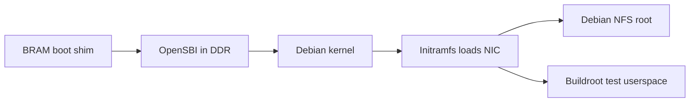

<!--
   Copyright 2026 Two Sigma Open Source, LLC

   Licensed under the Apache License, Version 2.0 (the "License");
   you may not use this file except in compliance with the License.
   You may obtain a copy of the License at

       http://www.apache.org/licenses/LICENSE-2.0

   Unless required by applicable law or agreed to in writing, software
   distributed under the License is distributed on an "AS IS" BASIS,
   WITHOUT WARRANTIES OR CONDITIONS OF ANY KIND, either express or implied.
   See the License for the specific language governing permissions and
   limitations under the License.
-->

# FROST Linux

FROST boots Debian 13 on the Alveo X3 with Debian's own riscv64 kernel,
unmodified. OpenSBI starts the kernel in S-mode, where it runs with Sv39
paging. The kernel's initramfs loads the FROST NIC driver as a module and
mounts the root filesystem over NFS through that NIC. Without an NFS root,
the image boots a small Buildroot test initramfs instead, which CI also boots
under QEMU.

To set up a board, follow the [Debian setup guide](../docs/debian_nfsroot.md).
To build the test image, see the [Buildroot tree](buildroot-external/README.md).

## Boot chain and entry state



The shim at address zero enters OpenSBI at `0x8000_0000` in M-mode, with
`a0 = 0` (the hart ID) and `a1` pointing to the DTB. The packer places the DTB
after the payload, as described under [Memory map](#memory-map).

The firmware is OpenSBI v1.9's generic platform from the `linux/opensbi`
submodule, built by [`opensbi_build.py`](opensbi_build.py) with:

- `FW_TEXT_START=0x80000000` and `FW_JUMP_OFFSET=0x200000`.
- An empty `FW_JUMP_FDT_OFFSET`, so the DTB address in `a1` passes through
  unchanged.
- The drivers in [`opensbi_frost_defconfig`](opensbi_frost_defconfig) (the
  ns16550 UART, the PLIC, and the CLINT) and `FDT_ASSUME_MASK=7`, which lets
  libfdt trust the packer's DTB.

It builds with the Bootlin `riscv64-linux-` toolchain by default. Another
toolchain, selected with `FROST_LINUX_CROSS_COMPILE` or `--cross`, must be
Linux-targeted with a PIE-capable linker: OpenSBI links position-independent.

OpenSBI enters the payload in S-mode with `satp` Bare and `sstatus.SIE=0`. It
delegates the SSI, STI, and SEI interrupts and the misaligned-fetch,
breakpoint, U-mode ecall, and page-fault exceptions. It sets
`mcounteren=0x7`, `scounteren=0x2`, and `menvcfg.STCE=1`, so S-mode can read
all three fixed counters and U-mode starts with access to `time` only.
OpenSBI emulates misaligned loads and stores in M-mode until the kernel
requests their delegation through FWFT.

## Memory map

The board and simulation share one physical map.

| Range | Contents |
|---|---|
| `[0x0000_0000, 256 KiB)` | Uncached boot BRAM, outside Linux's memory node. `[0x17C00, 0x18000)` is reserved for the debug module. |
| `[0x4000_0000, 0x4003_1000)` | Native MMIO: UART, FIFOs, timer, DMA test engine, and NIC. See `sw/lib/include/mmio.h`. |
| `[0x4000_1000, +0x100)` | ns16550a UART alias, PLIC source 1, with `reg-shift=2` and `reg-io-width=4` |
| `[0x4001_0000, +0xC000)` | SiFive CLINT alias: `msip` at `+0`, `mtimecmp` at `+0x4000`, `mtime` at `+0xBFF8` |
| `[0x4003_0000, +4 KiB)` | DMA-coherent NIC, bound by the `frost_net10g` driver ([device-tree binding](buildroot-external/board/frost/frost,net10g.yaml)) |
| `[0x4400_0000, +4 MiB)` | PLIC with M and S contexts for hart 0. Sources 1–4 are the UART, external pin, DMA test engine, and NIC. OpenSBI hides the M context from Linux. |
| `[0x8000_0000, +1 GiB)` | Cached DDR. The DTB advertises the board's DDR size: 1 GiB on X3. |

The PMA map has three regions: the BRAM, the device quadrant
`[0x4000_0000, 0x8000_0000)`, and cached DDR. An access anywhere else,
including any address with bits 63:32 set, raises a precise access fault
(cause 1, 5, or 7 for a fetch, load, or store) with the exact address in
`mtval`. Instruction fetch from the device quadrant also faults, and so does
an AMO, LR, or SC to it (cause 7, 5, or 7): devices take loads and stores
only. Addresses outside the map never alias onto it.

The image packer lays out DDR as follows, with offsets from `0x8000_0000`:

| Component | Offset | Size and alignment |
|-----------|--------|--------------------|
| OpenSBI `fw_jump.bin` | `+0` | At most 1 MiB. OpenSBI reserves its runtime regions in the DTB. |
| Kernel `Image` or other S-mode payload | `+2 MiB` | 2 MiB aligned |
| DTB | The first 2 MiB boundary at or above both `+16 MiB` and the payload's end | 64 KiB slot, with room for OpenSBI's in-place fixups |
| Initramfs, if any | Right after the DTB slot | Must fit in the advertised memory |

A Linux `Image` ends at its header's `image_size`, which includes BSS; a raw
payload ends with its file. Linux reserves its image up to the next 2 MiB
boundary and drops an initramfs that overlaps a reservation, so the DTB
starts on that boundary and the initramfs follows it. Payloads up to 14 MiB
put the DTB at `+16 MiB` and the initramfs at `+16 MiB + 64 KiB`; the Debian
kernel is larger, so its DTB lands on a later boundary.

By default the DTB advertises 64 MiB, the size of the simulation DDR model,
which leaves limited room for an initramfs behind the Debian kernel. Board
loading advertises the board's full DDR instead, and simulation uses
`DDR_MODEL_BYTES` when it is set. The packer rejects an image that does not
fit.

## Interrupts and time

The DT connects the CLINT to the hart's `cpu-intc` for the machine software
(cause 3) and machine timer (cause 7) interrupts, and the PLIC's M and S
contexts to causes 11 and 9. The CLINT registers are dword-aligned and
support 64-bit access: an `ld` reads `mtime` atomically, with no rv32-style
hi/lo/hi loop, and an 8-byte store to `mtimecmp` lands atomically.

`timebase-frequency` equals the CPU clock: `mtime` counts every core cycle,
with no divider. (Simulation builds can scale it with the `SIM_TIMER_SPEEDUP`
parameter.) The packer writes the timebase and the UART's `clock-frequency`
into the DTB from `FPGA_CPU_CLK_FREQ`. The loader supplies 322.265625 MHz by
default, and `FROST_CPU_CLK_HZ` overrides it for divided-clock bitstreams.
Because OpenSBI leaves `menvcfg.STCE=1`, the kernel programs its timer
directly through Sstc (`stimecmp`) instead of an SBI call.

## Advertised ISA

The generated DTB declares the
[implemented extensions](../README.md#supported-risc-v-extensions), Sstc,
Svade, and `mmu-type = "riscv,sv39"`. Userspace uses RV64 ELF and the LP64D
ABI.

## Counters and mcounteren

FROST implements `cycle`, `time`, and `instret` as 64-bit Zicntr CSRs; `time`
reads the CLINT's `mtime`. The rv32-only `*h` aliases are illegal
instructions at every privilege level.

Two WARL registers gate counter access below M-mode. S-mode needs the
counter's bit set in `mcounteren` (0x306); U-mode needs it set in both
`mcounteren` and `scounteren` (0x106). M-mode is never gated. A blocked access
is an illegal instruction (`mcause` 2, `mtval` 0).

| CSR | Behavior |
|---|---|
| `mcounteren`, `scounteren` | Only the CY, TM, and IR bits (2:0) exist; bits 31:3 read zero and ignore writes. Both reset to `0x7`. |
| `mcountinhibit` (0x320) | CY (bit 0) and IR (bit 2) stop `cycle` and `instret` while set. TM reads 0, and bits 31:3 read zero. |
| `mcycle` (0xB00), `minstret` (0xB02) | Accept full 64-bit M-mode writes |
| `hpmcounter*`, `mhpmcounter*` | Not implemented. An unimplemented CSR raises an illegal instruction at every privilege, which lets firmware probe optional CSRs by trapping. |

OpenSBI's SBI PMU uses `mcountinhibit`, `mcycle`, and `minstret` to stop,
start, and preload the fixed counters, and its privileged-version probe
requires `mcountinhibit` before it sets `menvcfg.STCE`. OpenSBI hands the
kernel `scounteren=0x2`, so userspace starts with only `rdtime`; the kernel
decides whether to allow direct `rdcycle` and `rdinstret`.

Userspace counts cycles and instructions through `perf_event_open`
(`PERF_COUNT_HW_CPU_CYCLES`, `PERF_COUNT_HW_INSTRUCTIONS`), which Linux serves
through the SBI PMU. The DTB's `riscv,pmu` node maps both events to the fixed
counters; without it, OpenSBI reports them as unsupported and the kernel's
perf driver disables them. `frost_stress --counters` counts a child process
running a fixed workload, from its exec to its exit, and the boot stress
payload reports cycle, instruction, time, and IPC deltas for its own workload.

## Kernel

[`debian_kernel.py`](debian_kernel.py) downloads Debian's riscv64 kernel and
headers from snapshot.debian.org and checks their sizes and SHA-256 sums. The
pinned release is `6.12.107+deb13-riscv64`; the snapshot, versions, and
checksums are in the script. FROST runs this kernel unmodified, with its NIC
driver built as a separate module.

Its subcommands, `fetch`, `release`, `image`, `module`, and `initramfs`,
print their result on stdout and progress on stderr. `module` and `initramfs`
are described under [NIC module](#nic-module). `FROST_DEBIAN_KERNEL_CACHE`
overrides the default `linux/debian-kernel` cache. Native and container
builds can use the cache concurrently, and an incomplete entry is rebuilt.

To move to a new kernel, change the pinned values in `debian_kernel.py`,
rebuild the images, and install the same release on each board's NFS root as
the [Debian guide](../docs/debian_nfsroot.md#operation) describes. Then rerun
the Linux boot checks.

A replacement kernel selected with `FROST_LINUX_KERNEL` must provide:

| Option | Why |
|---|---|
| `CONFIG_MMU`, `CONFIG_ARCH_RV64I`, `CONFIG_64BIT` | Sv39 RV64 kernel in S-mode. Leave `CONFIG_RISCV_M_MODE` unset. |
| `CONFIG_RISCV_SBI` | Runs under OpenSBI and calls the SBI interface |
| `CONFIG_RISCV_PMU`, `CONFIG_RISCV_PMU_SBI` | Cycle and instruction counters through the SBI PMU |
| `CONFIG_RISCV_MISALIGNED` | Handles misaligned accesses once the kernel takes FWFT delegation. The pin selects it through `CONFIG_RISCV_PROBE_UNALIGNED_ACCESS`; `CONFIG_RISCV_EMULATED_UNALIGNED_ACCESS` also works. |
| `CONFIG_BINFMT_ELF`, `CONFIG_FPU` | ELF userspace with LP64D hard float |
| `CONFIG_BLK_DEV_INITRD` | External initramfs through `linux,initrd-*`. A compressed initramfs also needs its `CONFIG_RD_*` decompressor; the test initramfs is uncompressed. |
| `CONFIG_DEVTMPFS`, `CONFIG_TMPFS`, `CONFIG_PROC_FS`, `CONFIG_SYSFS` | Mounted by the test initramfs's inittab. It mounts devtmpfs itself, so `CONFIG_DEVTMPFS_MOUNT` is not needed (the pin leaves it unset). |
| `CONFIG_SERIAL_8250`, `CONFIG_SERIAL_8250_CONSOLE`, `CONFIG_SERIAL_OF_PLATFORM` | Console on the ns16550a alias, found through the DT. Build these in: the test initramfs has no serial modules. |
| `CONFIG_OF`, `CONFIG_OF_EARLY_FLATTREE` | Device-tree probing and the early console (`earlycon=uart8250,mmio32,0x40001000`) |
| `CONFIG_NET`, `CONFIG_INET`, `CONFIG_PACKET` | Packet sockets for `frost_nettest`, and IPv4 for an NFS root |
| `CONFIG_MODULES`, or the driver built in (`CONFIG_NETDEVICES`, `CONFIG_ETHERNET`, `CONFIG_NET_VENDOR_FROST`, `CONFIG_FROST_NET10G`) | The `frost_net10g` driver for the `frost,net10g` node. The pin loads it as a module ([NIC module](#nic-module)). |
| `CONFIG_NFS_FS`, `CONFIG_NFS_V3` | The kernel's NFS client, needed for either kind of [NFS root](#nfs-root): the kernel performs the mount even when an initramfs requests it. The pin builds both as modules, which its initramfs carries. |
| `CONFIG_ROOT_NFS`, `CONFIG_IP_PNP` (`CONFIG_IP_PNP_DHCP` for `ip=dhcp`) | Only for a kernel that mounts the NFS root itself from `ip=` and `nfsroot=`. That kernel also needs the NFS client and the NIC driver built in. The pin has neither option. |
| `CONFIG_CGROUPS`, `CONFIG_UNIX` | Required by systemd on the NFS root, which needs the cgroup v2 hierarchy but no particular controller (the pin enables the usual ones). `CONFIG_AUTOFS_FS`, `CONFIG_TMPFS_POSIX_ACL`, and `CONFIG_TMPFS_XATTR` are recommended. systemd's other requirements, and the seccomp support it recommends, are kernel defaults. |

The test image boots with `ipv6.disable=1`: Debian's kernel builds IPv6 in,
and its autoconfiguration frames would loop back through the NIC and fail
`frost_nettest`'s idle checks.

## NIC module

`debian_kernel.py module` builds the [NIC driver](frost-net10g/README.md)
against the pinned kernel's headers and checks the module's `vermagic`
release and symbol CRCs against that kernel. Linux would not catch a
mismatch: the pin sets `CONFIG_MODVERSIONS`, under which the kernel ignores
the release in `vermagic` and loads the module into any ABI-compatible
kernel. The image build compiles the module with Buildroot's cross toolchain;
a standalone build uses `FROST_LINUX_CROSS_COMPILE` or `--cross`.

`debian_kernel.py initramfs` appends the module and a startup script to
Buildroot's `rootfs.cpio` as a second cpio archive, which the kernel unpacks
after the first, so Buildroot does not rebuild. For the same `vermagic`
reason, the script checks `uname -r` itself before it loads the module, then
prints `FROST_NET10G_MODULE_PASS <release>` or
`FROST_NET10G_MODULE_FAIL <reason>` before login. `FROST_NET10G_MODULE` names
a prebuilt module to use instead of building one.

For Debian NFS boots, install the driver through DKMS and include it in
Debian's initramfs, as the
[driver guide](frost-net10g/README.md#an-nfs-root-needs-the-module-in-the-initramfs)
describes.

## NFS root

Follow the [Debian setup guide](../docs/debian_nfsroot.md) to build and export
a riscv64 root filesystem. Debian's kernel builds its NFS client as a module
and has no `ip=` autoconfiguration, so it mounts the root from an initramfs
that carries the NFS client and the
[NIC driver](frost-net10g/README.md#an-nfs-root-needs-the-module-in-the-initramfs).
The export must allow read-write access from the board without root squashing.

`sw/apps/linux_boot` reads these environment variables, which the loader
passes through:

| Variable | Purpose |
|----------|---------|
| `FROST_LINUX_NFSROOT` | Export as `<server-ip>:/<path>`. Unset, the image boots the test initramfs. |
| `FROST_LINUX_IP` | Kernel `ip=` value; defaults to `dhcp` and requires `FROST_LINUX_NFSROOT` |
| `FROST_LINUX_KERNEL` | Absolute path to a replacement kernel `Image` |
| `FROST_LINUX_INITRD` | Absolute path to a replacement initramfs |
| `FROST_LINUX_MAC` | Board MAC address; defaults to `02:11:22:33:44:55` |

For Debian, pack the root's `/boot/vmlinux-<version>` with the matching
`/boot/initrd.img-<version>`. The hardware regression requires the pinned
release and picks the kernel and initramfs itself; see its
[setup](../docs/debian_nfsroot.md#hardware-regression).

A static IP uses `<client>::<gateway>:<netmask>:<hostname>:<device>:off`, for
example `192.0.2.2::192.0.2.1:255.255.255.0:frost:eth0:off`. Each board on a
shared network needs its own locally administered MAC. The packer rejects
malformed, multicast, and all-zero addresses.

With both `FROST_LINUX_NFSROOT` and `FROST_LINUX_INITRD` set, the packer
writes bootargs that select initramfs-tools' NFS boot (`boot=nfs`) and an
NFSv3 mount over TCP:

```
earlycon console=ttyS0 boot=nfs root=/dev/nfs nfsroot=<server-ip>:/<path>,vers=3,tcp,hard rw ip=<FROST_LINUX_IP>
```

With `FROST_LINUX_NFSROOT` alone, the packer packs no initramfs and the kernel
mounts the root itself. That needs a replacement kernel with `CONFIG_IP_PNP`,
`CONFIG_ROOT_NFS`, the NFS client, and the NIC driver built in; Debian's
kernel cannot do it. Both paths mount with `nolock`, so file locks are local
to the board.

Without `FROST_LINUX_NFSROOT`, the kernel runs the initramfs's `/sbin/init`,
so a replacement initramfs must provide it. Debian's initramfs-tools image
starts at `/init` and works only with the NFS boot above.

## Images and testing

`sw/apps/linux_boot` builds the images the FPGA loader writes: `sw.{mem,txt}`
is the boot shim for low BRAM, `sw_ddr.{mem,txt}` is the DDR image, and
`sw64.mem` is the shim in dword rows for the 64-bit data BRAM. By default the
DDR image holds OpenSBI, the pinned Debian kernel, and the test initramfs from
the [Buildroot flow](buildroot-external/README.md).

Linux boots are tested on X3 hardware and under QEMU. RTL simulation covers
OpenSBI and directed bare-metal tests, but not a full Linux boot. On the
board, the [hardware regression](../fpga/README.md#hardware-regression) boots
Debian from its NFS root, and `fpga/linux_boot_soak.py` boots the test image
repeatedly.
