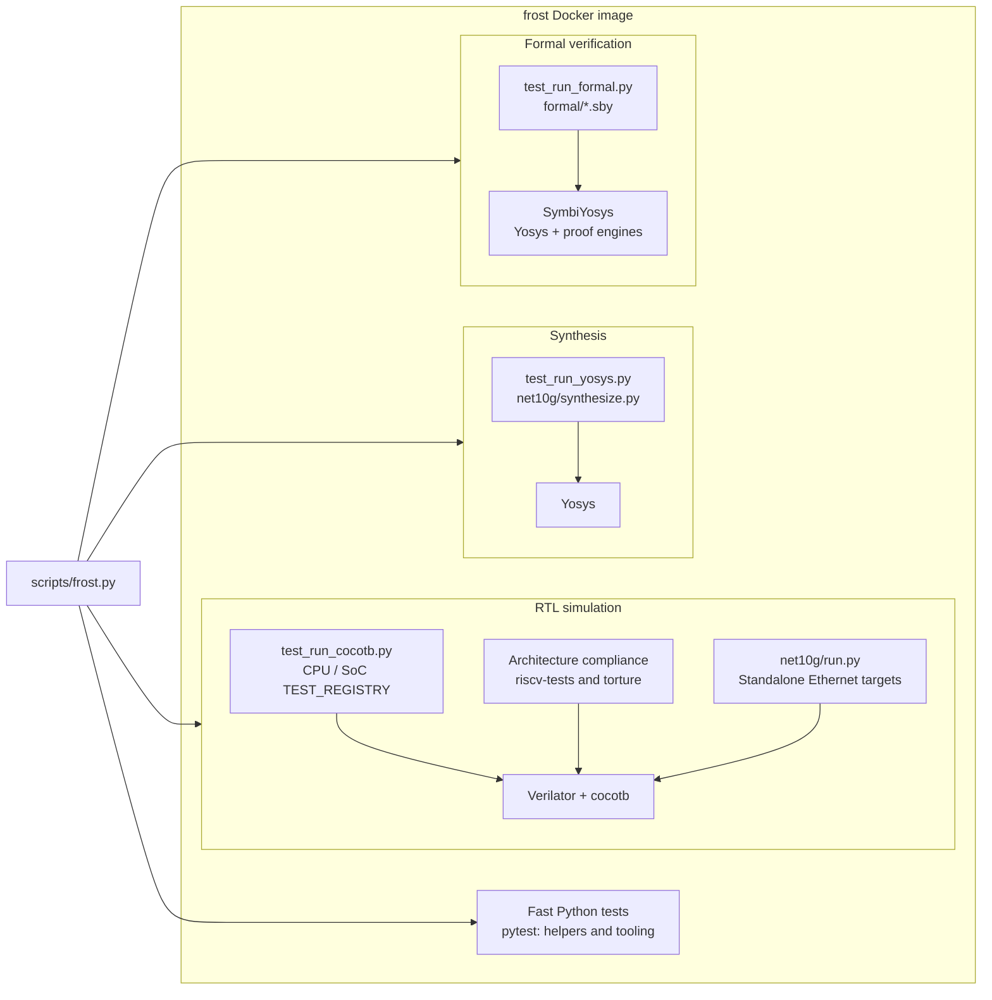

# Frost Test Infrastructure

Runners for RTL simulation, architecture compliance, ISA regression, random
instruction torture, synthesis, formal verification, and Python tooling checks.

## Overview



The CPU/SoC registry covers block benches, directed tests, and compiled
applications. The [standalone Ethernet benches](net10g/README.md) have their
own target registry and synthesis runner. Formal targets use the engines
selected by each `.sby` file; see the [formal guide](../formal/README.md).

Simulation coverage spans low BRAM and cached DDR. Architecture compliance
also has an instruction-cache-only tier; riscv-tests and torture provide
Sv39 execution modes. The runner sections below describe which combinations
each suite supports.

## Reproducible Local Execution

Run these examples from the repository root through `./scripts/frost.py`. The
wrapper uses the pinned `frost` image as the invoking UID/GID with its home
under `/tmp`, keeping artifacts writable by native tools. Its `cocotb` and
`pytest` shortcuts first run `make clean` in `tests/`. After building the image
with `docker build -t frost .`, run the read-only preflight:

```bash
./scripts/frost.py doctor
```

The preflight is read-only and returns nonzero on failure.

## Test Files

### `test_run_cocotb.py`

Runs CPU/SoC Cocotb simulations directly or through pytest. `TEST_REGISTRY` in
`test_run_cocotb.py` is the canonical list of those targets:

```bash
./scripts/frost.py cocotb --list-tests
./scripts/frost.py cocotb --help
```

RTL assertions are enabled; a failed assertion fails the simulation.
Properties guarded by `` `ifdef FORMAL `` run only in the formal flow.
For the portable and Xilinx response-path targets, see the
[memory-response tests](../verif/cocotb_tests/cpu_ooo/memory/README.md).

Applications compile automatically before simulation. The debug-module tests
drive the design's JTAG pins from cocotb (`debug_test`) or hand them to a real
`openocd` over `remote_bitbang` (`debug_openocd_test`). When `openocd` is not
installed, `debug_openocd_test` logs a warning and passes; setting
`FROST_REQUIRE_OPENOCD=1`, as CI does, turns that into a failure.

```bash
# Basic usage
./scripts/frost.py cocotb tomasulo_test             # Run CPU correctness test
./scripts/frost.py cocotb hello_world               # Run Hello World program
./scripts/frost.py cocotb isa_test                  # Run ISA compliance tests
./scripts/frost.py cocotb freertos_demo             # Run FreeRTOS demo
./scripts/frost.py cocotb coremark_pro_core         # CoreMark-PRO workload system sim
                                                   # (also: _cjpeg, _linear_alg, _loops,
                                                   #  _nnet, _parser, _radix2, _sha,
                                                   #  _zip; long-running)

# Reproducibility options
./scripts/frost.py cocotb cdb_arbiter --random-seed=12345
./scripts/frost.py cocotb cdb_arbiter --testcase=test_random_multi_fu_stress

# Seed sweep (parallel random seed testing)
./scripts/frost.py cocotb cdb_arbiter --seed-sweep 10
./scripts/frost.py cocotb cdb_arbiter --seed-sweep 20 --max-workers 4
./scripts/frost.py cocotb cdb_arbiter --seed-sweep 10 \
  --testcase test_random_multi_fu_stress
```

`--seed-sweep N` runs N random seeds in isolated build directories. The
summary lists results and commands to reproduce failures. From the host,
pass those arguments through `./scripts/frost.py cocotb`, for example:

```bash
./scripts/frost.py cocotb cdb_arbiter --random-seed=987654321
```

Options:
- `--seed-sweep N`: number of random seeds to test.
- `--max-workers W`: cap on parallel workers (default: min(N, cpu_count)).
- `--testcase` narrows the sweep to one test function.

Through pytest:

```bash
./scripts/frost.py pytest                           # Run all pytest-registered Cocotb tests
./scripts/frost.py pytest -k hello_world            # Run a specific test
./scripts/frost.py pytest -k unit                   # Run unit tests
./scripts/frost.py pytest -m "cocotb_real_program and not coremark_pro"
./scripts/frost.py pytest -m "cocotb_real_program and coremark_pro"
./scripts/frost.py pytest -s                        # Show live output
```

Real-program tests default to the `bram` tier, which normally places code and
data in low BRAM. `FROST_COCOTB_MEM_CONFIG=ddr` selects cached-DDR linking to
exercise the L1I and the D-side cached tier. Some apps override this choice:
the AMO and timer torture apps always use DDR, CoreMark-PRO has a DDR-backed
heap, and OpenSBI smoke uses a fixed BRAM-shim/DDR-firmware layout.

```bash
FROST_COCOTB_MEM_CONFIG=ddr ./scripts/frost.py cocotb hello_world
FROST_COCOTB_MEM_CONFIG=ddr ./scripts/frost.py pytest -k test_real_program
```

`*_fetch_fuzz` and `ddr_*` programs are excluded from the `ddr` tier: they
use custom builds or already place data at fixed DDR addresses. Unit benches
are tier-independent. See `DDR_TIER_EXCLUDE` for the full list.

### `test_arch_compliance.py`

Runs the official [riscv-arch-test](https://github.com/riscv-non-isa/riscv-arch-test)
suite. Each assembly case runs under Verilator; its UART signature is compared
with a golden reference generated by the image's pinned Spike
(`sw/apps/arch_test/generate_references.py`). References live under
`sw/apps/arch_test/references/rv64i_m/`.

Suite groups: I, M, A, F, D, C, B, K, Zicond, Zifencei, privilege, D_Zcd,
and hints (262 tests at the current suite snapshot). `EXTENSION_TEST_FILTERS`
and `EXTENSION_TEST_EXCLUDES` restrict these groups to implemented
instructions; for example, K covers Frost's Zbkb subset. There is no F_Zcf:
RV64C reinterprets the C.FLW/C.FSW slots as C.LD/C.SD, so Zcf is rv32-only.

Run `./scripts/frost.py run make -C tests clean` before each of the runner
invocations below.

```bash
# Run all supported extensions
./scripts/frost.py run python3 tests/test_arch_compliance.py --all

# Run specific extensions
./scripts/frost.py run python3 tests/test_arch_compliance.py --extensions I M A

# Run a single test
./scripts/frost.py run python3 tests/test_arch_compliance.py \
  --test rv64i_m/I/src/addw-01.S

# Include large cases normally filtered out of Verilator runs
./scripts/frost.py run python3 tests/test_arch_compliance.py --all --no-sim-filter

# Select the memory tier the test runs from (default: ddr)
./scripts/frost.py run python3 tests/test_arch_compliance.py \
  --extensions I --mem-config bram
./scripts/frost.py run python3 tests/test_arch_compliance.py \
  --extensions Zifencei --mem-config ddr
./scripts/frost.py run python3 tests/test_arch_compliance.py \
  --extensions I --mem-config icache
```

The parameterized architecture, riscv-tests, and torture runners require
serial execution (`--parallel 1`, the default) because they share application
outputs, image links, and simulator paths. A larger worker count fails before
building. Cocotb seed sweeps use isolated paths and support parallel workers.

`--mem-config` selects the memory tier. It is passed to the Makefile as
`MEM_CONFIG`, which picks the linker script and crt0 stub that place code and
data/signature:
- `bram`: code, data, and signature all in low BRAM (pure ISA conformance).
- `icache`: code in DDR, so the L1I fetch path is under test; data and
  signature in low BRAM, which isolates instruction fetch from the D-side
  cached tier. Diagnostic only; not a CI job.
- `ddr`: code, data, and signature in DDR, so every load and store also
  exercises the D-side cached tier. This is the default
  (`DEFAULT_MEM_CONFIG`).

The pytest entry point honors `FROST_ARCH_MEM_CONFIG` to override the default.

Through pytest:

```bash
./scripts/frost.py run bash -c \
  'cd tests && make clean && exec pytest test_arch_compliance.py -v -m slow'
```

The runner is Verilator only.

Tests with more than 5000 test cases (`SIM_MAX_TEST_CASES`) are filtered out
by default because they take too long under Verilator; `--no-sim-filter`
includes them in the same simulation runner. Hardware regression uses the
native [FPGA workflow](../fpga/README.md). At the current suite snapshot no rv64i_m test exceeds the limit (the largest has 880 cases).

In CI, the suite runs as a GitHub Actions matrix of extension x memory tier
(`[bram, ddr]`) with `fail-fast: false` (`Arch Tests`). Zifencei (fence.i and
self-modifying code) is excluded from the `bram` tier: the low-BRAM Harvard
split has separate instruction and data memories, so a store reaches only the
data BRAM, and fence.i's writeback and invalidate apply only to the cached DDR
tier. F and D are excluded from the `ddr` tier because those batches exceed
the hosted-runner budget; the F/D `bram` jobs cover FPU conformance and the
other `ddr` jobs cover the cache path.

In the `bram` and `icache` tiers, a test whose `.text`/`.data` exceeds the
256 KiB low BRAM (96 KiB instruction + 160 KiB data) is reported SKIP rather
than FAIL; the `ddr` tier still runs it.

Low BRAM is sized to match hardware (`-GMEM_SIZE_BYTES=262144`, 256 KiB). The
behavioral DDR model provides the cached DDR region and preloads it from
`sw_ddr.mem`.

### `test_riscv_tests.py`

Runs self-checking [riscv-tests](https://github.com/riscv-software-src/riscv-tests)
ISA tests, which print `<<PASS>>` or `<<FAIL>>` through UART. They cover
multi-instruction dependencies, traps, atomics, FP behavior, two-wide dispatch,
and OOO commit beyond arch-test's single-instruction focus.

Supported suites: rv64ui, rv64um, rv64ua, rv64uf, rv64ud, rv64uc, rv64mi,
rv64si, rv64uzba, rv64uzbb, rv64uzbs, rv64uzbkb (172 tests in the `ddr`
tier; the `bram` tier skips two more, see below).

Run `./scripts/frost.py run make -C tests clean` before each of the runner
invocations below.

```bash
# Run all suites
./scripts/frost.py run python3 tests/test_riscv_tests.py --all

# Run specific suites
./scripts/frost.py run python3 tests/test_riscv_tests.py \
  --suites rv64ui rv64um rv64uf

# Run a single test
./scripts/frost.py run python3 tests/test_riscv_tests.py --test rv64ui/add

# Select the memory tier (default: bram)
./scripts/frost.py run python3 tests/test_riscv_tests.py \
  --all --mem-config ddr

# List available tests
./scripts/frost.py run python3 tests/test_riscv_tests.py --list
```

`--mem-config` selects the memory tier: `bram` (default) keeps code and data
in low BRAM (pure ISA path); `ddr` runs the test from the cached DDR region,
which exercises the L1I fetch path and the D-side cached tier. The Makefile
knob `MEM_CONFIG` selects the linker script, plus the ROM boot stub for
`ddr`.

`--env` selects the environment. `p` (default) is the physical environment:
the test runs bare in M-mode (the upstream `-p` variants). `v` is the virtual
environment (the upstream `-v` variants): the test runs as demand-paged Sv39
user code under the supervisor kernel in `sw/apps/riscv_tests/env_v/`. Fetch
and data are translated, page faults are delegated to S-mode, and the kernel
sets the A/D bits on fault (Svade). `v` requires `--mem-config ddr`, since
page tables and user frames live in cached DDR, and covers the user-level
suites only. The Makefile knob is `ENV`.

```bash
# The -v variants of the base-integer suite
./scripts/frost.py run python3 tests/test_riscv_tests.py \
  --suites rv64ui --mem-config ddr --env v
```

Through pytest:

```bash
./scripts/frost.py run bash -c \
  'cd tests && make clean && exec pytest test_riscv_tests.py -v -m slow'
```

The runner is Verilator only.

A few tests are skipped in every tier because Frost cannot pass them by
design: misaligned accesses trap rather than complete, there is no debug
trigger module and no PMP, `mcycle`/`minstret` are read-only aliases, and
`rv64si/dirty` expects hardware A/D-bit updates on an Svade machine. See
`ISA_SKIP_TESTS` in the script.

Two tests are skipped in the `bram` tier only (`ISA_SKIP_TESTS_BRAM`):
`rv64ui/fence_i`, because self-modifying code is meaningful only against the
cached DDR L1I, and `rv64si/icache-alias`, because its page tables must live
in cached DDR for the walker to reach them. Both run in `ddr`.

In CI, the suites run as a suite x memory tier (`[bram, ddr]`) matrix in the
`p` environment, plus the user-level suites in `ddr` / `v`; benchmarks run as
a benchmark x memory tier matrix.

### `test_riscv_torture.py`

Runs a generated RV64IMAFDC corpus (20 committed tests) covering ALU,
multiply/divide, memory, branch, FP, and AMO operations, including W-form
ALU/MUL, LD/SD/LWU, and `.d` atomics. A 64-bit Spike run generates the
register signatures used to check Frost simulation.

Run `./scripts/frost.py run make -C tests clean` before each of the runner
invocations below.

```bash
# Run all torture tests
./scripts/frost.py run python3 tests/test_riscv_torture.py --all

# Run a single test
./scripts/frost.py run python3 tests/test_riscv_torture.py --test test_001

# Select the memory tier (default: bram)
./scripts/frost.py run python3 tests/test_riscv_torture.py \
  --all --mem-config ddr

# List available tests and reference status
./scripts/frost.py run python3 tests/test_riscv_torture.py --list
```

`--mem-config` selects the memory tier: `bram` (default) runs from low BRAM
(pure ISA path); `ddr` runs from the cached DDR region, which exercises the
L1I fetch path and the D-side cached tier.

`--paged` runs the whole test, the random stream and the footer's signature
dump included, in S-mode under an Sv39 identity map. The map is three 1 GiB
leaves over the low BRAM, the device quadrant, and DDR, so every fetch and
data access translates through the ITLB/DTLB and the walker. It requires
`--mem-config ddr` because the root table lives in `.data`, which must be in
cached DDR. The Spike references are unchanged: translation does not alter the
architectural register state the signature captures. The Makefile knob is
`PAGED=1`.

```bash
./scripts/frost.py run python3 tests/test_riscv_torture.py \
  --all --mem-config ddr --paged
```

In CI, the corpus runs as a memory tier (`[bram, ddr]`) matrix plus `ddr`
paged.

The corpus and its Spike references are checked in under `tests_rv64/` and
`references_rv64/`. To regenerate:

```bash
cd sw/apps/riscv_torture
./generate_tests.py --generate --count 20 --seed 20260803
```

Through pytest:

```bash
./scripts/frost.py run bash -c \
  'cd tests && make clean && exec pytest test_riscv_torture.py -v -m slow'
```

The runner is Verilator only. Spike (`riscv-isa-sim`) is needed only to
regenerate references, not to run the tests.

FP register signatures are compared exactly against the Spike references.
Integer registers are compared too, except sp, gp, x30 (the AMO address
temporary), and x31 (the memory base): the generator pins layout-dependent
addresses to those four, and Frost's link map differs from Spike's.

### `test_run_yosys.py`

Runs two Yosys synthesis checks:

- `generic`: coarse synthesis of portable RTL, including elaboration, memory
  inference, and structural checks. It does not establish ASIC or non-Xilinx
  FPGA mapping.
- Xilinx UltraScale+: full synthesis of the X3 cached hierarchy, AXI memory
  interface, and coherent NIC/MAC/PCS.

Both use `hw/rtl/frost.f` with `cpu_and_mem` as the top and reject unresolved
modules and latches. The image's pinned sv2v frontend handles the NIC/MAC/PCS
sources; Yosys reads the CPU and library SystemVerilog directly.
The Xilinx target has a two-hour timeout, overridable with
`FROST_YOSYS_XILINX_TIMEOUT_SEC`.

```bash
./scripts/frost.py synthesis                       # Run default targets
./scripts/frost.py synthesis --target generic      # Generic/ASIC coarse synthesis
./scripts/frost.py synthesis --target ice40        # Any Yosys synth_* target
./scripts/frost.py synthesis --verbose             # Show full Yosys output
```

Through pytest:

```bash
./scripts/frost.py run pytest tests/test_run_yosys.py
```

### `test_run_formal.py`

Runs the SymbiYosys targets in `formal/`. Each target declares its supported
tasks in `FORMAL_TARGETS`; use `--list-targets` to see them. Tasks include
bounded checks (`bmc`), reachability (`cover`), unbounded safety proofs
(`prove`), and parameter variants. See the [formal guide](../formal/README.md)
for proof scope and assumptions.

```bash
./scripts/frost.py formal                          # All targets, all declared tasks
./scripts/frost.py formal --list-targets           # Targets, their tasks, and exit
./scripts/frost.py formal --target reorder_buffer  # One target (the .sby stem)
./scripts/frost.py formal --task bmc               # One task type
./scripts/frost.py formal --verbose                # Show full sby output
```

`--task` intersects with each target's declared tuple, so it never forces a task
onto a target that does not support it. Each sby task gets a 40 minute timeout
(`SBY_TASK_TIMEOUT_S`), sized as a hang backstop rather than a performance gate.

Through pytest:

```bash
./scripts/frost.py run pytest tests/test_run_formal.py
```

Every target x task pair is a separate parametrized case, and the whole
`TestFormalVerification` class carries the `formal` marker; CI selects it with
`pytest tests/ -m formal -v`.

## Configuration Files

| File                       | Purpose                                   |
|----------------------------|-------------------------------------------|
| `conftest.py`              | Pytest configuration and fixtures         |
| `fixtures/` | Captured tool and board output for parser tests; preserve bytes, including terminal escapes and trailing whitespace in `*.log` files |
| `Makefile`                 | Cocotb simulation build rules             |
| `test_arch_compliance.py`  | riscv-arch-test compliance runner         |
| `test_riscv_tests.py`      | riscv-tests ISA regression runner         |
| `test_riscv_torture.py`    | Random instruction torture test runner    |
| `.gitignore`               | Excludes build artifacts                  |

## Running Tests

### Run Fast Python Tests

This is the non-simulator selection CI runs. It covers the tooling and helper
tests without launching Cocotb, synthesis, or formal jobs. The underlying
command, for focused debugging:

```bash
./scripts/frost.py run pytest tests \
  -m "not cocotb and not synthesis and not formal and not slow" -v
```

For the normal local gate, run both this selection and CI's exact lint job:

```bash
./scripts/frost.py check
```

`check` is `./scripts/frost.py lint` followed by the fast-Python selection
above. It keeps going after a failed phase so its summary covers both jobs;
`./scripts/frost.py check --fail-fast` stops at the first failure. The lint
hooks include formatters and auto-fixers, so `check` may modify files; review
the working-tree diff afterwards.

The full regression is split across simulator, synthesis, formal,
architecture-compliance, and software workflows. Use their dedicated commands
instead of host-native `pytest`.

### Filter by Test Type

```bash
./scripts/frost.py pytest -m cocotb                # Simulation tests only
./scripts/frost.py pytest -m "cocotb and cocotb_unit"
./scripts/frost.py pytest -k hello_world
./scripts/frost.py synthesis
./scripts/frost.py formal
./scripts/frost.py lint
```

### Environment Variables

| Variable             | Description                                          | Default      |
|----------------------|------------------------------------------------------|--------------|
| `SIM`                | Simulator; every runner sets it to `verilator`       | `verilator`  |
| `COCOTB_TEST_FILTER` | Regex selecting test functions to run (set by `--testcase`) | (all)      |
| `COCOTB_RANDOM_SEED` | Random seed for reproducibility (set by `--random-seed`)    | (random)   |
| `WAVES`              | Generate waveform file (1/0)                         | `0`        |
| `FROST_COCOTB_MEM_CONFIG` | Memory tier for real-program tests (`bram` / `ddr`) | `bram`   |

## Test Output

### Simulation Build Artifacts

The `sim_build/` directory contains compiled simulation files:

```
sim_build/
├── Vtop                    # Verilator executable
├── Vtop*.cpp               # Generated C++ files
├── *.o                     # Object files
└── .last_toplevel          # Tracks toplevel for incremental builds
```

### Test Results

- `results.xml`: JUnit-format test results (for CI integration)
- `dump.fst`: FST waveform file (when `WAVES=1`; the Makefile passes `--trace-fst --trace-structs`)

## Requirements

See the [main README](../README.md#prerequisites) for validated tool versions.

### Other Tools

| Tool       | Purpose                  |
|------------|--------------------------|
| Python     | Test runner              |
| Cocotb     | Verification framework   |
| Yosys      | Open-source synthesis    |
| RISC-V GCC | C cross-compiler         |

## CI Integration

The [CI workflow](../.github/workflows/ci.yml) runs the following checks in
the pinned Docker image:

| Suite | Configurations |
| --- | --- |
| Cocotb applications | BRAM and DDR where supported; each CoreMark-PRO workload runs separately |
| Cocotb unit benches, DDR probes, fetch fuzzers, OpenSBI smoke | Tier-independent or fixed-layout runs |
| Architecture compliance | BRAM and DDR; excludes Zifencei on BRAM and F/D on DDR |
| riscv-tests | Physical mode in BRAM/DDR, user-level Sv39 tests in DDR, and benchmarks |
| Torture | BRAM, DDR, and paged DDR |
| Ethernet | Standalone MAC/PCS simulation and portable synthesis |
| Tooling | Lint, fast Python tests, synthesis, and formal verification |

The runner sections above explain exclusions and local-only configurations.
Use the workflow for exact job filters. When changing Cocotb shards, update
both the named shard and the runtime/other complement so no test is lost.
Inspect a selection without simulation using `--collect-only`:

```bash
FROST_COCOTB_MEM_CONFIG=ddr ./scripts/frost.py pytest --collect-only -q \
  -m "cocotb and cocotb_real_program and not coremark_pro" -k '[coremark]'
```

### Test Markers

```python
@pytest.mark.cocotb       # RTL simulation tests
@pytest.mark.cocotb_real_program  # Cocotb real-program tests
@pytest.mark.cocotb_unit  # Cocotb unit-bench tests
@pytest.mark.coremark_pro # CoreMark-PRO real-program tests
@pytest.mark.synthesis    # Synthesis tests
@pytest.mark.formal       # Formal verification tests
@pytest.mark.slow         # Long-running tests
```

## Troubleshooting

### "No module named 'cocotb'"

Build or rebuild the pinned image rather than installing Cocotb on the host:

```bash
docker build -t frost .
```

### Verilator incremental build issues

The test runner tracks the toplevel module in `sim_build/.last_toplevel`.
The canonical shortcuts clean automatically; rerun through the wrapper:

```bash
./scripts/frost.py cocotb <test-name>
```

### Tests timing out

For long tests such as `coremark` and `freertos_demo`, raise the cycle budget:

```bash
COCOTB_COREMARK_MAX_CYCLES=30000000 ./scripts/frost.py cocotb coremark
COCOTB_MAX_CYCLES=2000000 ./scripts/frost.py cocotb hello_world
```
