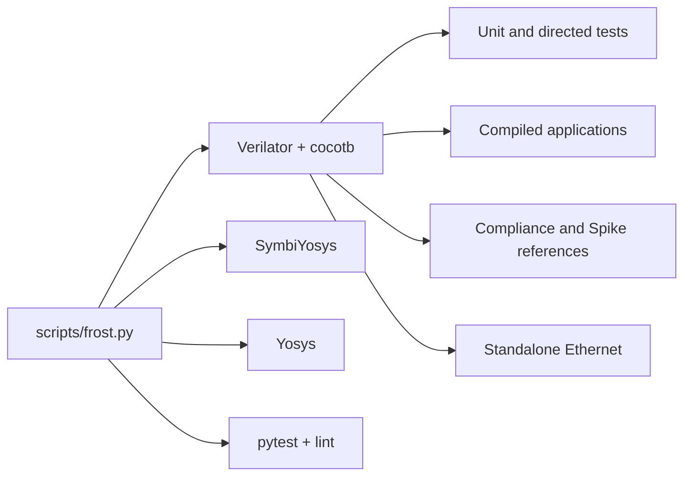

# Test Infrastructure

Run regression tools through the pinned `frost` image from the repository root.
See [tooling setup](../docs/tooling.md). Vivado and hardware regression run
[natively](../fpga/README.md#hardware-regression).

## Overview



## Fast checks

```bash
./scripts/frost.py doctor
./scripts/frost.py check
```

`check` runs CI's lint and fast Python jobs; `--fail-fast` stops after a failed
phase. Lint hooks can change files. For a focused Python run:

```bash
./scripts/frost.py run pytest tests -m "not cocotb and not synthesis and not formal and not slow" -v
```

## Test Files

### `test_run_cocotb.py`

`TEST_REGISTRY` defines CPU/SoC block benches, directed tests, and applications.
Apps compile automatically; failed RTL assertions fail simulation.

```bash
./scripts/frost.py cocotb --list-tests
./scripts/frost.py cocotb hello_world
./scripts/frost.py cocotb cdb_arbiter --random-seed 12345
./scripts/frost.py cocotb cdb_arbiter --testcase test_random_multi_fu_stress
./scripts/frost.py cocotb cdb_arbiter --seed-sweep 20 --max-workers 4
./scripts/frost.py pytest -m "cocotb and cocotb_unit" -v
./scripts/frost.py pytest -m "cocotb_real_program and not coremark_pro"
```

The `cocotb` and `pytest` shortcuts clean `tests/` first. Seed sweeps use
isolated builds and print failure-reproduction commands. `--testcase` narrows
the cocotb test function; pytest's `-k` and `-m` select registered targets.

Real programs default to `bram`; select cached DDR with:

```bash
FROST_COCOTB_MEM_CONFIG=ddr ./scripts/frost.py cocotb hello_world
```

Some apps use fixed DDR or composite layouts. Unit benches are tier-independent;
`DDR_TIER_EXCLUDE` lists fixed-layout/custom-build programs omitted from the
DDR shard, including DDR probes and fetch fuzzers.

`debug_test` drives JTAG directly; `debug_openocd_test` uses OpenOCD through
`remote_bitbang`. Set `FROST_REQUIRE_OPENOCD=1` to fail when OpenOCD is absent
(as CI does); otherwise that target warns and passes. The
[memory-response tests](../verif/cocotb_tests/cpu_ooo/memory/README.md) cover
portable and Xilinx datapaths.

### Compliance and torture runners

These runners share application and simulator outputs: use serial execution
(`--parallel 1`, the default) and clean before **each invocation**:

```bash
./scripts/frost.py run make -C tests clean
./scripts/frost.py run python3 tests/test_arch_compliance.py --all
```

This clean step also applies to each riscv-tests/torture command below.
All three runners use Verilator. Their pytest entry points can be run with
`./scripts/frost.py run bash -c 'cd tests && make clean && exec pytest <runner>.py -v -m slow'`.

### `test_arch_compliance.py`

Runs the implemented subsets of riscv-arch-test and compares UART signatures
with committed Spike references under `sw/apps/arch_test/references/rv64i_m/`.
Supported groups include I/M/A/F/D/C/B, Zbkb within K, Zicond, Zifencei,
privilege, D_Zcd, and hints. Zcf is RV32-only. The filters and exclusions in
the runner define the exact inventory.

```bash
./scripts/frost.py run python3 tests/test_arch_compliance.py --extensions I M A
./scripts/frost.py run python3 tests/test_arch_compliance.py --test rv64i_m/I/src/addw-01.S
./scripts/frost.py run python3 tests/test_arch_compliance.py --extensions I --mem-config icache
```

| Memory tier | Code | Data/signature |
|-------------|------|----------------|
| `ddr` (default) | DDR | DDR |
| `bram` | BRAM | BRAM |
| `icache` (diagnostic) | DDR | BRAM |

The pytest entry point accepts `FROST_ARCH_MEM_CONFIG`. Cases over
`SIM_MAX_TEST_CASES` (5000) are filtered unless `--no-sim-filter` is set.
Low-BRAM overflow is SKIP in `bram`/`icache`; DDR still runs those cases.
The BRAM map reserves 95 KiB code, 1 KiB debug, and 160 KiB data/stack.

CI excludes Zifencei on BRAM because ordinary stores cannot change its separate
instruction copy. It excludes F/D on DDR to fit runner budgets; F/D BRAM jobs
cover FPU conformance. `icache` is local-only.

### `test_riscv_tests.py`

Runs self-checking upstream ISA suites and benchmarks, using UART
`<<PASS>>`/`<<FAIL>>`. Use `--list` for cases and `--all` for all ISA suites.

```bash
./scripts/frost.py run python3 tests/test_riscv_tests.py --suites rv64ui rv64um
./scripts/frost.py run python3 tests/test_riscv_tests.py --test rv64ui/add
./scripts/frost.py run python3 tests/test_riscv_tests.py --all --mem-config ddr
./scripts/frost.py run python3 tests/test_riscv_tests.py --suites rv64ui --mem-config ddr --env v
```

`--mem-config bram` is the default. `--env p` runs bare M-mode tests;
`--env v` runs user suites under the demand-paged Sv39 supervisor in
`sw/apps/riscv_tests/env_v/`. Virtual mode requires DDR and manages A/D bits
through page faults (Svade).

`ISA_SKIP_TESTS` excludes unsupported misaligned-access behavior, debug
triggers, PMP, and hardware A/D updates. It also excludes `instret_overflow`;
that case needs revalidation against the implemented writable machine counters.
`ISA_SKIP_TESTS_BRAM` additionally excludes `fence_i` and `icache-alias`, which
require DDR instruction storage or page tables.

### `test_riscv_torture.py`

Runs a committed RV64IMAFDC corpus against Spike register signatures.

```bash
./scripts/frost.py run python3 tests/test_riscv_torture.py --all
./scripts/frost.py run python3 tests/test_riscv_torture.py --test test_001
./scripts/frost.py run python3 tests/test_riscv_torture.py --all --mem-config ddr --paged
```

`bram` is the default tier. `--paged` requires DDR and runs the test and
signature dump in S-mode through an Sv39 identity map of BRAM, devices, and
DDR. Translation leaves the Spike reference unchanged. FP registers compare
exactly; integer comparison excludes layout-dependent `sp`, `gp`, `x30`, and
`x31`.

To regenerate the corpus and references with the pinned compiler and Spike:

```bash
./scripts/frost.py run python3 sw/apps/riscv_torture/generate_tests.py --generate --count 20 --seed 20260803
```

### `test_run_yosys.py`

Checks portable coarse synthesis (`generic`) and full Xilinx UltraScale+
synthesis, rejecting unresolved modules and latches. Both use `frost.f` with
`cpu_and_mem` as top; sv2v handles NIC/MAC/PCS sources. Generic synthesis does
not establish device mapping or timing. The Xilinx timeout is two hours,
overridable with `FROST_YOSYS_XILINX_TIMEOUT_SEC`.

```bash
./scripts/frost.py synthesis
./scripts/frost.py synthesis --target generic
```

See [standalone Ethernet verification](net10g/README.md) for its separate
simulation and portable-synthesis targets.

### `test_run_formal.py`

See the [formal guide](../formal/README.md) for proof contracts and assumptions.

```bash
./scripts/frost.py formal
./scripts/frost.py formal --list-targets
./scripts/frost.py formal --target reorder_buffer
./scripts/frost.py formal --task bmc
```

`--task` selects only declared tasks; each target/task pair has a 40-minute
hang timeout and a separate pytest case. Use `--verbose` for solver output.

## Environment and output

| Variable | Purpose |
|----------|---------|
| `COCOTB_TEST_FILTER` | Test-function regex (`--testcase`) |
| `COCOTB_RANDOM_SEED` | Reproduction seed (`--random-seed`) |
| `FROST_COCOTB_MEM_CONFIG` | Application memory tier (`bram` default) |
| `WAVES=1` | Write `dump.fst` waveforms |
| `COCOTB_MAX_CYCLES` | Generic real-program timeout; app-specific budgets can override it |
| `COCOTB_COREMARK_MAX_CYCLES` | CoreMark timeout |

Build products live in `tests/sim_build/`; `results.xml` records JUnit results.
The runner removes the previous report and requires a fresh, nonempty test
report before accepting success. Parallel make orders report cleanup before
simulation, including when the compiled RTL is reused.
Use the wrapper to clear stale builds. Rebuild the image for missing or
mismatched tools; raise the appropriate app budget for expected long runs.
Captured parser fixtures in `tests/fixtures/` must retain their bytes,
including terminal escapes and trailing whitespace.

## CI Integration

The [CI workflow](../.github/workflows/ci.yml) runs the following checks in
the pinned Docker image:

| Suite | Configurations |
| --- | --- |
| Cocotb applications | BRAM and DDR where supported; each CoreMark-PRO workload runs separately |
| Cocotb unit benches, DDR probes, fetch fuzzers, OpenSBI smoke | Tier-independent or fixed-layout runs |
| Architecture compliance | BRAM and DDR; excludes Zifencei on BRAM and F/D on DDR |
| riscv-tests | Physical mode in BRAM/DDR, user-level Sv39 tests in DDR, and benchmarks |
| Torture | BRAM, DDR, and paged DDR |
| Ethernet | Standalone MAC/PCS simulation and portable synthesis |
| Tooling | Lint, fast Python tests, synthesis, and formal verification |
| Linux | Fresh firmware/rootfs builds and QEMU boot checks |

The runner sections above explain exclusions and local-only configurations.
Use the workflow for exact job filters. When changing Cocotb shards, update
both the named shard and the runtime/other complement so no test is lost.
Inspect a selection without simulation using `--collect-only`:

```bash
FROST_COCOTB_MEM_CONFIG=ddr ./scripts/frost.py pytest --collect-only -q \
  -m "cocotb and cocotb_real_program and not coremark_pro" -k '[coremark]'
```

Markers are listed in [CONTRIBUTING.md](../CONTRIBUTING.md#test-markers).
