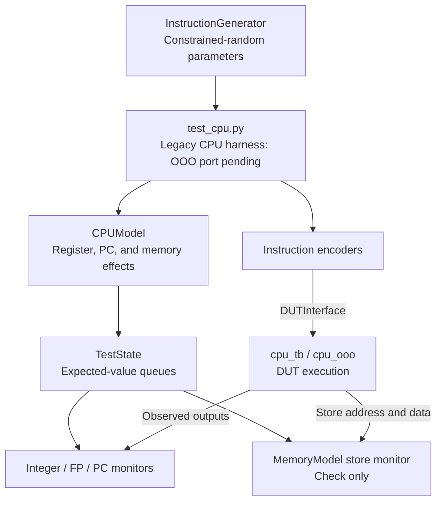

# Frost RISC-V CPU verification

The Python [Cocotb](https://www.cocotb.org/) framework checks Frost RTL against
software reference models.

## Architecture

### Verification Data Flow

Current CI combines block-level benches, directed machine-mode trap tests,
and compiled applications. The [test infrastructure overview](../tests/README.md)
also covers the ISA, torture, synthesis, and formal runners.

The diagram below focuses on the legacy CPU reference harness in
`test_cpu.py`. Its `cpu_random` target is CLI-only and still needs an OOO
port: the fixed-latency expectation queues must become a commit-indexed
scoreboard. It is not currently a passing regression for the OOO core.



The test loop encodes each instruction and separately computes its expected
effects before driving the DUT. Monitors compare observed outputs with the
queued expectations. The memory monitor checks stores; it does not drive
read data or update the software memory model.

`InstructionExecutor` offers the encode/model/queue/drive sequence as a
reusable helper for directed tests. The current directed suites orchestrate
their own instruction driving and checks. `directed_traps` runs in CI;
`directed_atomics` and `compressed` are ported and remain CLI-only.
`directed_multicycle` still needs an OOO port, like `cpu_random`.

### Design Under Test (DUT)

The Frost CPU implements RV64GCB (G = IMAFD, plus C and B) with M, S, and U
privilege modes. `verif/config.py` pins `XLEN` to 64 to match `riscv_pkg`;
the shared integer arithmetic and signedness helpers use that setting. See the
[root README](../README.md) for the full ISA extension table.

### Verification Methodology

- Block benches check pipeline, memory, control, and debug modules.
- Directed CPU tests exercise traps, atomics, and compressed instructions.
  The table under [Running Tests](#running-tests) identifies supported targets.
- Compiled applications use UART pass/fail detection and exercise BRAM and
  cached DDR. ISA compliance and torture have separate runners in `tests/`.

## Directory Structure

| Path | Purpose |
| --- | --- |
| `cocotb_tests/` | CPU harnesses, directed tests, compiled-program tests, and block benches |
| `models/` | Integer, branch, floating-point, and memory reference models |
| `encoders/` | Instruction encoders and operation tables |
| `monitors/` | Integer/FP register and PC monitors |
| `utils/` | Alignment, data types, logging, and assertions |
| `config.py` | Shared constants and DUT signal paths |
| `verification_types.py`, `exceptions.py` | Type aliases and test exceptions |

## Components

### Test Infrastructure (`/cocotb_tests`)

#### Legacy random CPU harness (`test_cpu.py`)

Generates constrained-random instruction sequences and coordinates generation,
modeling, and DUT driving. It manages the expected-value queues the monitors
consume and models stalls and branch flushes with assumptions inherited from
the in-order core. The `cpu_random` target is CLI-only until its scoreboard
is ported to OOO commit events.

- `run_random_regression()`: shared regression driver wrapped by the `@cocotb.test()` functions (`test_random_riscv_regression`, `test_random_riscv_regression_force_one_address`, and the FP variants)

`TestConfig`, defined in `test_common.py`, passes configuration explicitly.

#### Test state (`test_state.py`)

`TestState` holds the software CPU state: integer and FP register files, program
counter history, the expected-value queues, the LR/SC reservation, and the
branch taken/not-taken history used for pipeline flush handling. It provides
helper methods for state updates and queue management.

#### CPU model (`cpu_model.py`)

`CPUModel` computes expected behavior:
- `model_instruction_execution()`: models complete instruction execution
- `_compute_writeback_value()`: calculates register writeback values
- `_compute_expected_program_counter()`: determines the next PC
- `model_memory_write()`: models store operations with byte masks

#### Instruction generator (`instruction_generator.py`)

`InstructionGenerator` generates valid RISC-V instruction parameters, enforces
alignment requirements (halfword, word, and doubleword), encodes instructions
into 32-bit binary, and can constrain addresses to allocated memory.
`InstructionParams` is a named tuple for instruction fields.

#### Integration test (`test_real_program.py`)

Runs compiled applications and detects pass/fail over UART. CoreMark-PRO
uses DDR-backed heaps; the behavioral DDR model loads `sw_ddr.mem` like the
hardware loader. Use the test registry to select an application.

#### Test helpers (`test_helpers.py`)
- `DUTInterface`: DUT signal access behind configurable hierarchy paths
- `TestStatistics`: test metrics and coverage tracking

### Reference Models (`/models`)

#### ALU Model (`alu_model.py`)
Models integer arithmetic, multiplication/division, loads, word AMOs,
bit-manipulation, Zicond, and RV64 word operations. `op_tables.py` lists the supported
instructions; it is a subset of the CPU ISA. RV32 ZIP/UNZIP are unsupported.
LR.W uses the load evaluator; `TestState` models reservations and SC.W results.
Results and shift amounts are masked to the configured XLEN.

#### Branch Model (`branch_model.py`)
`branch_taken_decision()` models the taken/not-taken decision for BEQ, BNE,
BLT, BGE, BLTU, and BGEU, with signed or unsigned comparison as the operation
requires.

#### Memory Model (`memory_model.py`)
Keeps a software copy of the CPU harness's data memory:
- Byte-addressable memory masked to `MEMORY_ADDRESS_WIDTH` in `config.py`
- Byte, halfword, word, and doubleword accesses (the DUT's simulation data
  BRAM stores aligned 64-bit rows)
- The `driver_and_monitor` coroutine checks DUT store traffic. Despite the
  name it drives nothing; `cpu_model.py` writes the memory image itself.

### Instruction Encoding (`/encoders`)

#### Instruction Encoders (`instruction_encode.py`)
Encodes the R (register-register), I (immediate, loads), S (store), B (branch),
and J (jump) formats, plus LUI, FENCE/FENCE.I/PAUSE, CSR, LR/SC and AMO,
ECALL/EBREAK/MRET/WFI, and the FP instructions (loads, stores, arithmetic,
comparisons, conversions, sign-injection, moves, and FCLASS).

#### Operation Tables (`op_tables.py`)
Maps each instruction mnemonic to its binary encoder, and to a software
evaluator as well where the result is modeled (stores, branches, jumps, and
fences need no evaluator). Tables are grouped by family (`R_ALU`, `I_ALU`,
`LOADS`, `STORES`, `BRANCHES`, `JUMPS`, the `C_*` compressed tables, the `FP_*`
tables), driving generation and result modeling for the instructions the
Python harness supports. These tables cover a subset of the CPU ISA; for
example, the atomic tables contain word operations, and supervisor control
instructions are exercised by other suites.

### Monitors (`/monitors`)

`monitors.py` checks DUT outputs throughout the simulation:
- `RegisterFileMonitor` and `FPRegisterFileMonitor` compare full register-file
  snapshots when `o_vld` asserts (the integer comparison excludes x0)
- `ProgramCounterMonitor` compares `o_pc` when `o_pc_vld` asserts
- The memory interface monitor (`memory_model.driver_and_monitor`) checks store
  traffic only. Whenever the byte write-enable mask is non-zero it matches the
  DUT's address and data against the expected queues, and raises on an
  unexpected write. Load results are checked indirectly through the register
  file monitor.

## Test Execution

### Test Configuration

`TestConfig` is a dataclass with the following parameters:

| Parameter                      | Default | Description                                        |
|--------------------------------|---------|----------------------------------------------------|
| `num_loops`                    | 16000   | Number of random instructions to generate          |
| `min_coverage_count`           | 80      | Minimum executions required per instruction type   |
| `memory_init_size`             | 0x2000  | Size of initialized memory region (8KB)            |
| `clock_period_ns`              | 3       | Clock period in nanoseconds                        |
| `reset_cycles`                 | 3       | Number of clock cycles to hold reset               |
| `use_structured_logging`       | False   | Enable rich formatted debug output                 |
| `constrain_addresses_to_memory`| False   | Limit generated addresses to allocated space       |
| `force_one_address`            | False   | Use rs1=0 and imm=0 to stress memory hazards       |
| `compressed_ratio`             | 0.0     | Ratio of compressed (C extension) ALU instructions |

### Configuring a test

Pass a `TestConfig` instance to the legacy random harness. This configuration
example describes its API; the OOO scoreboard port is still pending:

```python
from cocotb_tests.test_common import TestConfig
from cocotb_tests.test_cpu import run_random_regression

# Enable structured logging for debugging
config = TestConfig(use_structured_logging=True)
await run_random_regression(dut, config=config)

# Constrain addresses and run fewer iterations
config = TestConfig(
    num_loops=1000,
    constrain_addresses_to_memory=True,
)
await run_random_regression(dut, config=config)
```

### Running Tests

Run these commands from the repository root through `./scripts/frost.py`.
The wrapper runs the pinned CI image as the invoking user's UID/GID and always
cleans `tests/` before a cocotb run. Registry-driven real-program and unit tests
use `./scripts/frost.py cocotb <name>`; pass `--list-tests` for the canonical
target list. The single source of truth is `TEST_REGISTRY` in
`tests/test_run_cocotb.py`.

CPU harness targets use `cpu_tb`:

| Target | Status |
| --- | --- |
| `directed_traps` | Supported; runs in CI |
| `directed_atomics`, `compressed` | Supported; CLI-only |
| `directed_multicycle`, `cpu_random` | Fixed-latency harnesses awaiting an OOO port; expected to fail |

Bare `make` in `tests/` builds the `Makefile` default (`TOPLEVEL=cpu_tb`,
`COCOTB_TEST_MODULES=cocotb_tests.test_cpu`), which loads only the unported
`cpu_random` module. Prefer the registry targets:

```bash
# Trap handling (ECALL, EBREAK, MRET) -- ported, runs in CI
./scripts/frost.py cocotb directed_traps
# LR.W/SC.W atomic instructions -- ported, passes, CLI-only (not in CI)
./scripts/frost.py cocotb directed_atomics
# Back-to-back multi-cycle ops -- not yet ported to OOO, expected to fail
./scripts/frost.py cocotb directed_multicycle
```

Run a single test function with `--testcase` (sets cocotb's
`COCOTB_TEST_FILTER` to the supplied name or regex followed by `$`):
```bash
./scripts/frost.py cocotb directed_traps --testcase test_directed_trap_handling
./scripts/frost.py cocotb directed_atomics --testcase test_directed_lr_sc
```

Run integration tests with real programs (registry targets):
```bash
./scripts/frost.py cocotb hello_world
./scripts/frost.py cocotb hello_world --testcase test_real_program
```

### Memory tier (BRAM vs cached DDR)

Real-program tests have two memory-tier settings. The default `bram` tier
normally places code and data in low BRAM. Setting
`FROST_COCOTB_MEM_CONFIG=ddr` selects linking into the cached DDR region
(`0x8000_0000`, behind the L1/L2 cache hierarchy), exercising the L1I fetch
path and the D-side cache; the behavioral DDR model loads `sw_ddr.mem`.
Some apps keep dedicated DDR sections or heaps, force DDR linking, or use a
fixed boot layout. For example, AMO and timer torture always use DDR, and
OpenSBI smoke keeps its BRAM shim and DDR firmware regardless of the setting.
CI selects tiers through `FROST_COCOTB_MEM_CONFIG` and runs fixed-layout
OpenSBI smoke separately on the `bram` axis.

```bash
FROST_COCOTB_MEM_CONFIG=ddr ./scripts/frost.py cocotb coremark
```

In the ddr tier the behavioral DDR persists across reset and `.data` is loaded
in place, so a second run would see the program's mutated memory. The runner
therefore forces `COCOTB_NUM_RUNS=1`; the bram tier keeps its two-run default,
which checks that programs survive a reset. `*_fetch_fuzz` and `ddr_*` programs
self-skip in the ddr tier.

Common controls in `test_real_program.py` are `COCOTB_NUM_RUNS`
(reset-and-rerun count, default 2) and `COCOTB_MAX_CYCLES` (the generic timeout
budget). Application-specific budgets can take precedence: CoreMark-style
benchmarks, AMO torture, and timer torture have their own timeout environment
variables; several other directed apps use fixed larger budgets.

### Using another DUT hierarchy

For a different signal hierarchy, configure the paths:
```python
from config import DUTSignalPaths

custom_paths = DUTSignalPaths(
    regfile_ram_rs1_path="my_cpu.registers.rs1_port.data",
    regfile_ram_rs2_path="my_cpu.registers.rs2_port.data",
)

dut_if = DUTInterface(dut, signal_paths=custom_paths)
```

## Extending the Framework

- Adding an instruction: register an encoder/evaluator pair in
  `encoders/op_tables.py`. Instructions in existing operation families are
  picked up from the table; a new format or operation family also needs
  generator and reference-model support.
- Adding a monitor: monitors are plain coroutines started by the test. See
  `monitors/monitors.py` for the existing ones.
- Adapting to a different DUT hierarchy: override signal paths through
  `DUTSignalPaths` (see above) instead of editing test code.
- Configuration: shared constants live in `config.py`, per-run behavior in
  `TestConfig`. Semantic type aliases (`Address`, `RegisterIndex`, ...) are
  defined in `verification_types.py`, the custom exception hierarchy in
  `exceptions.py`, and RISC-V-specific validation helpers
  (`HardwareAssertions`) in `utils/validation.py`.
