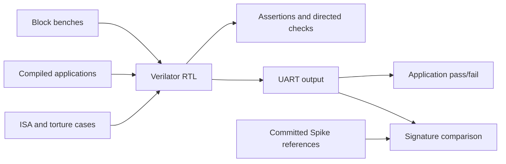

# Verification

This directory holds the Python side of FROST's simulation tests: the cocotb
benches in `cocotb_tests/` and the models, encoders, and monitors they share.
Block benches drive one RTL module and check it against independent models
and assertions. Application tests compile a program from `sw/apps/`, run it
on the whole SoC, and read its result from the UART. The runners in
[`tests/`](../tests/README.md) build the RTL with Verilator and launch these
benches; that README covers commands, memory tiers, the ISA suites, and CI.

## Architecture



Signature suites compare architectural results with Spike references
committed to the repository, so Spike is needed only to regenerate them.

## Directory Structure

| Path | Purpose |
|------|---------|
| `cocotb_tests/` | Block benches, directed CPU tests, application harness |
| `models/` | Integer, branch, floating-point, and memory models |
| `encoders/` | Instruction encoders and operation tables |
| `monitors/` | Register and PC monitors for the CPU reference harness |
| `utils/` | Alignment, data types, struct packing, logging, assertions |
| `config.py` | Constants (`XLEN=64`) and configurable DUT signal paths |
| `verification_types.py`, `exceptions.py` | Shared types and exceptions |

## Running Tests

```bash
./scripts/frost.py cocotb --list-tests                                      # every target
./scripts/frost.py cocotb directed_traps                                    # one target
./scripts/frost.py cocotb directed_atomics --testcase test_directed_lr_sc   # one test function
./scripts/frost.py cocotb hello_world                                       # an application, from BRAM
FROST_COCOTB_MEM_CONFIG=ddr ./scripts/frost.py cocotb hello_world           # the same, from cached DDR
```

`TEST_REGISTRY` in `tests/test_run_cocotb.py` defines the targets. Always use
the wrapper, which cleans `tests/` and runs the pinned image. Running `make`
in `tests/` with no arguments selects the CPU reference harness described
below, which does not pass, so always name a target. `--testcase` selects
test functions by regex through `COCOTB_TEST_FILTER`. The
[environment table](../tests/README.md#environment-and-output) lists the
cycle budgets and run counts for applications.

## CPU reference harness

`test_cpu.py`, which the `cpu_random` target runs, generates random
instructions, encodes them, predicts their effects with a Python model, and
drives `cpu_tb`. The encoders, models, and expected state are RV64: register
values, immediates, PCs, and counters are XLEN wide. The monitors expect the
PC and each instruction's results at a fixed offset from fetch, and
`directed_multicycle` makes the same assumption. The out-of-order core
breaks it: it fetches two instructions per cycle, redirects fetch on its own
schedule, retires up to two instructions per cycle after a variable delay,
and squashes wrong-path instructions, and the testbench cannot tell which of
the instructions it drives will be squashed. Both targets stop at their
first PC check, before any register comparison, and fail until they check
results in commit order. Until then, the riscv-tests, the architecture
compliance suites, and application tests such as `ddr_atomic_test` and
`c_ext_test` cover those instructions in CI.

| CPU harness target | Status |
|--------------------|--------|
| `directed_traps` | Passes; runs in CI |
| `directed_atomics`, `compressed` | Pass; run from the command line only |
| `cpu_random`, `directed_multicycle` | Fail: they need a scoreboard indexed by commit order |

| Component | Role |
|-----------|------|
| `InstructionGenerator` | Valid, aligned instruction parameters; optional address constraints |
| `CPUModel` | Register, PC, memory, and instruction effects |
| `TestState` | Architectural state, expected queues, LR/SC reservation, branch history |
| `DUTInterface` | Signal access through `DUTSignalPaths` |
| Register and FP monitors | Compare full snapshots on `o_vld`; the integer comparison skips x0 |
| PC monitor | Compares on `o_pc_vld` |
| Memory monitor | Checks each store's address and data against the expected queues (the byte mask only marks that a store happened); it does not drive reads or update model memory |

`encoders/op_tables.py` defines the modeled ISA subset and the instruction
families the generator draws from. Atomic modeling covers word operations;
supervisor instructions are tested by other suites. `TestConfig` in
`cocotb_tests/test_common.py` supplies generation, reset, clock, coverage,
and logging options. Directed suites can drive the DUT and check results
themselves.

## Extending the Framework

- Add encoder and evaluator pairs to `encoders/op_tables.py`. New instruction
  families also need generator and model support.
- Add monitors as coroutines started by the test.
- Override `DUTSignalPaths` for hierarchy differences instead of hardcoding
  paths in test logic.
- Keep shared constants in `config.py` and per-run behavior in `TestConfig`.
- Reuse CPU port layouts from `cocotb_tests/cpu_structs.py` and serialization
  helpers from `utils/packed_structs.py`; keep stimulus defaults in each bench.
- Register new benches in `TEST_REGISTRY` as described in the
  [test guide](../tests/README.md#adding-a-target).
