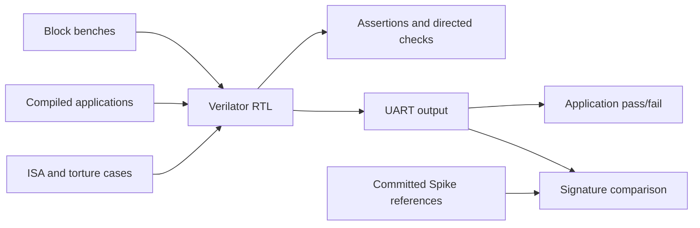

# Verification

This directory holds the Python side of FROST's simulation tests: the cocotb
benches in `cocotb_tests/` and the models and encoders they share.
Block benches drive one RTL module and check it against independent models
and assertions. Application tests compile a program from `sw/apps/`, run it
on the whole SoC, and read its result from the UART. The runners in
[`tests/`](../tests/README.md) build the RTL with Verilator and launch these
benches; that README covers commands, memory tiers, the ISA suites, and CI.

## Architecture



Signature suites compare architectural results with Spike references
committed to the repository, so Spike is needed only to regenerate them.

## Directory Structure

| Path | Purpose |
|------|---------|
| `cocotb_tests/` | Block benches, directed CPU tests, application harness |
| `models/` | Integer, floating-point, and memory models |
| `encoders/` | Instruction encoders and operation tables |
| `utils/` | Memory-access helpers, data types, struct packing, assertions |
| `config.py` | Constants (`XLEN=64`) and configurable DUT signal paths |
| `verification_types.py` | Shared `NewType` wrappers |

## Running Tests

```bash
./scripts/frost.py cocotb --list-tests                                      # every target
./scripts/frost.py cocotb directed_traps                                    # one target
./scripts/frost.py cocotb directed_atomics --testcase test_directed_lr_sc   # one test function
./scripts/frost.py cocotb hello_world                                       # an application, from BRAM
FROST_COCOTB_MEM_CONFIG=ddr ./scripts/frost.py cocotb hello_world           # the same, from cached DDR
```

`TEST_REGISTRY` in `tests/test_run_cocotb.py` defines the targets. Always use
the wrapper, which cleans `tests/` and runs the pinned image. Running `make`
in `tests/` with no arguments runs the `directed_traps` suite. `--testcase` selects
test functions by regex through `COCOTB_TEST_FILTER`. The
[environment table](../tests/README.md#environment-and-output) lists the
cycle budgets and run counts for applications.

## Directed CPU tests

The directed suites drive instruction words into `cpu_tb`, the core with a
fetch driver and a data memory model, and check results by waiting on commit
events and reading the architectural register files through `DUTInterface`.
They follow the out-of-order core's own timing rather than fixed pipeline
offsets. (`cpu_tb` fills the upper half of every fetch window with an ECALL,
which cannot pair as slot 2, so each 32-bit instruction is fetched alone.)
Random instruction streams run as compiled programs instead: the
riscv-torture suite checks them against Spike.

| CPU harness target | Status |
|--------------------|--------|
| `directed_traps` | Runs in CI |
| `directed_atomics`, `compressed` | Run from the command line only |

| Component | Role |
|-----------|------|
| `TestState` | Register and PC state, counter shadows, LR/SC reservation, expected-store queues |
| `DUTInterface` | Signal access through `DUTSignalPaths` |
| Memory monitor | Checks each store's address and data against the expected queues (the byte mask only marks that a store happened); it does not drive reads or update model memory |

`encoders/op_tables.py` pairs an encoder with a reference evaluator for each
modeled instruction. Atomic modeling covers word operations; supervisor
instructions are tested by other suites. `TestConfig` in
`cocotb_tests/test_common.py` supplies the reset, clock, and coverage options.

## Extending the Framework

- Add encoder and evaluator pairs to `encoders/op_tables.py`.
- Add monitors as coroutines started by the test.
- Override `DUTSignalPaths` for hierarchy differences instead of hardcoding
  paths in test logic.
- Keep shared constants in `config.py` and per-run behavior in `TestConfig`.
- Reuse CPU port layouts from `cocotb_tests/cpu_structs.py` and serialization
  helpers from `utils/packed_structs.py`; keep stimulus defaults in each bench.
- Register new benches in `TEST_REGISTRY` as described in the
  [test guide](../tests/README.md#adding-a-target).
