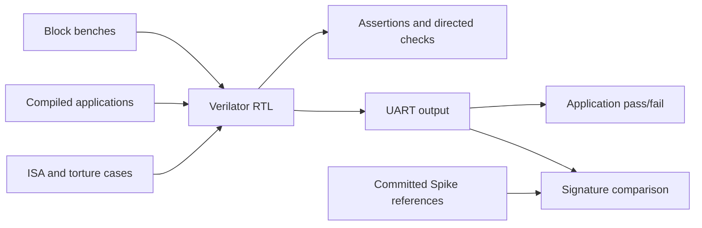

# Verification

Cocotb benches check RTL blocks, directed CPU behavior, and compiled
applications. [tests/README.md](../tests/README.md) covers commands, memory
tiers, compliance, torture, and CI selection.

## Architecture



Block tests use independent models and assertions. Applications compile before
simulation and run through the SoC, including UART and memory. Signature suites
compare architectural results with Spike; Spike is needed only to regenerate
references.

## Directory Structure

| Path | Purpose |
|------|---------|
| `cocotb_tests/` | Block benches, directed CPU tests, application harness |
| `models/` | Integer, branch, floating-point, and memory models |
| `encoders/` | Instruction encoders and operation tables |
| `monitors/` | Register and PC monitors for the CPU reference harness |
| `utils/` | Alignment, data types, struct packing, logging, assertions |
| `config.py` | Constants (`XLEN=64`) and configurable DUT signal paths |
| `verification_types.py`, `exceptions.py` | Shared types and exceptions |

## Running Tests

```bash
./scripts/frost.py cocotb --list-tests
./scripts/frost.py cocotb directed_traps
./scripts/frost.py cocotb directed_atomics --testcase test_directed_lr_sc
./scripts/frost.py cocotb hello_world
FROST_COCOTB_MEM_CONFIG=ddr ./scripts/frost.py cocotb hello_world
```

`TEST_REGISTRY` in `tests/test_run_cocotb.py` defines available targets. Always
use the wrapper, which cleans `tests/` and runs the pinned image.

| CPU harness target | Status |
|--------------------|--------|
| `directed_traps` | Supported; CI |
| `directed_atomics`, `compressed` | Supported; CLI-only |
| `cpu_random`, `directed_multicycle` | Require a commit-indexed OOO scoreboard; expected to fail |

Bare `make` in `tests/` selects the unported `test_cpu.py` harness. Use named
targets. `--testcase` selects a function/regex through `COCOTB_TEST_FILTER`.
For programs, `COCOTB_NUM_RUNS` controls reset/rerun count (default 2), and
`COCOTB_MAX_CYCLES` is the generic budget; app-specific limits can take precedence.

## CPU reference harness

`test_cpu.py` generates instructions, encodes them, models expected effects,
and drives `cpu_tb`. Its fixed-latency queues need an OOO port before this
can be a passing CPU regression.

| Component | Contract |
|-----------|----------|
| `InstructionGenerator` | Valid, aligned instruction parameters; optional address constraints |
| `CPUModel` | Register, PC, memory, and instruction effects |
| `TestState` | Architectural state, expected queues, LR/SC reservation, branch history |
| `InstructionExecutor` | Reusable encode/model/queue/drive helper |
| `DUTInterface` | Signal access through `DUTSignalPaths` |
| Register/FP monitors | Compare full snapshots on `o_vld`; integer comparison excludes x0 |
| PC monitor | Compare on `o_pc_vld` |
| Memory monitor | Check stores and byte masks against queues; does not drive reads or update model memory |

`encoders/op_tables.py` defines the modeled ISA subset and generation families.
Atomic modeling covers word operations; supervisor instructions use other
suites. `TestConfig` in `cocotb_tests/test_common.py` supplies generation, reset,
clock, coverage, and logging options. Directed suites can orchestrate their
own driving and checks.

## Extending the Framework

- Add encoder/evaluator pairs to `encoders/op_tables.py`. New instruction
  families also need generator and model support.
- Add monitors as coroutines started by the test.
- Override `DUTSignalPaths` for hierarchy differences instead of hardcoding
  paths in test logic.
- Keep shared constants in `config.py` and per-run behavior in `TestConfig`.
- Reuse CPU port layouts from `cocotb_tests/cpu_structs.py` and serialization
  helpers from `utils/packed_structs.py`; keep stimulus defaults in each bench.
- Register new benches using the [contribution guide](../CONTRIBUTING.md#adding-new-components).
